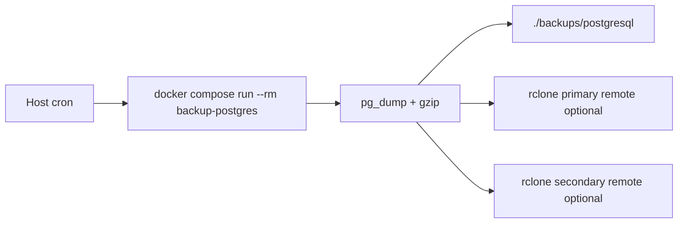

# ksiegowy-vibe

A self-hosted, multi-company Polish VAT accounting platform with KSeF (Krajowy System e-Faktur) integration.

## Disclaimer

This software is provided as-is and does not constitute legal, tax, accounting, or compliance advice. The project creator and maintainer do not accept responsibility for financial loss, tax, accounting, legal, reporting, or formal/compliance consequences, including penalties, interest, or filing mistakes, caused by software defects, misuse, or incorrect output, especially where Polish law or regulatory obligations apply. Users must verify all results independently and consult qualified legal, tax, or accounting professionals before relying on the software for decisions, filings, or statutory compliance.

## Documentation

| Document | Description |
|----------|-------------|
| [Architecture](docs/architecture.md) | C4 diagrams (context, containers, components) and flow diagrams for key workflows |
| [Development Run Modes](docs/development-run-modes.md) | Supported development setups, exact startup commands, env expectations, and PostgreSQL backup artifact-path caveat |
| [Infrastructure](docs/infrastructure.md) | Docker setup, CI/CD pipelines, environment variables, data persistence, and deployment checklist |
| [Google Drive Backup Setup](docs/google-drive-backup-setup.md) | How to create Google OAuth credentials for Google Drive backup |
| [Data Model](docs/data-model.md) | Database schema, entity relationship diagram, enumerations, and design notes |
| [Environment Context Switcher Plan](spec/environment-context-switcher-plan.md) | Implementation plan and ticket backlog for user-scoped `TEST` / `PRODUCTION` KSeF context switching |
| [PostgreSQL Restore Runbook](docs/restore-postgresql.md) | Initial restore procedure for PostgreSQL logical backups |
| [File Restore Runbook](docs/restore-files.md) | Restore procedure for company Google Drive and platform iCloud file backups |
| [Backup Restore Drill](docs/backup-restore-drill.md) | Repeatable restore drill steps with evidence capture |

## Features

- **KSeF Integration** — Submit VAT invoices and sync incoming invoices from the National e-Invoice System (FA(3) XML generation, XSD validation, session management, offline queue with retry)
- **KSeF Environment Context Switcher** — Per-user `TEST` / `PRODUCTION` environment switching with separate credentials, sessions, invoice visibility, and invoice KSeF state per environment. See the [implementation plan](spec/environment-context-switcher-plan.md) and [data model docs](docs/data-model.md#environment-aware-ksef-operating-model) for details.
- **Invoice Management** — Full lifecycle: draft → issue → PDF/XML generation → KSeF submission, including KOR correction invoices linked to accepted KSeF originals, with support for formal corrections such as invoice-number fixes
- **Incoming Invoices** — Upload PDFs/images with OCR, or sync directly from KSeF; review & confirm
- **Multi-company Support** — Manage multiple VAT entities with role-based access (Admin / Accountant / Viewer)
- **Contractor Management** — Buyer/seller database with NIP lookup (GUS API)
- **VAT Reporting** — VAT register with CSV export
- **Backup** — Platform-managed PostgreSQL + iCloud backup, plus company-admin Google Drive backup policy (manual, invoice-issued trigger, daily/weekly schedule via host cron one-shot job)
- **Authentication** — Google OAuth2 with JWT (httpOnly cookies)

## Tech Stack

| Layer | Technology |
|-------|-----------|
| API | Fastify 5 + TypeScript (Node.js 22 LTS) |
| Frontend | Next.js 15 + React 19 (App Router) |
| Database | PostgreSQL 17 + Prisma 6 |
| File Storage | Local filesystem (`./storage/`) |
| Auth | Google OAuth2 + JWT |
| OCR | Tesseract (local, Polish) + OpenRouter API (vision LLM fallback) |
| PDF Generation | Puppeteer |
| XML | xmlbuilder2 + libxmljs2 (XSD validation) |
| Email | Resend (optional) |
| Scheduling | node-cron (API iCloud + KSeF retry) + host cron (PostgreSQL + scheduled company Google Drive one-shot jobs) |
| Monorepo | pnpm workspaces |

## Monorepo Workflow

- This repository is a `pnpm` workspace monorepo. Use `pnpm` for root-level and package-scoped commands.
- Run commands for a single package with `pnpm --filter <package-name> ...`, for example `pnpm --filter @ksiegowy/api test`.
- Package scripts are defined in each workspace package such as `apps/api/package.json`, `apps/web/package.json`, and `packages/*/package.json`.

## Project Structure

```
ksiegowy-vibe/
├── apps/
│   ├── api/              # Fastify REST API (port 3001)
│   │   └── prisma/       # Schema & migrations
│   └── web/              # Next.js frontend (port 3000)
├── packages/
│   ├── types/            # Shared TypeScript types
│   ├── shared-utils/     # Utility functions
│   ├── ksef-client/      # KSeF HTTP client
│   ├── fa3-xml/          # FA(3) XML builder, parser + XSD validation
│   └── pdf-templates/    # HTML → PDF templates (Puppeteer)
├── scripts/              # DB seeding, KSeF CLI
├── ops/backup/           # PostgreSQL one-shot backup container + script
├── storage/              # Local file storage (gitignored)
├── backups/              # Local PostgreSQL backup artifacts (gitignored)
├── apps/api/Dockerfile   # API container (Node 22, GraphicsMagick, Tesseract)
├── apps/web/Dockerfile   # Web container (Next.js standalone)
├── docker-compose.yml    # Full stack: API + Web + PostgreSQL 17 + Adminer
├── .dockerignore
└── PLAN.md               # Implementation roadmap
```

## Frontend Design System

The visual system is **Aurora Solid** — opaque layered surfaces, no `blur()`/`backdrop-filter`, one shadow per page frame, Sora + IBM Plex Mono typography. Tokens live as CSS custom properties in `apps/web/src/app/globals.css` and are exposed to Tailwind v4 via `@theme inline`.

Source of truth: **`spec/aurora-solid-redesign-plan.md`** (plan and phase history) and **`docs/specs/aurora-solid-tokens.md`** (the token spec: both themes, contrast findings, component states). `spec/stitch-ui-implementation-plan.md` and `spec/ui/00-06` describe the previous "Aeon Ethereal" system and are superseded historical record.

- The web app root layout uses `apps/web/src/components/brand/assets/logo.png` as the favicon via Next.js metadata, so browser tab branding stays aligned with the shared brand asset.
- The 60px chrome bar is the sole global brand anchor and contains company, KSeF, theme, and session context.
- The 226px desktop rail contains navigation plus contextual status widgets (JPK_V7M filing deadline, rejected-invoice count); page actions live beside the content they affect.
- Light mode is the default, with an explicit dark preference stored locally in the browser. Both themes are held to WCAG AA on text and interactive boundaries.
- Mobile retains persistent bottom navigation in a reserved shell region and scrollable main content, so content and focused controls are not covered while scrolling.

## First-Run Flow

A signed-in user with no company is redirected from `/dashboard` into the onboarding wizard at `/onboarding`, rather than seeing an empty dashboard:

1. **Account** — already satisfied by sign-in.
2. **Company data** — NIP register lookup (`GET /companies/lookup`) then create (`POST /companies`).
3. **KSeF connection** — token per environment (`PATCH /companies/:id/ksef-settings`).
4. **Invite your accountant** — optional (`POST /companies/:companyId/invites`); no email is sent, so the UI surfaces a copyable invite link.

Progress is not stored separately — the wizard resumes by deriving the first incomplete step from the session and the company record, so "Save and finish later" is simply a link back to `/dashboard`. Invited users join an existing company through `POST /invites/:token/accept` and never enter this flow.

## Prerequisites

### Local development (pnpm)
- Node.js 22 LTS
- pnpm
- Docker (for PostgreSQL)
- GraphicsMagick (`brew install graphicsmagick` / `apt-get install graphicsmagick`)
- Tesseract with Polish pack (`brew install tesseract tesseract-lang` / `apt-get install tesseract-ocr tesseract-ocr-pol`)
- Google OAuth2 credentials

### Fully containerised
- Docker + Docker Compose
- Google OAuth2 credentials

## Getting Started

For supported development setups, see [Development Run Modes](docs/development-run-modes.md). It covers:

- full Docker runtime
- full local app runtime with PostgreSQL in Docker
- local web with API + PostgreSQL in Docker
- the local `POSTGRESQL_BACKUP_ARTIFACTS_PATH` caveat for PostgreSQL backup freshness status

### Option A — Fully containerised (recommended)

Runs API, web frontend, and database inside Docker. Tesseract and GraphicsMagick are included in the API image — no local installation needed.

#### 1. Clone and configure environment

```bash
git clone <repo-url>
cd ksiegowy-vibe
cp .env.example .env
```

Fill in the required variables in `.env` (see [Environment Variables](#environment-variables)). The `DATABASE_URL` is overridden automatically by Docker Compose to point at the postgres container.

#### 2. Build and start all services

```bash
docker compose up --build
```

On first run this builds both Docker images (takes a few minutes). Subsequent starts are fast.

#### 3. Run database migrations

```bash
docker compose exec api node node_modules/.bin/prisma migrate deploy --schema prisma/schema.prisma
```

#### 4. (Optional) Seed initial data

```bash
docker compose exec api node node_modules/.bin/tsx scripts/seed.ts
```

See [Seed Scripts](#seed-scripts) for available options including KSeF test data.

Services:
- Web: http://localhost:3000
- API: http://localhost:3001
- Adminer (DB GUI): http://localhost:8080 *(start with `docker compose --profile tools up`)*

#### Useful container commands

```bash
# Start in background
docker compose up -d --build

# View API logs
docker compose logs -f api

# Rebuild a single service after code changes
docker compose up --build api

# Stop all services
docker compose down

# Stop and remove all data volumes
docker compose down -v
```

---

### Option B — Local development (pnpm)

#### 1. Clone and install dependencies

```bash
git clone <repo-url>
cd ksiegowy-vibe
pnpm install
```

#### 2. Start the database

```bash
docker compose up -d postgres
docker compose --profile tools up -d      # + Adminer GUI (optional)
```

#### 3. Configure environment

```bash
cp .env.example .env
```

Fill in the required variables (see [Environment Variables](#environment-variables)).

If you run the API locally, set `POSTGRESQL_BACKUP_ARTIFACTS_PATH` to an absolute path pointing at repo `backups/postgresql` (see [Development Run Modes](docs/development-run-modes.md)). Using the default relative path can make PostgreSQL backup status appear unavailable.

#### 4. Run migrations and seed

```bash
pnpm db:migrate
pnpm db:seed
```

See [Seed Scripts](#seed-scripts) for available options including KSeF test data.

#### 5. Start development

```bash
pnpm dev
```

- API: http://localhost:3001
- Web: http://localhost:3000
- Adminer (DB GUI): http://localhost:8080 *(requires `--profile tools`)*

## Environment Variables

### Required

| Variable | Description |
|----------|-------------|
| `DATABASE_URL` | PostgreSQL connection string |
| `GOOGLE_CLIENT_ID` | Google OAuth2 client ID |
| `GOOGLE_CLIENT_SECRET` | Google OAuth2 client secret |
| `GOOGLE_REDIRECT_URI` | Google OAuth2 redirect URI (e.g. `http://localhost:3001/auth/google/callback`) |
| `JWT_SECRET` | Access token signing secret |
| `JWT_REFRESH_SECRET` | Refresh token signing secret |
| `ENCRYPTION_KEY` | AES encryption key for KSeF tokens and backup credentials |

### Optional

| Variable | Description |
|----------|-------------|
| `OPENROUTER_API_KEY` | Required for incoming invoice OCR |
| `GDRIVE_CLIENT_ID` | Google Drive backup |
| `GDRIVE_CLIENT_SECRET` | Google Drive backup |
| `GDRIVE_REDIRECT_URI` | Google Drive backup OAuth callback URL |
| `RESEND_API_KEY` | Email PDF delivery |
| `GUS_API_KEY` | NIP lookup via GUS API |
| `STORAGE_BASE_PATH` | File storage path (default: `./storage`) |
| `ICLOUD_BACKUP_PATH` | iCloud backup (macOS only) |
| `ICLOUD_RCLONE_REMOTE` | rclone remote name used for iCloud backup on Linux/VPS |
| `ICLOUD_RCLONE_DEST` | Destination path on `ICLOUD_RCLONE_REMOTE` for iCloud backups |
| `DB_BACKUP_ENABLED` | Enable one-shot PostgreSQL backup container job (`true`/`false`) |
| `DB_BACKUP_ENVIRONMENT_NAME` | Environment tag used in backup artifact names (e.g. `production`) |
| `DB_BACKUP_RETENTION_DAYS` | Remote retention window for PostgreSQL artifacts |
| `DB_BACKUP_LOCAL_RETENTION_DAYS` | Local retention window for files in `./backups/postgresql` |
| `DB_BACKUP_POSTGRES_READY_TIMEOUT_SECONDS` | How long backup job waits for PostgreSQL readiness before failing |
| `BACKUP_DESTINATION_ROOT` | Optional canonical remote backup root shared by Google Drive file backups and PostgreSQL remote publishing; set it to opt in PostgreSQL remote publishing to `<root>/postgresql/<environment>/...` |
| `DB_BACKUP_REMOTE_BASE_PATH` | Legacy PostgreSQL remote base path used only when `BACKUP_DESTINATION_ROOT` is unset |
| `DB_BACKUP_REMOTE_PRIMARY_NAME` | Primary rclone remote name for PostgreSQL backups |
| `DB_BACKUP_REMOTE_SECONDARY_NAME` | Secondary rclone remote name for PostgreSQL backups |
| `DB_BACKUP_RCLONE_CONFIG_PATH` | Absolute host path to source `rclone.conf` mounted read-only in remote mode; backup container seeds a writable runtime copy from it (leave empty in local-only mode) |
| `POSTGRESQL_BACKUP_ARTIFACTS_PATH` | Path used by API freshness checks to read local PostgreSQL artifacts; for local API runtime use an absolute path to repo `backups/postgresql` |
| `BACKUP_FRESHNESS_ENABLED` | Enable one-shot freshness verification service |
| `BACKUP_FRESHNESS_REQUIRE_POSTGRESQL_BACKUP` | Requirement mode (`true`/`false`/`auto`) for PostgreSQL backup freshness |
| `BACKUP_FRESHNESS_REQUIRE_GDRIVE_BACKUP` | Requirement mode (`true`/`false`/`auto`) for Google Drive file backup freshness |
| `BACKUP_FRESHNESS_REQUIRE_ICLOUD_BACKUP` | Requirement mode (`true`/`false`/`auto`) for iCloud file backup freshness |
| `BACKUP_FRESHNESS_POSTGRESQL_MAX_AGE_HOURS` | Max allowed age for latest PostgreSQL artifact |
| `BACKUP_FRESHNESS_GDRIVE_MAX_AGE_HOURS` | Max allowed age for latest successful Google Drive `BackupRun` |
| `BACKUP_FRESHNESS_ICLOUD_MAX_AGE_HOURS` | Max allowed age for latest successful iCloud `BackupRun` |
| `NEXT_PUBLIC_API_URL` | API base URL for the web frontend (default: `http://localhost:3001`) |
| `PUPPETEER_EXECUTABLE_PATH` | Path to Chrome/Chromium binary for PDF generation (macOS: point to system Chrome to skip ~200MB download) |
| `CORS_ORIGIN` | Allowed CORS origin for the API |

## PostgreSQL Backup Job (first slice)

This repository now includes a dedicated one-shot Docker Compose service named `backup-postgres` that runs outside the API process.

It runs only as its own manual or externally scheduled job. Starting Docker Compose does not trigger it, and `POST /companies/:companyId/backup-policy/run` does not trigger it. To create PostgreSQL backups, run `docker compose --profile backup run --rm backup-postgres` or schedule that command externally.

- API still runs daily iCloud backup cron and hourly KSeF retry cron.
- PostgreSQL artifacts are written to `./backups/postgresql` (not `./storage`).
- In Docker Compose runtime, the API mounts `./backups/postgresql` read-only and reads freshness from `POSTGRESQL_BACKUP_ARTIFACTS_PATH=/app/backups/postgresql`.
- `BACKUP_DESTINATION_ROOT` is the canonical remote backup root for company Google Drive file backups and for PostgreSQL remote publishing only when you explicitly set it.
- The backup job waits for PostgreSQL readiness before starting `pg_dump`.
- Local retention cleanup is applied after each successful run (`DB_BACKUP_LOCAL_RETENTION_DAYS`).
- Option A keeps one shared PostgreSQL database unchanged. Every PostgreSQL logical backup still contains the whole shared database, not a per-company slice.
- Each run creates:
  - `postgresql-<environment>-<timestamp>.sql.gz`
  - `postgresql-<environment>-<timestamp>.sql.gz.sha256`
  - `postgresql-<environment>-<timestamp>.manifest.json`

Canonical remote destinations:

- PostgreSQL: `<BACKUP_DESTINATION_ROOT>/postgresql/<environment>/<timestamp>/...`
- Company Google Drive files: `<BACKUP_DESTINATION_ROOT>/files/<environment>/company-<companyId>/...`

Backward compatibility note:

- when `BACKUP_DESTINATION_ROOT` is unset, PostgreSQL remote publishing stays on legacy `DB_BACKUP_REMOTE_BASE_PATH/<environment>/...`
- setting `BACKUP_DESTINATION_ROOT` is the explicit opt-in to the unified PostgreSQL remote path

Backup modes:

- **Local-only mode** (no remotes configured): backup writes local artifacts and applies local retention only.
- **Remote mode** (at least one remote configured): local artifacts are still written first, then uploaded through staged remote publish flow.

Remote publishing behavior (remote mode only):
- artifacts are uploaded to a remote staging directory first
- remote presence of the full set is checked (`.sql.gz`, `.sha256`, `.manifest.json`)
- the set is promoted to a final timestamped remote directory
- if verification/promotion fails, partial remote set is cleaned up and job fails

Verification scope note:
- current checks confirm remote artifact-set presence only
- they do not prove remote checksum integrity or restore ability on the remote destination



### Run manually

```bash
docker compose --profile backup run --rm backup-postgres
```

#### Quick commands

```bash
# Production — backs up and uploads to Google Drive
pnpm backup:postgres

# Local test — runs the full pipeline but skips remote upload
pnpm backup:postgres:local
```

> **Note:** If you update your host rclone config after the first backup run (e.g. add a remote or re-authenticate), remove the cached volume first so the container picks up the new config:
> ```bash
> docker volume rm ksiegowy-vibe-pl_backup_postgres_rclone_runtime
> ```

The job does **not** require remotes in local-only mode.

### PostgreSQL Restore

Full restore workflow: download from Google Drive → inspect → restore.

```bash
# 1. Download latest backup from Google Drive to local artifacts folder
pnpm backup:postgres:download

# 2. Inspect what was downloaded
ls -lh backups/postgresql/

# 3. Stop the API, restore, start API
docker compose stop api
DB_RESTORE_CONFIRMED=yes pnpm restore:postgres
docker compose start api
```

To restore a specific artifact instead of the latest:

```bash
DB_RESTORE_CONFIRMED=yes DB_RESTORE_ARTIFACT_NAME=postgresql-production-20260531T201833Z.sql.gz pnpm restore:postgres
```

See [`docs/restore-postgresql.md`](docs/restore-postgresql.md) for the full runbook including manual fallback steps.

Docker Compose backup profile ships with a local placeholder rclone config file, so local-only mode runs without configuring `DB_BACKUP_RCLONE_CONFIG_PATH`.

In remote mode, Compose mounts the source `rclone.conf` read-only and the backup service uses a separate writable runtime volume for `/tmp/rclone-runtime/rclone.conf`. The backup script seeds that runtime file from the source config when needed, so rclone can persist runtime updates safely.

The job fails fast only when remote upload is configured incorrectly (for example remote name is set but `DB_BACKUP_RCLONE_CONFIG_PATH` does not point to a valid mounted `rclone.conf` with required remotes).

### Host cron wiring example

Local/host scheduling example only. Docker Compose does not start this job automatically; cron on your developer machine or host must run it explicitly.

```bash
# Example local crontab entry: every day at 03:15 host local time
15 3 * * * cd /path/to/ksiegowy-vibe.pl && docker compose --profile backup run --rm backup-postgres >> /var/log/ksiegowy-postgres-backup.log 2>&1
```

Before enabling cron:
- set `DB_BACKUP_ENABLED=true`
- set local retention (`DB_BACKUP_LOCAL_RETENTION_DAYS`)
- ensure PostgreSQL service is reachable by the Compose stack

If you want **local-only mode**:
- leave both remote names empty (`DB_BACKUP_REMOTE_PRIMARY_NAME`, `DB_BACKUP_REMOTE_SECONDARY_NAME`)
- leave `DB_BACKUP_RCLONE_CONFIG_PATH` empty (Compose uses local placeholder config)

If you want **remote mode**:
- set at least one remote name (`DB_BACKUP_REMOTE_PRIMARY_NAME` and/or `DB_BACKUP_REMOTE_SECONDARY_NAME`)
- set `BACKUP_DESTINATION_ROOT` to opt in to the unified PostgreSQL remote path, or keep using legacy `DB_BACKUP_REMOTE_BASE_PATH`
- set `DB_BACKUP_RCLONE_CONFIG_PATH` to an absolute path available on the host
- set remote retention (`DB_BACKUP_RETENTION_DAYS`)
- use encrypted backup storage (`rclone crypt` or an encrypted provider/storage class with strict IAM)

> Security note: this slice does not automatically verify whether a configured remote is encrypted. Encryption posture must be enforced by operator configuration.
> Operator note: in local-only mode, Compose mounts a bundled placeholder config file. In remote mode, `DB_BACKUP_RCLONE_CONFIG_PATH` must point to a real host `rclone.conf` file.
> Compatibility note: `BACKUP_DESTINATION_ROOT` is the canonical setting. The PostgreSQL backup script falls back to legacy `DB_BACKUP_REMOTE_BASE_PATH` only when `BACKUP_DESTINATION_ROOT` is unset.

## Scheduled Company Google Drive Backup Job

Scheduled company Google Drive policy execution now runs outside the API process through a dedicated one-shot service named `backup-gdrive-scheduled`.

- Service command: `node dist/scheduled-company-google-drive-backup-runner.js`
- Uses API runtime and existing policy logic (`runScheduledCompanyGoogleDriveBackups`)
- Uses `DATABASE_URL` and `STORAGE_BASE_PATH`
- Mounts `./storage` as read-only (`/app/storage:ro`)

Manual company Google Drive backup trigger and invoice-issued trigger are unchanged.

- `POST /companies/:companyId/backup-policy/run` still triggers immediate company Google Drive file backup only. It does not run the PostgreSQL backup job.
- Invoice-issued trigger remains async best-effort and can be delayed or skipped during API downtime/restart windows.

### Host cron wiring example

```bash
# Every minute. Runs policy scheduling outside API process.
* * * * * cd /path/to/ksiegowy-vibe.pl && docker compose --profile backup run --rm backup-gdrive-scheduled >> /var/log/ksiegowy-gdrive-scheduled-backup.log 2>&1
```

## Backup Freshness Check (alerting-ready)

Use one-shot `verify-backups` service to fail fast when required backups are stale, missing, or latest run status is failed.

```bash
docker compose --profile backup run --rm verify-backups
```

What it checks:
- latest PostgreSQL backup complete set (`.sql.gz`, `.sha256`, `.manifest.json`) in `./backups/postgresql`
- local checksum validation of the latest PostgreSQL backup set
- latest PostgreSQL backup artifact age in `./backups/postgresql`
- latest `BackupRun` status and successful run age for `gdrive` (company-scoped or platform-scoped)
- latest `BackupRun` status and successful run age for `icloud` when required

Requirement mode defaults to `auto` and follows env-level enablement signals:
- PostgreSQL required when `DB_BACKUP_ENABLED=true`
- Google Drive required when `GDRIVE_CLIENT_ID`, `GDRIVE_CLIENT_SECRET`, `GDRIVE_REDIRECT_URI`, and `ENCRYPTION_KEY` are present
- iCloud required when `ICLOUD_BACKUP_PATH` or `ICLOUD_RCLONE_REMOTE` is set

`auto` does not prove end-to-end provider readiness (credentials validity, remote access health, or restoreability).

Alert wiring example (host cron):

```bash
# Optional local crontab entry: every 30 minutes on the host machine.
# Non-zero exit can be captured by cron mail, systemd, or external monitors.
*/30 * * * * cd /path/to/ksiegowy-vibe.pl && docker compose --profile backup run --rm verify-backups >> /var/log/ksiegowy-backup-freshness.log 2>&1
```

Verification scope limit:
- current check validates local PostgreSQL complete-set presence, local checksum validation, local artifact age, and `BackupRun` metadata
- it does not prove remote artifact checksum integrity or full restoreability

## Company Backup Settings APIs

Company admins can manage **company-scoped Google Drive file backup behavior** through dedicated company endpoints. Platform PostgreSQL backup stays platform-managed and is exposed in company settings as a **read-only status indicator**.

Google Drive runs are company-scoped and use company-specific remote folders.

`iCloud` remains platform/ops-managed only and is intentionally not part of company policy options in this slice.

In the web app, this configuration is available in **Dashboard → Ustawienia** as an admin-only card, with a clear split between read-only platform PostgreSQL status and editable company Google Drive policy. Technical status fields are available in the advanced details accordion.

### Endpoints

- `GET /companies/:companyId/backup-status`
  - ADMIN only
  - Preferred read model for the settings UI status card
  - Returns:
    - overall backup status for the settings view
    - read-only platform PostgreSQL status indicator (`FRESH` / `STALE` / `MISSING` / `INCOMPLETE` / `UNAVAILABLE`)
    - company Google Drive connection and automation summary, including `REAUTHORIZATION_REQUIRED` when OAuth consent must be restored

- `GET /companies/:companyId/backup-policy`
  - ADMIN only
  - Returns:
    - Google Drive connection status for this company, including persisted `requiresReauthorization`
    - company policy (`MANUAL` / `DAILY` / `WEEKLY`, local schedule fields, invoice-issued toggle)
    - read-only platform PostgreSQL backup freshness for compatibility with the existing policy payload

`backup-status` is the indicator-focused status endpoint used by the settings UI. `backup-policy` remains the editable Google Drive policy endpoint and manual-run entry point.

If the status read model cannot be loaded but `backup-policy` still loads, the settings page keeps Google Drive policy editing available and degrades the PostgreSQL indicator to unavailable.

- `PATCH /companies/:companyId/backup-policy`
  - ADMIN only
  - Updates company policy fields:
    - `automaticOnInvoiceIssued`
    - `scheduleMode`
    - `scheduleHour`
    - `scheduleMinute`
    - `scheduleDayOfWeek` (`1=Monday ... 7=Sunday`)
    - `scheduleTimezone` (IANA timezone)

- `POST /companies/:companyId/backup-policy/run`
  - ADMIN only
  - Triggers immediate company-scoped Google Drive file backup only (`triggerSource=manual_admin`)
  - Does not trigger the separate PostgreSQL backup job
  - Returns `409` with code `REAUTHORIZATION_REQUIRED` when the stored Google refresh token is no longer valid and the admin must reconnect Google Drive

### Schedule semantics

- `MANUAL` — no automatic schedule
- `DAILY` — once per day at configured local hour/minute
- `WEEKLY` — once per week at configured local day/hour/minute

The scheduled one-shot job evaluates schedule slots and records a deduplication key per slot (`CompanyBackupPolicy.lastScheduledRunKey`) to avoid duplicate runs for the same policy slot.

Current execution model note: scheduled and invoice-issued company Google Drive backups are both best-effort.

- Scheduled run (`backup-gdrive-scheduled`) is best-effort per slot and currently has no catch-up semantics for missed slots during downtime.
- Invoice-issued run remains API async best-effort and can be delayed or skipped during API downtime/restart windows.

## Development Scripts

```bash
pnpm dev           # Start API + web in parallel
pnpm build         # Build all packages and apps
pnpm test          # Run all tests
pnpm lint          # Lint all packages
pnpm typecheck     # Type check all packages

pnpm db:migrate    # Create a new Prisma migration
pnpm db:studio     # Open Prisma Studio (DB GUI)
pnpm db:seed       # Seed initial data
```

## KSeF Correction Flow

- The `Wystaw korektę (KOR)` action is available on the outgoing invoice detail view for invoices with `status=ISSUED` and `ksefStatus=ACCEPTED`.
- Creating the correction opens a new `KOR` draft that keeps a reference to the original invoice number, issue date, and original KSeF reference number.
- Correction lines use signed adjustment values, so issuing and editing a `KOR` draft supports negative net, VAT, and gross amounts when reversing the original invoice.
- The correction draft then follows the standard flow: issue the correction, then use `Wyślij korektę do KSeF` on the correction detail view.
- Offline retry uses the same stored correction metadata, so queued KOR submissions can be retried safely.

### Running unit tests

```bash
pnpm --filter @ksiegowy/api test -- src/services/<filename>.test.ts
```

## E2E Tests (Playwright)

End-to-end tests live in `apps/e2e/` and cover authentication, navigation, contractors, and invoices.

### How it works

Playwright starts two servers automatically before running tests:

1. **Mock API** (`apps/e2e/mock-api/server.js`) on port `3099` — a lightweight Node.js HTTP server that simulates the real API without a database. It handles all routes needed by the dashboard (auth, companies, contractors, invoices, members) and returns deterministic test data.
2. **Next.js web** (`apps/web`) on port `3000` — started with `API_URL=http://localhost:3099` so server components call the mock instead of the real API.

Authentication is simulated by injecting an `auth_token` cookie before each test via a shared fixture (`tests/fixtures/auth.ts`). No Google OAuth or real JWT is needed.

### Running

```bash
# Run all e2e tests
pnpm test:e2e

# Run a single spec file
pnpm --filter @ksiegowy/e2e exec playwright test tests/contractors.spec.ts

# Interactive UI mode (recommended for debugging)
pnpm --filter @ksiegowy/e2e test:ui

# Debug mode (step through tests)
pnpm --filter @ksiegowy/e2e test:debug

# Open the last HTML report
pnpm --filter @ksiegowy/e2e report
```

Visual dashboard baselines must be generated and verified with the exact
Playwright dependency and matching Linux container image (`1.59.1`):

```bash
# Regenerate the three dashboard baselines
docker run --rm --ipc=host --env CI=true -e VISUAL_REGRESSION=true -v "$PWD:/work" -w /work mcr.microsoft.com/playwright:v1.59.1-noble bash -lc "corepack enable && pnpm install --frozen-lockfile && pnpm --filter @ksiegowy/e2e exec playwright test tests/dashboard.spec.ts --project=chromium-linux --grep 'visual:' --update-snapshots"

# Verify without changing baselines
docker run --rm --ipc=host --env CI=true -e VISUAL_REGRESSION=true -v "$PWD:/work" -w /work mcr.microsoft.com/playwright:v1.59.1-noble bash -lc "corepack enable && pnpm install --frozen-lockfile && pnpm --filter @ksiegowy/e2e exec playwright test tests/dashboard.spec.ts --project=chromium-linux --grep 'visual:'"
```

Do not use a floating Playwright package range or a different container image
for visual comparisons.

Focused dashboard and responsive header checks:

```bash
pnpm --filter @ksiegowy/web typecheck
pnpm --filter @ksiegowy/web lint
pnpm --filter @ksiegowy/e2e test
```

At a 390px viewport, the authenticated app header keeps the brand and theme/session controls on the first row, company and KSeF controls on the second row, and verifies that the page does not overflow horizontally.

### First run setup

Playwright browsers must be installed once before running tests:

```bash
pnpm --filter @ksiegowy/e2e exec playwright install chromium
```

### Local vs CI behaviour

| | Local | CI |
|---|---|---|
| Web server | Reused if already running on `:3000` | Always started fresh |
| Mock API | Reused if already running on `:3099` | Always started fresh |
| Workers | Parallel (all CPUs) | 1 (sequential) |
| Retries | 0 | 2 |
| Report | Opens on failure | Uploaded as artifact |

> **Note for local development:** If you have the Next.js dev server already running (e.g. via `pnpm dev`), Playwright reuses it. That server must have been started with `API_URL=http://localhost:3099` for dashboard tests to work correctly. If not, kill the existing server first — Playwright will start a fresh one with the correct env.

### Test structure

```
apps/e2e/
├── mock-api/
│   └── server.js          # Standalone mock HTTP server (no dependencies)
├── tests/
│   ├── fixtures/
│   │   └── auth.ts        # authenticatedPage / authenticatedPageNoCompany fixtures
│   ├── smoke.spec.ts      # Home and login page smoke tests
│   ├── dashboard.spec.ts  # Dashboard metrics, empty state, auth redirect
│   ├── contractors.spec.ts # Contractor list, search, new contractor form
│   ├── invoices.spec.ts   # Invoice list, new invoice form, line items
│   └── navigation.spec.ts # Sidebar navigation and routing
└── playwright.config.ts
```

## Seed Scripts

### `scripts/seed.ts` — database bootstrap

Creates the base company, a default contractor, and the admin user. Safe to re-run — skips records that already exist.

```bash
# Local
pnpm tsx scripts/seed.ts

# With a custom admin email
pnpm tsx scripts/seed.ts --email your@email.com

# Wipe and recreate all seed data
pnpm tsx scripts/seed.ts --reset

# Docker
docker compose exec api node node_modules/.bin/tsx scripts/seed.ts
```

Creates:
- **Acme Software sp. z o.o.** — company (NIP `1234563218`, `ksefEnv=TEST`)
- **Example Client sp. z o.o.** — contractor (NIP `9876543210`)
- Admin user linked to the provided email

---

### `scripts/ksef-seed-incoming.ts` — KSeF TEST incoming invoices

> ⚠️ **TEST environment only.** Never run with `--production` unless you intend to create real, permanent invoices in KSeF.

Submits FA(3) invoices to KSeF TEST where **Trysoft is the buyer**, so the incoming sync feature has data to work with.

#### Environment variables

| Variable | Required | Description |
|----------|----------|-------------|
| `KSEF_CONTRACTOR_TOKEN` | No¹ | KSeF API token of the contractor (submitter) |
| `KSEF_CONTRACTOR_NIP` | No | Contractor NIP — defaults to `9876543210` |
| `KSEF_AUTH_TOKEN` | Fallback | Trysoft's token — used when `KSEF_CONTRACTOR_TOKEN` is absent |
| `KSEF_NIP` | No | Trysoft's buyer NIP — defaults to `1234563218` |

¹ If `KSEF_CONTRACTOR_TOKEN` is not set, the script falls back to self-invoice mode (Trysoft as both seller and buyer), which is valid in the TEST environment.

#### Usage

```bash
# Dry run — build and validate XML, no network calls
pnpm tsx scripts/ksef-seed-incoming.ts --dry-run

# Submit 5 invoices (default)
KSEF_CONTRACTOR_TOKEN=<token> pnpm tsx scripts/ksef-seed-incoming.ts

# Submit a custom number of invoices
KSEF_CONTRACTOR_TOKEN=<token> pnpm tsx scripts/ksef-seed-incoming.ts --count 10

# Self-invoice fallback (Trysoft token used as both submitter and buyer)
KSEF_AUTH_TOKEN=<token> pnpm tsx scripts/ksef-seed-incoming.ts

# Show all options
pnpm tsx scripts/ksef-seed-incoming.ts --help
```

#### CLI flags

| Flag | Default | Description |
|------|---------|-------------|
| `--count <n>` | `5` | Number of invoices to submit |
| `--dry-run` | false | Validate XML but skip KSeF submission |
| `--production` | false | Target production KSeF (requires explicit opt-in, 5 s warning delay) |
| `--help` | — | Print usage |

#### What it creates

Each run submits invoices with:
- **Sellers** — rotated across 3 fixture contractors
- **Issue dates** — spread evenly over the last 90 days
- **Services** — Usługi IT, Konsulting, Hosting, Licencje oprogramowania, Szkolenia (rotated)
- **Amounts** — 500–4 500 PLN net, 23% VAT
- **Payment** — bank transfer, due date +30 days

#### After seeding

Once invoices are submitted, import them into the system:

```bash
POST /companies/{companyId}/incoming/ksef-sync
Content-Type: application/json

{
  "dateFrom": "YYYY-MM-DD",
  "dateTo": "YYYY-MM-DD"
}
```

Or use the **"Synchronizuj z KSeF"** button on the Incoming Invoices page in the web UI.

## API Routes

All company-scoped routes require a valid JWT and active company membership.

| Method | Path | Description |
|--------|------|-------------|
| GET | `/health` | Health check |
| GET | `/ready` | Readiness check |
| GET/POST | `/auth/google` | Google OAuth2 login |
| GET/POST/PATCH/DELETE | `/companies` | Company management |
| GET/POST/PATCH/DELETE | `/companies/:companyId/invoices` | Outgoing invoices |
| POST | `/companies/:companyId/invoices/:id/issue` | Issue invoice + generate PDF/XML |
| POST | `/companies/:companyId/invoices/:id/send-to-ksef` | Submit to KSeF |
| GET/POST | `/companies/:companyId/incoming` | Incoming invoices + OCR upload |
| POST | `/companies/:companyId/incoming/ksef-sync` | Sync incoming invoices from KSeF |
| GET/POST/PATCH/DELETE | `/companies/:companyId/contractors` | Contractor CRUD (list supports `status`/`year` query params, returns per-contractor `turnover`) |
| GET | `/companies/:companyId/contractors/:id/summary` | Per-contractor financial summary: year turnover/paid, all-time outstanding, recent documents |
| GET/POST/PATCH/DELETE | `/companies/:companyId/members` | User membership |
| GET/POST | `/companies/:companyId/invites` | User invitations |
| GET | `/companies/:companyId/reports` | VAT register + CSV export |
| GET | `/companies/:companyId/ksef/queue` | KSeF offline queue |
| GET | `/companies/:companyId/backup-status` | Company ADMIN read-only backup status for settings |
| GET/PATCH | `/companies/:companyId/backup-policy` | Company ADMIN Google Drive backup policy + compatibility freshness fields |
| POST | `/companies/:companyId/backup-policy/run` | Company ADMIN immediate Google Drive backup run |
| GET | `/backup/gdrive/connect` | Start Google Drive OAuth connection flow |
| GET | `/backup/gdrive/callback` | Complete Google Drive OAuth callback |

## KSeF Integration

The platform supports full KSeF integration:

- **FA(3) format** — XML generation and parsing validated against official XSDs (`@ksiegowy/fa3-xml`)
- **Invoice types** — VAT, KOR (corrections)
- **Session management** — Token-based authentication with encryption at rest
- **Outgoing flow** — Submit → poll status → store reference number
- **Incoming sync** — Query KSeF for invoices where company is buyer, upsert into IncomingInvoice (link OCR-uploaded or create new)
- **Offline queue** — Queue submissions when KSeF is unavailable, retry via cron job

### Getting a KSeF API token (test environment)

The token saved in company settings (`PATCH /companies/:id/ksef-settings`) must be the **short API token generated in the KSeF portal** — not a JWT session token from the auth flow. Storing a JWT causes `KSeF token is too long to encrypt`.

**Step 1 — Open the test portal**

Go to **https://ap-test.ksef.mf.gov.pl**

**Step 2 — Prepare a test NIP**

Generate a 10-digit NIP at **http://generatory.it/** — in the test environment it does not have to belong to a real company.

**Step 3 — Log in**

1. Click **"Zaloguj się"**
2. Enter the NIP from step 2
3. Choose **"Certyfikat kwalifikowany"** (Qualified Certificate) as the authentication method
4. When asked if the certificate acts as a signature with NIP — choose **"Tak"** (Yes), then **"Dalej"**
5. Set Identifier Type to **"Pieczęć z NIP"** (Stamp with NIP), re-enter the NIP
6. Click **"Uwierzytelnij"** (Authenticate)

> No real qualified certificate is required in the test environment.

**Step 4 — Generate the token**

1. In the left menu find **"Tokeny"** or **"Generuj token"**
2. Give the token a name (e.g. `integration-test`)
3. Select permissions: at minimum **"Wystawianie faktur"** (Invoice issuing)
4. Click **"Generuj"**
5. **Copy the token immediately** — it is shown only once

The generated token is a short alphanumeric string with no dots, not a three-part JWT.

**Step 5 — Save in the app**

```
PATCH /companies/:id/ksef-settings
{
  "ksefToken": "<the short token copied above>",
  "ksefEnv": "TEST"
}
```

## Deployment

The application is designed for self-hosted deployment. The public repository intentionally stops at **generic OCI image publication** from your workstation or deployment host. Environment-specific promotion and rollout steps should live in a private operations repository.

### Publish production images to a private registry

The repository ships a local script that builds and pushes **both** production images:

- `apps/api/Dockerfile`
- `apps/web/Dockerfile`

Required environment variables:

| Variable | Description |
|----------|-------------|
| `REGISTRY_HOST` | Private registry host, for example `registry.example.internal` |
| `IMAGE_NAMESPACE` | Registry namespace or project |
| `REGISTRY_USERNAME` | Registry username |
| `REGISTRY_PASSWORD` | Registry password or robot-account secret |
| `IMAGE_TAG` | Primary image tag, for example `2026-06-13` or `git-sha` |

Optional environment variables:

| Variable | Default | Description |
|----------|---------|-------------|
| `CONTAINER_ENGINE` | `docker` | Container engine command, for example `docker` or `podman` |
| `BUILD_CONTEXT_DIRECTORY` | repo root | Build context used for both images |
| `API_DOCKERFILE_PATH` | `apps/api/Dockerfile` | API Dockerfile path |
| `WEB_DOCKERFILE_PATH` | `apps/web/Dockerfile` | Web Dockerfile path |
| `API_IMAGE_NAME` | `api` | API image name inside the registry namespace |
| `WEB_IMAGE_NAME` | `web` | Web image name inside the registry namespace |
| `SECONDARY_IMAGE_TAG` | unset | Optional second tag to publish for both images, for example `latest` |
| `WEB_NEXT_PUBLIC_API_URL` | unset | Specific override for the required browser API URL build arg |
| `NEXT_PUBLIC_API_URL` | unset | Standard browser API URL build arg. The publish script uses this when `WEB_NEXT_PUBLIC_API_URL` is not set |

Example:

```bash
export REGISTRY_HOST="registry.example.internal"
export IMAGE_NAMESPACE="accounting-apps"
export REGISTRY_USERNAME="publisher"
export REGISTRY_PASSWORD="<registry-secret>"
export IMAGE_TAG="2026-06-13"
export SECONDARY_IMAGE_TAG="latest"
export API_IMAGE_NAME="api"
export WEB_IMAGE_NAME="web"
export NEXT_PUBLIC_API_URL="https://app.example.com/backend"

pnpm publish:container:images
```

The script fails fast on missing configuration, requires a real browser API URL for the web image, logs in with `--password-stdin`, and prints the published image references at the end so you can hand them off to whatever private deployment or GitOps system you use.

### Docker Compose (full stack)

```bash
cp .env.example .env        # fill in secrets
docker compose up -d --build
docker compose exec api node node_modules/.bin/prisma migrate deploy --schema prisma/schema.prisma
```

File uploads are persisted via a bind mount at `./storage` on the host.

### Bare Node.js (VPS)

```bash
# System dependencies
apt-get install -y graphicsmagick tesseract-ocr tesseract-ocr-pol

pnpm install --frozen-lockfile
pnpm --filter @ksiegowy/api exec prisma migrate deploy
pnpm build
node apps/api/dist/main.js
```

For a more detailed private-registry publishing guide, see [docs/infrastructure.md](docs/infrastructure.md#local-private-registry-image-publishing).

## Roles

| Role | Permissions |
|------|------------|
| `ADMIN` | Full access — manage company settings, members, invoices |
| `ACCOUNTANT` | Create and manage invoices, contractors, reports |
| `VIEWER` | Read-only access |

## License

Private — all rights reserved.
