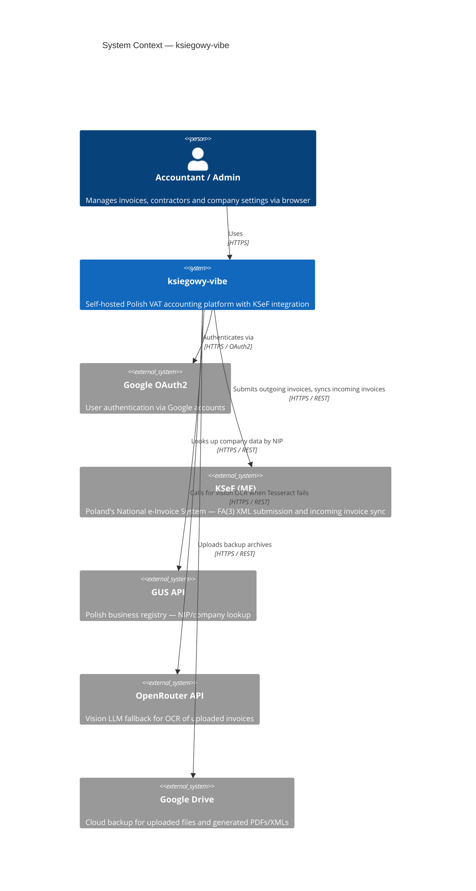
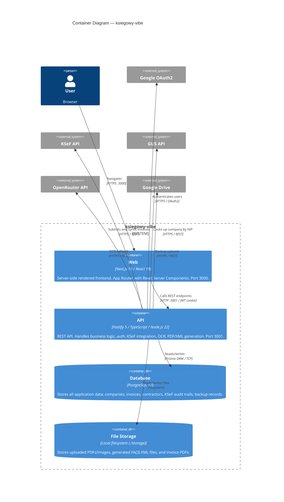
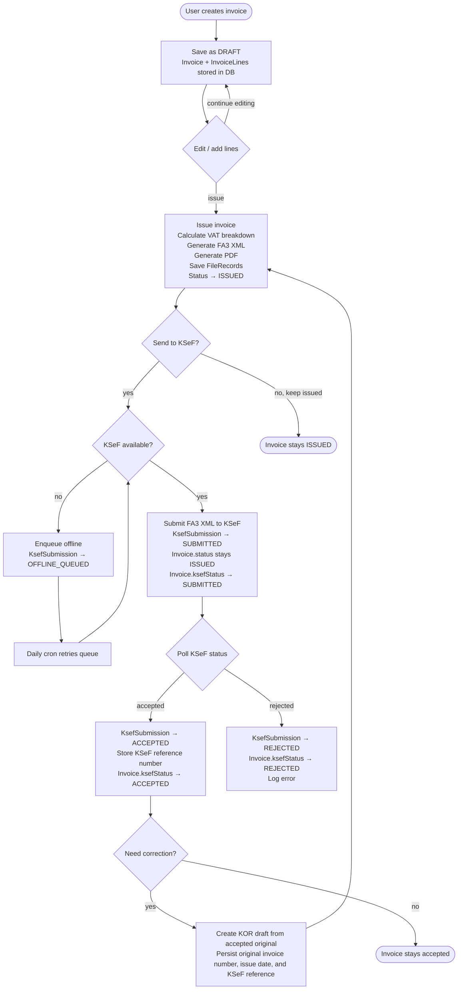
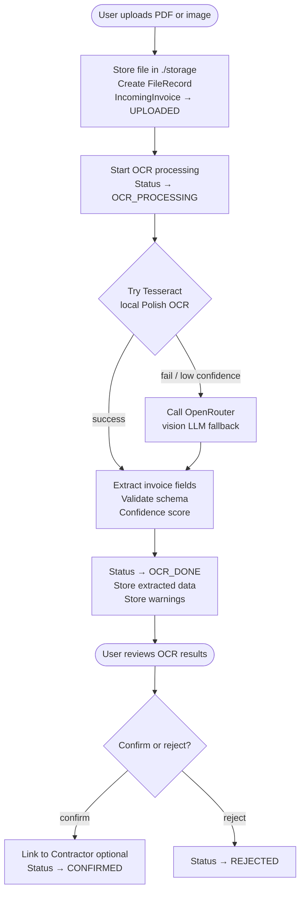
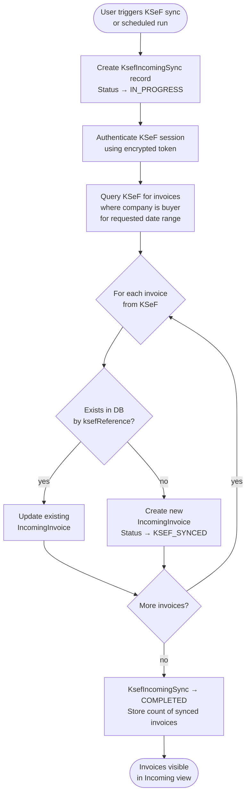
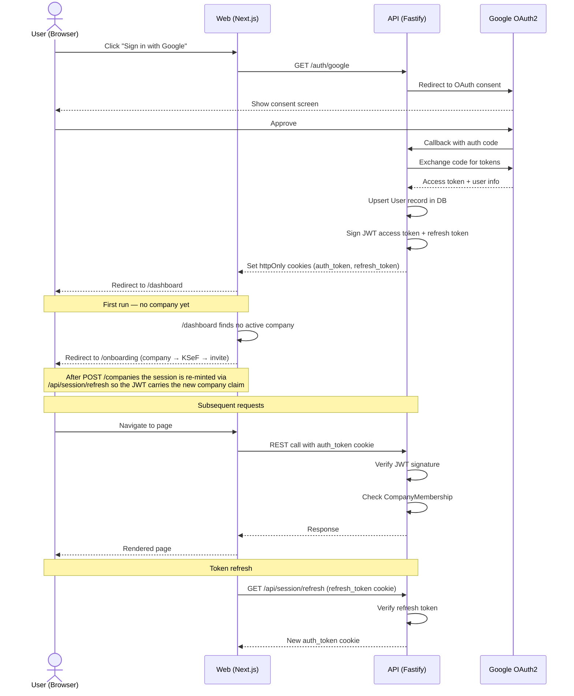
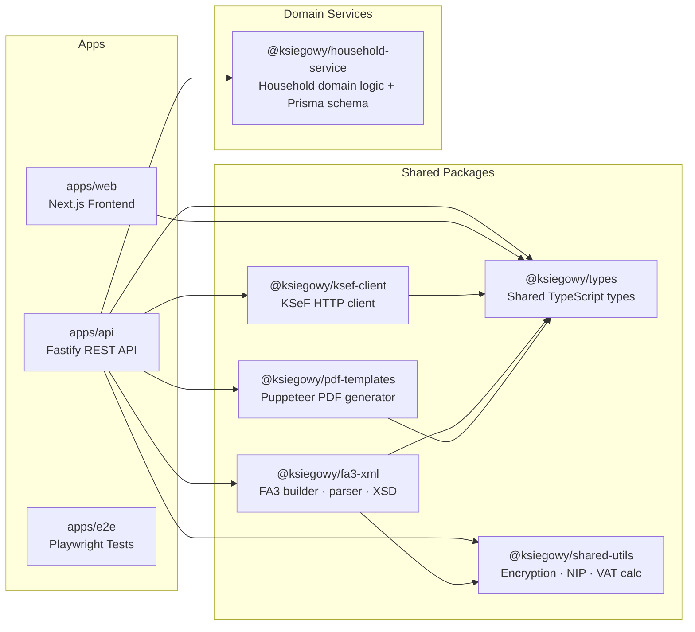
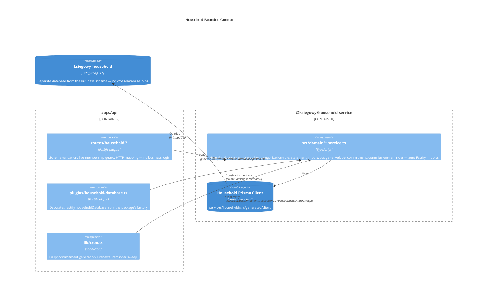

# Architecture

This document describes the architecture of `ksiegowy-vibe` using C4 model diagrams and key flow diagrams.

---

## C4 Level 1 — System Context

Shows how the system fits into the world and who/what interacts with it.

---

## C4 Level 2 — Containers

Shows the deployable units inside the system and how they communicate.

---

## C4 Level 3 — API Components

Zooms into the API container to show its internal building blocks.

```mermaid
C4Component
  title Component Diagram — API (Fastify)

  System_Boundary(api, "API — apps/api") {

    Boundary(routes, "Routes Layer") {
      Component(route_auth, "auth/google", "Fastify route", "Google OAuth2 login and callback")
      Component(route_companies, "companies", "Fastify route", "Company CRUD and KSeF settings")
      Component(route_company_backup_policy, "companies/backup-policy", "Fastify route", "Company ADMIN Google Drive backup policy and manual trigger")
      Component(route_company_backup_status, "companies/backup-status", "Fastify route", "Company ADMIN read-only backup status for settings")
      Component(route_invoices, "invoices/outgoing", "Fastify route", "Invoice lifecycle: create, issue, send to KSeF")
      Component(route_incoming, "invoices/incoming", "Fastify route", "Incoming invoice upload and OCR review")
      Component(route_contractors, "contractors", "Fastify route", "Contractor CRUD, turnover-annotated list, per-contractor financial summary")
      Component(route_contractor_rates, "contractor-service-rates.routes", "Fastify route", "Per-contractor service rate overrides")
      Component(route_members, "members", "Fastify route", "Company membership and roles")
      Component(route_reports, "reports", "Fastify route", "VAT register and CSV export")
      Component(route_ksef, "ksef", "Fastify route", "KSeF queue status and session management")
      Component(route_backup, "backup", "Fastify route", "Platform/ops backup endpoints (legacy provider routes)")
    }

    Boundary(services, "Service Layer") {
      Component(svc_invoice, "InvoiceService", "TypeScript class", "Invoice business logic: create, issue, VAT totals, PDF/XML generation")
      Component(svc_ksef, "KsefService", "TypeScript class", "KSeF session auth, outgoing submission, offline queue retry")
      Component(svc_ksef_incoming, "KsefIncomingService", "TypeScript class", "Sync incoming invoices from KSeF, upsert by ksefReference")
      Component(svc_ocr, "OcrProcessor", "TypeScript module", "Orchestrates Tesseract + OpenRouter OCR; validates extracted schema")
      Component(svc_backup, "BackupService", "TypeScript module", "Google Drive and iCloud providers + company backup policy scheduler")
      Component(svc_registry, "CompanyRegistryService", "TypeScript class", "GUS API NIP lookup")
      Component(svc_contractor_financials, "ContractorFinancialsService", "TypeScript module", "Turnover/outstanding aggregation per contractor, excluding FORMAL corrections")
    }

    Boundary(plugins, "Plugins") {
      Component(plugin_prisma, "PrismaPlugin", "Fastify plugin", "Provides Prisma client via fastify.prisma")
      Component(plugin_auth, "AuthPlugin", "Fastify plugin", "JWT verification and company membership check on decorated routes")
    }

    Boundary(packages, "Internal Packages") {
      Component(pkg_fa3, "@ksiegowy/fa3-xml", "TypeScript package", "Builds, parses and XSD-validates FA(3) XML invoices")
      Component(pkg_pdf, "@ksiegowy/pdf-templates", "TypeScript package", "Generates invoice PDFs via Puppeteer")
      Component(pkg_ksef_client, "@ksiegowy/ksef-client", "TypeScript package", "HTTP client for the KSeF REST API")
      Component(pkg_utils, "@ksiegowy/shared-utils", "TypeScript package", "Encryption, NIP validation, VAT calc, Polish number-to-words")
    }
  }

  ContainerDb(db, "PostgreSQL 17")
  ContainerDb(storage, "File Storage")
  System_Ext(ksef_ext, "KSeF API")
  System_Ext(openrouter_ext, "OpenRouter API")
  System_Ext(gdrive_ext, "Google Drive")

  Rel(route_invoices, svc_invoice, "Calls")
  Rel(route_invoices, svc_ksef, "Calls")
  Rel(route_incoming, svc_ocr, "Calls")
  Rel(route_incoming, svc_ksef_incoming, "Calls")
  Rel(route_backup, svc_backup, "Calls")
  Rel(route_company_backup_policy, svc_backup, "Calls")
  Rel(route_companies, svc_registry, "Calls")
  Rel(route_contractors, svc_contractor_financials, "Calls")

  Rel(svc_invoice, pkg_fa3, "Builds FA(3) XML")
  Rel(svc_invoice, pkg_pdf, "Generates PDF")
  Rel(svc_invoice, pkg_utils, "VAT calc, encryption")
  Rel(svc_ksef, pkg_ksef_client, "Submits invoices")
  Rel(svc_ksef_incoming, pkg_ksef_client, "Queries KSeF")

  Rel(svc_invoice, plugin_prisma, "DB queries")
  Rel(svc_ksef, plugin_prisma, "DB queries")
  Rel(svc_ocr, openrouter_ext, "Vision LLM fallback")
  Rel(svc_backup, gdrive_ext, "Uploads files")
  Rel(pkg_ksef_client, ksef_ext, "REST calls")
  Rel(svc_invoice, storage, "Writes PDF/XML")
```

---

## Contractor Financials

`GET /companies/:companyId/contractors` accepts `status` (`active` | `inactive` | `all`,
default `active`) and `year` (default current UTC year) querystring parameters. Each
contractor in the response now carries `turnover` (year-to-date gross, decimal string)
and `turnoverYear`. `GET /companies/:companyId/contractors/:id/summary` returns a
per-contractor card: year-scoped `turnover`/`paidThisYear`, an **all-time** `outstanding`
balance (a prior year's unpaid invoice is still owed this year, so it is never
year-scoped), and up to 3 `recentDocuments` (newest first, not year-scoped, so a
dormant contractor still shows its history).

Both are backed by `apps/api/src/services/contractor-financials.service.ts`. Every
aggregate query there filters `status: 'ISSUED'` and, critically, `NOT: { correctionMode:
'FORMAL' }`: a FORMAL correction stores a full positive duplicate of the original
invoice's totals (KSeF "formal correction" = same amounts, corrected metadata only), so
including it would roughly double the contractor's turnover. CANCELLATION corrections
store negative totals and stay included — they net the sum back down to the correct
figure. Money is handled exclusively via Prisma `Decimal` arithmetic (never
`parseFloat`/JS number math), and `outstanding` is clamped at zero to avoid showing a
misleading negative balance on overpayment.

The list endpoint stays at 2 queries (contractors + one `groupBy` for turnover); the
summary endpoint runs its 3 queries (year aggregate, all-time aggregate, recent
documents) in a single `Promise.all`.

The per-contractor service-rate CRUD (`/companies/:companyId/contractors/:id/service-rates`)
lives in its own route file, `contractor-service-rates.routes.ts`, split out from
`contractors.ts` to keep contractor identity/financials and rate-override management as
separate concerns.

---

## Flow Diagrams

### Outgoing Invoice Lifecycle

### Incoming Invoice — OCR Upload

### Incoming Invoice — KSeF Sync

### Authentication Flow

### Package Dependency Graph

---

## Household Bounded Context (Personal Mode)

Personal/household budgeting is a separate bounded context from company bookkeeping: its own Prisma schema and Postgres database (`ksiegowy_household`), owned end-to-end by the `@ksiegowy/household-service` package (`services/household/`). `apps/api` depends on it as a thin HTTP layer only — no household query logic exists inside `apps/api` itself, and no household service imports from the company/invoice/KSeF services or vice versa.

Key backend decisions (full detail in [`docs/household-mode.md`](./household-mode.md)):
- **No JWT `households` claim** — every household route does a live `HouseholdMembership` lookup instead, so a removed member loses access immediately rather than after the access-token TTL.
- **Private-account visibility** is enforced by one function, `visibleAccountIds()`, used by every list and aggregate query — a private account owned by someone else is omitted, never returned with a redacted balance.
- **Transfers** between accounts are two `HouseholdTransaction` rows sharing `transferGroupId` (not a `type` enum), so every income/expense/envelope aggregate stays a plain `SUM(amount)` with one `transferGroupId IS NULL` predicate.
- **Commitment-generation cron is idempotent** at the database level via `@@unique([commitmentId, date])` — a retry or double-run cannot double-charge a commitment.
