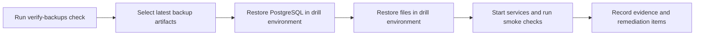

# Backup Restore Drill Procedure

This document defines a practical restore drill for current backup capabilities.

## Objective

- prove restore operators can recover PostgreSQL and file storage in non-production
- capture evidence and issues for follow-up

## Drill cadence

- minimum: quarterly
- recommended after major backup-flow changes

## Drill workflow



## Steps

1. Run freshness verification:

   ```bash
   docker compose --profile backup run --rm verify-backups
   ```

2. Restore PostgreSQL using [`docs/restore-postgresql.md`](./restore-postgresql.md).
3. Restore files using [`docs/restore-files.md`](./restore-files.md).
4. Run smoke checks:
   - API `/health` and `/ready`
   - login + company list
   - invoice list with file access
5. Record drill evidence.

## Evidence template

Capture and store as markdown in your ops workspace or incident system.

```md
# Backup Restore Drill Evidence

- Date:
- Operator:
- Environment:
- PostgreSQL artifact:
- File backup source:
- Verify-backups result:
- Restore start time:
- Restore end time:
- Total duration:
- Smoke checks passed (yes/no):
- Issues observed:
- Remediation tickets:
```

## Known limits in current slice

- Freshness check validates local PostgreSQL artifact age and `BackupRun` metadata only.
- It does not prove remote checksum integrity or full restoreability.
- Google Drive file backup restore may require manual file-to-path mapping.
- Option A still uses one shared PostgreSQL database, so drill restores of PostgreSQL always restore the whole shared database, not a company-scoped subset.
