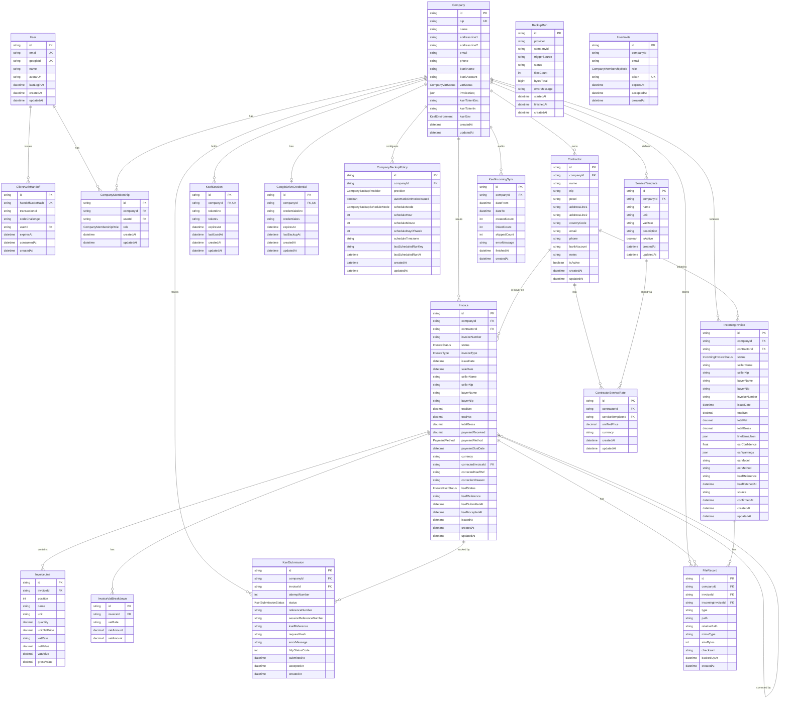
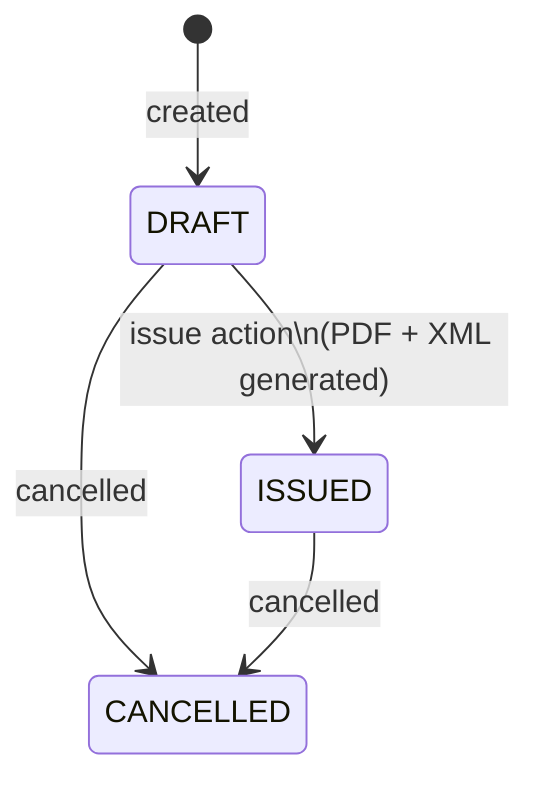
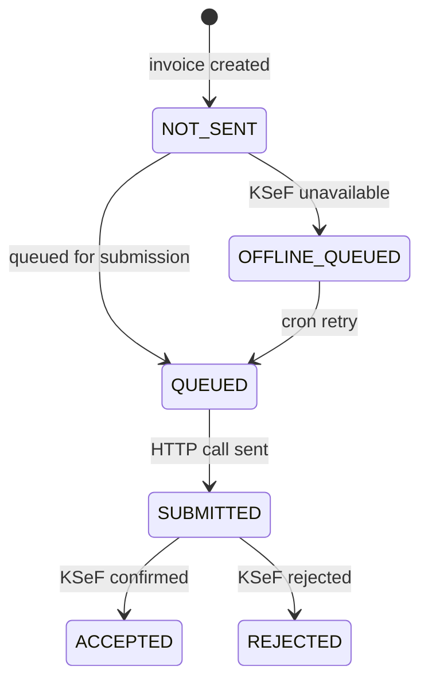
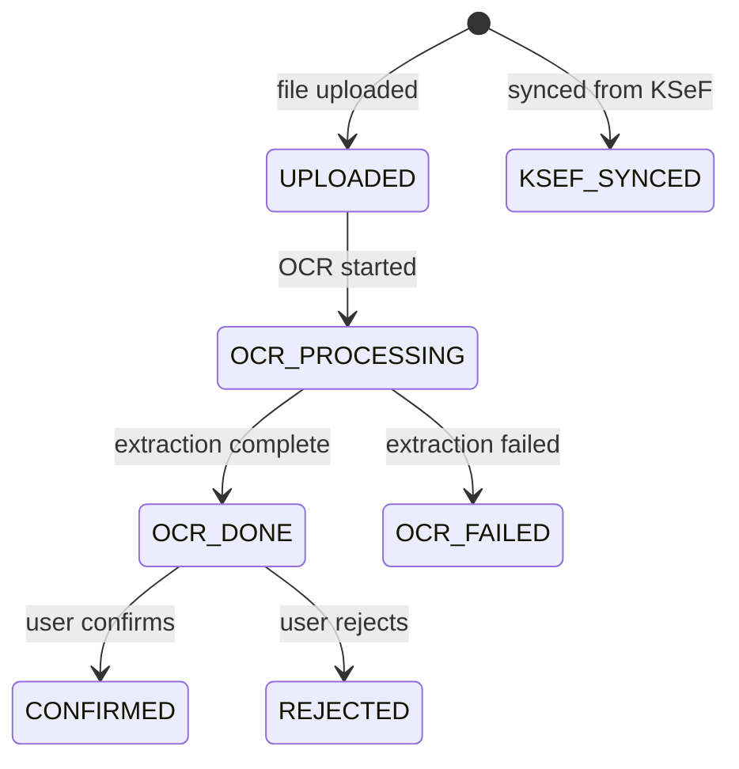

# Data Model

This document describes the database schema, entity relationships, enumerations, and key design decisions.

Schema source: [`apps/api/prisma/schema.prisma`](../apps/api/prisma/schema.prisma)  
Database: PostgreSQL 17, managed by Prisma 6.

---

## Entity Relationship Diagram

---

## Entities

### User

Represents an authenticated user. Authentication is via Google OAuth2 — `googleId` is the stable identifier from Google.

| Column | Type | Notes |
|--------|------|-------|
| `id` | `cuid` | Primary key |
| `email` | `string` | Unique, used as login identity |
| `googleId` | `string?` | Unique Google account identifier |
| `name` | `string?` | Display name from Google profile |
| `avatarUrl` | `string?` | Profile picture URL |
| `lastLoginAt` | `datetime?` | Updated on every successful login |

A user gains access to companies via `CompanyMembership` records — they have no direct relationship to company data.

---

### ClientAuthHandoff

Short-lived persisted auth handoff used by the desktop-compatible client exchange flow. The database stores only a SHA-256 hash of the one-time handoff code.

| Column | Type | Notes |
|--------|------|-------|
| `handoffCodeHash` | `string` | Unique SHA-256 hash of the raw handoff code |
| `transactionId` | `string` | Client-provided transaction binding |
| `codeChallenge` | `string` | PKCE-style challenge matched against the exchange verifier |
| `userId` | `string` | Authenticated user that completed Google login |
| `expiresAt` | `datetime` | Hard TTL for exchange |
| `consumedAt` | `datetime?` | Set once when the handoff is exchanged |
| `createdAt` | `datetime` | Persistence timestamp |

This model makes the auth handoff safe across API restarts and multi-instance deployments while preserving one-time semantics.

---

### Company

The central tenant entity. All application data is scoped to a company.

| Column | Type | Notes |
|--------|------|-------|
| `nip` | `string` | Unique Polish VAT number |
| `vatStatus` | enum | `ACTIVE` / `EXEMPT` / `NO_VAT` |
| `invoiceSeq` | `json` | Invoice number sequence counters per year/series, e.g. `{"2025": 42}` |
| `ksefTokenEnc` | `string?` | AES-256-GCM encrypted KSeF API token |
| `ksefTokenIv` | `string?` | Encryption IV for `ksefTokenEnc` |
| `ksefEnv` | enum | `TEST` or `PRODUCTION` — controls which KSeF endpoint is called |

---

### CompanyMembership

Join table between `User` and `Company`. Enforces role-based access control at the API layer.

| Column | Type | Notes |
|--------|------|-------|
| `role` | enum | `ADMIN` / `ACCOUNTANT` / `VIEWER` |
| `(companyId, userId)` | unique | A user can only have one role per company |

| Role | Access |
|------|--------|
| `ADMIN` | Full access — company settings, members, invoices, contractors |
| `ACCOUNTANT` | Create and manage invoices, contractors, reports |
| `VIEWER` | Read-only |

---

### Contractor

Buyer or seller in the company's trade network. Scoped to a company; NIP is unique per company.

| Column | Type | Notes |
|--------|------|-------|
| `nip` | `string?` | Polish VAT number; unique within the company |
| `pesel` | `string?` | National ID for natural persons |
| `countryCode` | `string` | Default `"PL"` |
| `isActive` | `bool` | Soft delete flag |
| `(companyId, nip)` | unique | Prevents duplicate NIP per company |

---

### Invoice

Outgoing invoice with a document lifecycle kept separate from the KSeF submission lifecycle. All monetary fields use `Decimal(15, 2)` for precision.

#### Status lifecycle

#### KSeF status lifecycle

#### Key columns

| Column | Type | Notes |
|--------|------|-------|
| `invoiceNumber` | `string?` | Set on issue; unique per company |
| `invoiceType` | enum | `VAT` standard, `KOR` correction, `ZAL` advance, `ROZ` settlement, `UPR` simplified |
| `totalNet/Vat/Gross` | `Decimal(15,2)` | Aggregated from lines at issue time |
| `correctedInvoiceId` | `string?` | Self-referencing FK — points to the original invoice for `KOR` type |
| `correctedKsefRef` | `string?` | KSeF reference of the original (required by FA(3) spec) |
| `ksefReference` | `string?` | KSeF-assigned reference number after acceptance |

---

### InvoiceLine

One line item on an invoice. `position` determines display order and is unique per invoice.

| Column | Type | Notes |
|--------|------|-------|
| `quantity` | `Decimal(15, 4)` | Supports fractional quantities |
| `unitNetPrice` | `Decimal(15, 4)` | Higher precision for unit pricing |
| `vatRate` | `string` | `"23"`, `"8"`, `"5"`, `"0"`, `"ZW"` (exempt), `"NP"` (not subject) |
| `netValue/vatValue/grossValue` | `Decimal(15, 2)` | Pre-calculated and stored for FA(3) XML compliance |
| `(invoiceId, position)` | unique | Enforces ordering uniqueness per invoice |

---

### InvoiceVatBreakdown

Aggregated VAT totals per rate for an invoice. Used directly in the FA(3) XML `P_` fields and in PDF rendering.

| Column | Type | Notes |
|--------|------|-------|
| `vatRate` | `string` | Same values as `InvoiceLine.vatRate` |
| `netAmount/vatAmount` | `Decimal(15, 2)` | Sum of all lines with this rate |
| `(invoiceId, vatRate)` | unique | One row per rate per invoice |

---

### KsefSubmission

Audit trail for every KSeF submission attempt. Supports retry tracking via `attemptNumber`.

| Column | Type | Notes |
|--------|------|-------|
| `attemptNumber` | `int` | Increments on each retry; `(invoiceId, attemptNumber)` is unique |
| `status` | enum | `PENDING` → `SUBMITTED` → `ACCEPTED` / `REJECTED` / `ERROR` |
| `referenceNumber` | `string?` | Invoice reference within the KSeF session (v2 API) |
| `sessionReferenceNumber` | `string?` | KSeF online session reference (v2 API) |
| `ksefReference` | `string?` | Final KSeF identifier after acceptance |
| `requestHash` | `string?` | SHA hash of the submitted XML for deduplication |
| `responseBody` | `string?` | Raw KSeF API response stored for debugging |

---

### KsefSession

Cached KSeF API session token per company. One active session at a time (`companyId` is unique).

| Column | Type | Notes |
|--------|------|-------|
| `tokenEnc/tokenIv` | `string` | AES-256-GCM encrypted session token |
| `expiresAt` | `datetime` | Session expiry — API checks this before reuse |
| `lastUsedAt` | `datetime?` | Updated on each use for session health monitoring |

---

### FileRecord

Tracks every file stored on disk, linking it to invoices or incoming invoices. Used by the backup system.

| Column | Type | Notes |
|--------|------|-------|
| `type` | `string` | `outgoing_pdf`, `outgoing_xml`, `incoming_scan` |
| `path` | `string` | Absolute filesystem path |
| `relativePath` | `string` | Relative to `STORAGE_BASE_PATH` — portable across deployments |
| `checksum` | `string?` | SHA-256 for integrity verification during backup |
| `backedUpAt` | `datetime?` | Generic file-backup marker used by platform-managed providers (company Google Drive policy tracks incremental scope via `GoogleDriveCredential.lastBackupAt`) |

---

### IncomingInvoice

Incoming invoice received either via OCR upload or KSeF sync.

#### Status lifecycle

#### Key columns

| Column | Type | Notes |
|--------|------|-------|
| `source` | `string` | `"upload"` (OCR) or `"ksef"` (synced) |
| `lineItemsJson` | `json?` | Raw extracted line items from OCR |
| `ocrConfidence` | `float?` | 0–1 confidence score from OCR engine |
| `ocrWarnings` | `json?` | Array of field-level warnings from extraction |
| `ocrModel` | `string?` | Model identifier used (e.g. `"tesseract"`, `"openrouter/..."`) |
| `ocrMethod` | `string?` | `"tesseract"` or `"openrouter"` |
| `ksefReference` | `string?` | KSeF reference — used to deduplicate during sync |
| `ksefFetchedAt` | `datetime?` | When this record was last synced from KSeF |

---

### GoogleDriveCredential

Stores Google Drive OAuth2 credentials for backup, encrypted at rest. One record per company.

| Column | Type | Notes |
|--------|------|-------|
| `credentialsEnc/credentialsIv` | `string` | AES-256-GCM encrypted JSON `{access_token, refresh_token, expiry_date}` |
| `expiresAt` | `datetime` | OAuth2 token expiry — API refreshes before use |
| `lastBackupAt` | `datetime?` | Timestamp of last successful backup for this company |

---

### BackupRun

Audit log for each backup job execution. Not scoped to a single company — one row per run per provider.

| Column | Type | Notes |
|--------|------|-------|
| `provider` | `string` | `"gdrive"` or `"icloud"` |
| `companyId` | `string?` | `null` for platform-scoped runs, populated for company-scoped Google Drive runs |
| `triggerSource` | `string?` | Source of run trigger (`platform_schedule`, `manual_admin`, `manual_platform`, `invoice_issued`, `policy_schedule`) |
| `status` | `string` | `"success"` or `"error"` |
| `filesCount` | `int` | Number of files processed |
| `bytesTotal` | `bigint` | Total bytes uploaded in this run |

---

### CompanyBackupPolicy

Company-scoped policy for Google Drive backup behavior controlled by company admins.

| Column | Type | Notes |
|--------|------|-------|
| `provider` | `enum` | Currently only `GOOGLE_DRIVE` |
| `automaticOnInvoiceIssued` | `boolean` | Runs company Google Drive backup after issued invoice files are persisted |
| `scheduleMode` | `enum` | `MANUAL`, `DAILY`, `WEEKLY` |
| `scheduleHour` | `int?` | Local hour (`0-23`) for `DAILY`/`WEEKLY` |
| `scheduleMinute` | `int?` | Local minute (`0-59`) for `DAILY`/`WEEKLY` |
| `scheduleDayOfWeek` | `int?` | Weekly day (`1=Monday ... 7=Sunday`) for `WEEKLY` |
| `scheduleTimezone` | `string` | IANA timezone used for schedule evaluation (default `Europe/Warsaw`) |
| `lastScheduledRunKey` | `string?` | Deduplication key used by scheduled one-shot job per schedule slot |
| `lastScheduledRunAt` | `datetime?` | Last schedule slot execution timestamp |

---

### UserInvite

One-time invitation token for adding a new member to a company.

| Column | Type | Notes |
|--------|------|-------|
| `token` | `string` | Unique random token sent in invitation email |
| `expiresAt` | `datetime` | Token expiry |
| `acceptedAt` | `datetime?` | Set when the invitee accepts; null = pending |

---

### ServiceTemplate

Reusable service/product definitions shared across a company's invoices. Serves as a catalog for invoice line items.

| Column | Type | Notes |
|--------|------|-------|
| `vatRate` | `string` | Default VAT rate for this service |
| `unit` | `string` | Default unit, e.g. `"szt."`, `"godz."` |
| `isActive` | `bool` | Soft delete; inactive templates excluded from selectors |

---

### ContractorServiceRate

Contractor-specific pricing for a service template. Allows different prices for different clients.

| Column | Type | Notes |
|--------|------|-------|
| `unitNetPrice` | `Decimal(15, 4)` | Net price per unit for this contractor |
| `(contractorId, serviceTemplateId)` | unique | One rate per service per contractor |

---

### KsefIncomingSync

Audit trail for KSeF incoming invoice sync runs.

| Column | Type | Notes |
|--------|------|-------|
| `dateFrom/dateTo` | `datetime` | The query window sent to KSeF |
| `createdCount` | `int` | New `IncomingInvoice` records created |
| `linkedCount` | `int` | Existing upload records linked to KSeF references |
| `skippedCount` | `int` | Duplicates skipped |
| `errorMessage` | `string?` | Set if the sync failed partway through |
| `finishedAt` | `datetime?` | Null while in progress |

---

## Enumerations

### `CompanyVatStatus`
| Value | Meaning |
|-------|---------|
| `ACTIVE` | Company is an active VAT payer |
| `EXEMPT` | VAT-exempt (e.g. below threshold) |
| `NO_VAT` | Not a VAT entity |

### `KsefEnvironment`
| Value | Meaning |
|-------|---------|
| `TEST` | KSeF test environment (`ap-test.ksef.mf.gov.pl`) |
| `PRODUCTION` | KSeF production environment |

### `CompanyMembershipRole`
| Value | Meaning |
|-------|---------|
| `ADMIN` | Full access including settings and member management |
| `ACCOUNTANT` | Create/edit invoices, contractors, reports |
| `VIEWER` | Read-only access |

### `InvoiceStatus`
| Value | Meaning |
|-------|---------|
| `DRAFT` | Work in progress, not yet issued |
| `ISSUED` | PDF and FA(3) XML generated; KSeF progress is tracked separately in `ksefStatus` |
| `CANCELLED` | Manually cancelled |

### `InvoiceType`
| Value | FA(3) code | Meaning |
|-------|-----------|---------|
| `VAT` | FA | Standard VAT invoice |
| `KOR` | KOR | Correction invoice |
| `ZAL` | ZAL | Advance invoice |
| `ROZ` | ROZ | Settlement invoice |
| `UPR` | UPR | Simplified invoice |

### `PaymentMethod`
| Value | Meaning |
|-------|---------|
| `BANK_TRANSFER` | Standard bank transfer |
| `CASH` | Cash payment |
| `CARD` | Card payment |
| `OTHER` | Other method |

### `InvoiceKsefStatus`
| Value | Meaning |
|-------|---------|
| `NOT_SENT` | Invoice not submitted to KSeF yet |
| `QUEUED` | Queued internally for submission |
| `SUBMITTED` | HTTP request sent, awaiting response |
| `ACCEPTED` | KSeF returned acceptance |
| `REJECTED` | KSeF returned rejection |
| `OFFLINE_QUEUED` | KSeF was unavailable; will retry via cron |

### `KsefSubmissionStatus`
| Value | Meaning |
|-------|---------|
| `PENDING` | Submission record created, not yet sent |
| `SUBMITTED` | HTTP request completed |
| `ACCEPTED` | KSeF confirmed acceptance |
| `REJECTED` | KSeF rejected the invoice |
| `ERROR` | Network/server error during submission |

### `IncomingInvoiceStatus`
| Value | Meaning |
|-------|---------|
| `UPLOADED` | File stored, OCR not started |
| `OCR_PROCESSING` | OCR job running |
| `OCR_DONE` | Extraction complete, awaiting user review |
| `OCR_FAILED` | OCR could not extract data |
| `CONFIRMED` | User confirmed the extracted data |
| `REJECTED` | User rejected the invoice |
| `KSEF_SYNCED` | Created via KSeF sync, no OCR |

### `CompanyBackupProvider`
| Value | Meaning |
|-------|---------|
| `GOOGLE_DRIVE` | Company policy currently supports Google Drive only |

### `CompanyBackupScheduleMode`
| Value | Meaning |
|-------|---------|
| `MANUAL` | No automatic schedule (manual + invoice-issued trigger only) |
| `DAILY` | Backup executes once per day at configured local time |
| `WEEKLY` | Backup executes once per week at configured local day/time |

---

## Design Notes

### Multi-tenancy
Every entity is scoped to a `Company` via a `companyId` foreign key. The API enforces isolation by verifying `CompanyMembership` on every company-scoped route before executing any query.

### Encryption at rest
Sensitive credentials are never stored in plaintext:
- **KSeF API token** — `Company.ksefTokenEnc` + `Company.ksefTokenIv`
- **KSeF session token** — `KsefSession.tokenEnc` + `KsefSession.tokenIv`
- **Google Drive credentials** — `GoogleDriveCredential.credentialsEnc` + `GoogleDriveCredential.credentialsIv`

All use AES-256-GCM via `@ksiegowy/shared-utils`. The key is supplied via the `ENCRYPTION_KEY` environment variable.

### Decimal precision
All monetary values use `Decimal(15, 2)` (except unit prices which use `Decimal(15, 4)` for precision before rounding). This matches the FA(3) XML specification requirements for Polish VAT invoices.

### Cascade deletes
Most child records cascade delete when the parent company is deleted. Exceptions:
- `Invoice.contractorId` → `SetNull` (invoices survive contractor deletion)
- `FileRecord.invoiceId` → `SetNull` (file records survive invoice deletion for backup integrity)
- `IncomingInvoice.contractorId` → `SetNull`

### Invoice corrections
A `KOR` (correction) invoice self-references the original via `correctedInvoiceId`. The `corrections` relation allows querying all corrections for an invoice. `correctedKsefRef` is stored separately because corrections submitted to KSeF must reference the original KSeF number, not the internal database ID.

### Invoice number sequencing
`Company.invoiceSeq` is a JSON object keyed by year (and optionally series prefix), e.g. `{"2025": 42, "2025/KOR": 3}`. The API increments the counter atomically when issuing an invoice.
