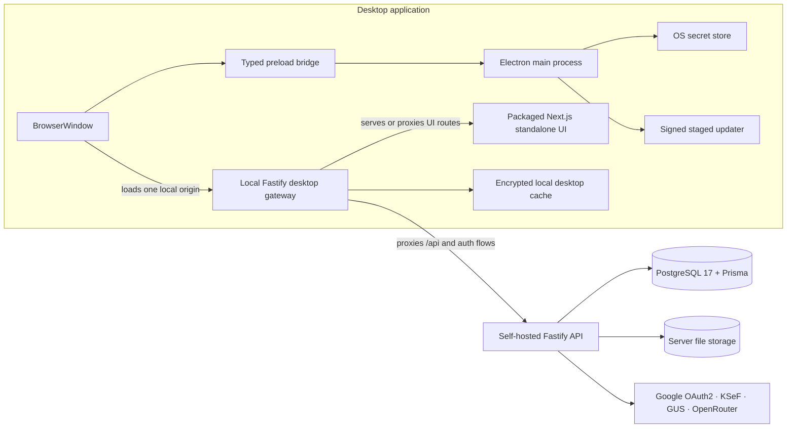

# Desktop Architecture

This document describes the target architecture for adding a cross-platform desktop application to `ksiegowy-vibe` using Electron.

---

## Status

- Overall: `accepted target direction`
- Delivery approach: `phased`
- Current implemented slice: `localhost gateway bootstrap + initial auth/api proxying + desktop-safe OAuth handoff` — Electron starts a localhost-only Fastify gateway with a health endpoint, proxies `/auth/*` and `/_desktop/api/*` to the configured API origin, reverse-proxies UI traffic to a local web runtime URL, and completes Google OAuth through a custom-protocol redirect plus short-lived one-time handoff exchange

---

## Context

`ksiegowy-vibe` is currently a self-hosted web platform built as a `pnpm` workspace monorepo.

- `apps/web` provides the Next.js 15 App Router frontend
- `apps/api` provides the Fastify 5 + TypeScript API
- PostgreSQL 17 + Prisma back the main business data model
- local filesystem storage is used for uploaded and generated files
- Google OAuth2, JWT cookies, Puppeteer, and Tesseract are already part of the platform runtime

The product needs a cross-platform desktop application without creating a second product architecture, duplicating business rules, or weakening the current security posture.

The current repository is web-first and Docker-first. Desktop support therefore needs to preserve the existing frontend and backend contracts while introducing a desktop shell, secure OS integrations, and signed desktop release flow.

---

## Decision

Adopt an Electron-based desktop architecture with these rules:

1. **Electron remains a thin shell**
   - A new `apps/desktop` workspace owns Electron main, preload, packaging, updates, and desktop-only orchestration.
   - Business logic stays in the existing web and API stack.

2. **The renderer loads a single localhost origin**
   - `BrowserWindow` must load only one local origin, for example `http://127.0.0.1:<port>`.
   - The renderer must not load arbitrary remote origins.

3. **Desktop uses a local Fastify gateway**
   - A lightweight local Fastify desktop gateway runs inside the desktop application.
   - It serves or reverse-proxies the packaged Next.js standalone UI.
   - It proxies business API traffic to the existing self-hosted API in the initial delivery.

4. **Next.js stays the only UI runtime**
   - `apps/web` remains the product UI.
   - Desktop uses the packaged standalone output rather than introducing a second renderer stack.

5. **Preload stays narrow and typed**
   - Preload exposes only explicitly approved desktop capabilities.
   - No raw Node.js access, generic IPC bridge, or unscoped file system access is allowed.

6. **Security defaults stay strict**
   - `sandbox: true`
   - `contextIsolation: true`
   - `nodeIntegration: false`
   - strict navigation, window-open, download, and permission allowlists

7. **Secrets and sensitive desktop data are protected locally**
   - refresh tokens and encryption key material must live in the OS secret store
   - sensitive local cached data must be encrypted at rest

8. **Desktop releases use signed staged updates**
   - packaging: `electron-builder`
   - updates: `electron-updater`
   - release channels: staged and signed

9. **Desktop starts online-first**
   - the existing self-hosted API remains the system of record in the first implementation
   - selective local-first behavior may be added later for bounded workflows such as file staging, OCR queueing, or encrypted drafts

---

## Rationale

- **Lowest migration risk**: preserves the current API, database, and business logic model instead of trying to package the whole backend stack locally from day one.
- **Maximum frontend reuse**: the desktop app renders the same Next.js application rather than a second UI implementation.
- **Cleaner trust boundary**: Electron main and preload stay small, while the renderer remains isolated and unprivileged.
- **Operationally reversible**: the desktop shell can ship before any future decision to move bounded workflows local.
- **Better release discipline**: signing, notarization, staged updates, and desktop runbooks can be introduced without redesigning the accounting domain.

---

## Consequences

### Positive

- high reuse of existing `apps/web` and `apps/api`
- single UI codebase across browser and desktop
- one clear desktop trust boundary
- no immediate requirement to package PostgreSQL locally
- easier incremental rollout for macOS and Windows

### Negative

- desktop depends on the existing deployed API in the first delivery
- auth flow and cookie behavior must be adapted carefully for the localhost desktop origin
- packaging and release operations become more complex than the current web-only flow
- some desktop expectations such as offline-first work must be deferred or kept deliberately narrow

---

## Target Architecture

---

## Security Constraints

- keep the renderer untrusted and isolated
- expose only task-specific preload APIs through typed contracts
- never store secrets in renderer storage or plain files
- restrict navigation to the single local origin plus explicit external allowlists
- use the system browser for Google OAuth2 rather than embedded sign-in pages
- keep file system access scoped to explicit user-approved operations
- sign installers and update artifacts for every supported desktop platform

---

## Runtime And Deployment Model

### Development

- run `apps/desktop` locally alongside the existing web/API development flow
- desktop main starts the local gateway and points the renderer at one localhost origin
- local gateway may proxy UI requests to the web dev server during development
- business API calls continue to target the existing API runtime
- current minimal gateway contract:
  - `GET /_desktop/health` returns local gateway health and upstream origins
  - `/auth/*` is proxied to `DESKTOP_API_URL` or `API_URL` fallback
  - `/_desktop/api/*` is proxied to `DESKTOP_API_URL` with the prefix stripped before forwarding
  - all other UI requests are proxied to `DESKTOP_WEB_RUNTIME_URL`
  - browser-side desktop requests use same-origin prefixes while server-side Next requests may still call `API_URL` directly
  - desktop Google sign-in starts from the renderer through a preload-triggered system-browser handoff
  - API callback redirects to `DESKTOP_AUTH_CALLBACK_URL` with a short-lived one-time handoff code and transaction id
  - desktop completes session establishment through `POST /auth/desktop/exchange`

Current first-slice limitation:

- desktop OAuth handoff records are stored in API process memory, so this implementation assumes a single API process until handoff storage is moved to shared persistence

### Production

- build `apps/web` as standalone output
- package Electron main, preload, local gateway, and standalone web assets together
- configure the desktop app to connect to a user-selected or centrally-configured self-hosted API base URL
- store desktop secrets under the OS secret store and desktop data under OS app-data paths
- publish signed staged releases through `electron-builder` and `electron-updater`

---

## Open Issues

- exact desktop OAuth callback shape: localhost callback, custom protocol, or both
- cookie, CSRF, and session policy for the localhost desktop origin
- desktop configuration model for self-hosted API endpoint discovery and validation
- which bounded workflows, if any, justify later local-first or local sidecar support

---

## Non-Goals

- packaging PostgreSQL inside the initial desktop release
- moving the full business API and data model to an offline local runtime in the first increment
- rebuilding the UI in native desktop widgets
- enabling broad Node.js or OS access inside the renderer
- supporting arbitrary multi-window or plugin-style desktop extensibility in the first release
