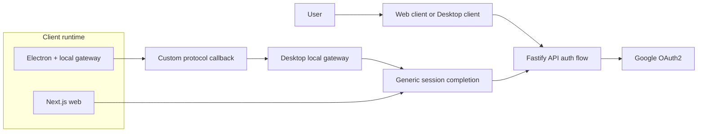
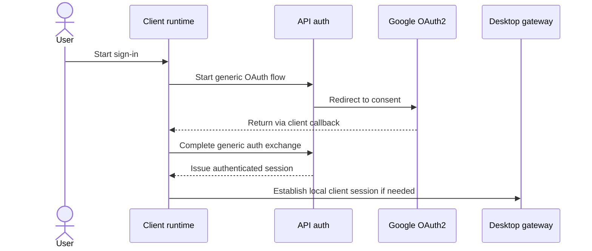

# ADR: Refactor desktop auth coupling into a client-agnostic auth flow

## Status

Proposed

## Implementation note

The first API decoupling slice is now in place:

- `apps/api` exposes `POST /auth/client/exchange` as the primary exchange contract
- `apps/api/src/routes/auth/google.ts` now delegates session logic and client handoff logic to dedicated modules
- client auth handoff records now persist in PostgreSQL via Prisma instead of API process memory
- only hashed handoff codes are stored
- TTL and single-use consumption are enforced at the database-backed exchange boundary
- the legacy `/auth/desktop/exchange` route has been removed

## Problem statement

The current authentication implementation works, but `apps/api` contains desktop-specific flow knowledge. This makes the API harder to evolve, couples one client type to shared auth behavior, and creates avoidable constraints for future clients and deployment topologies.

## Current-state evidence

The current desktop flow is implemented across shared auth routes and desktop-specific runtime code:

- `apps/api/src/routes/auth/google.ts`
  - depends on `DESKTOP_AUTH_CALLBACK_URL`
  - accepts generic `clientTransactionId` and `clientCodeChallenge` on `GET /auth/google`
  - stores client handoff state in PostgreSQL through Prisma
  - exposes `POST /auth/client/exchange`
- `apps/desktop/src/main.ts`
  - generates client transaction state for the desktop runtime
  - generates PKCE-style verifier/challenge
  - handles custom-protocol callback and handoff completion
- `apps/web/src/app/auth/desktop/callback/page.tsx`
  - finalizes sign-in through `/auth/client/exchange`
- `apps/desktop/src/desktop-gateway.ts`
  - proxies `/auth/client/exchange`

This means the API currently knows about one concrete client implementation instead of exposing a generic auth contract.

## Decision

Refactor auth so that `apps/api` exposes a generic, client-agnostic authentication flow and stops modeling desktop as a special case.

The API should own:
- core identity verification
- session issuance and refresh
- generic OAuth state and one-time authorization exchange primitives

The desktop app should own:
- custom protocol handling
- local gateway cookie establishment
- any client-local PKCE or handoff mechanics

Desktop-specific naming, route shapes, and environment variables should be removed from shared API auth contracts.

## Options considered

### 1. Keep the current desktop-specific coupling
- **Pros:** no refactor, lowest short-term cost
- **Cons:** shared auth stays polluted by client-specific concerns; harder to add new clients or scale API topology

### 2. Move all auth complexity into desktop only
- **Pros:** API stays simpler
- **Cons:** risks duplicating security-sensitive behavior outside the core auth boundary; weakens consistency across clients

### 3. Introduce a generic client-agnostic auth flow
- **Pros:** clean separation of responsibilities, reusable across web, desktop, and future clients, easier testing and scaling
- **Cons:** requires coordinated refactor across `apps/api`, `apps/desktop`, and web callback flow

## Recommended target architecture

Adopt option 3.

Target rules:

1. `apps/api` exposes generic auth endpoints and session semantics, not desktop-specific ones.
2. Client-specific transport concerns stay in the client runtime:
   - browser redirects in web
   - custom protocol deep link in desktop
   - localhost cookie bridging in desktop gateway
3. Any temporary auth artifact stored by the API must be generic and safe for multi-instance deployment.
4. Shared auth naming must reflect capability, not client type.

Example target contract direction:
- replace desktop-specific start parameters with generic OAuth client context
- use `/auth/client/exchange` as the generic one-time auth completion endpoint
- move desktop callback URL handling out of shared API env assumptions where possible

## Consequences

### Positive

- cleaner API boundaries
- easier future support for additional clients
- reduced auth route specialization
- better alignment with KISS, SOLID, and low coupling
- easier move from in-memory handoff state to shared persistence

### Negative

- requires cross-app refactor
- temporary migration complexity while old and new flows coexist
- desktop and web callback handling must be revalidated end-to-end

## Non-goals

- changing identity provider from Google OAuth2
- redesigning JWT or session policy beyond what is needed for decoupling
- introducing offline-first desktop auth
- rebuilding the desktop gateway architecture
- changing business-domain authorization rules

## Migration notes

- introduce the generic auth completion flow first
- move in-memory handoff and state storage to shared persistence or signed stateless artifacts before relying on multi-instance API deployment
- update desktop runtime and web callback code to use generic naming
- remove:
  - `DESKTOP_AUTH_CALLBACK_URL` from shared API assumptions
  - remaining desktop-prefixed API field names
- update `README.md`, `docs/desktop-architecture.md`, and auth-related specs after implementation
