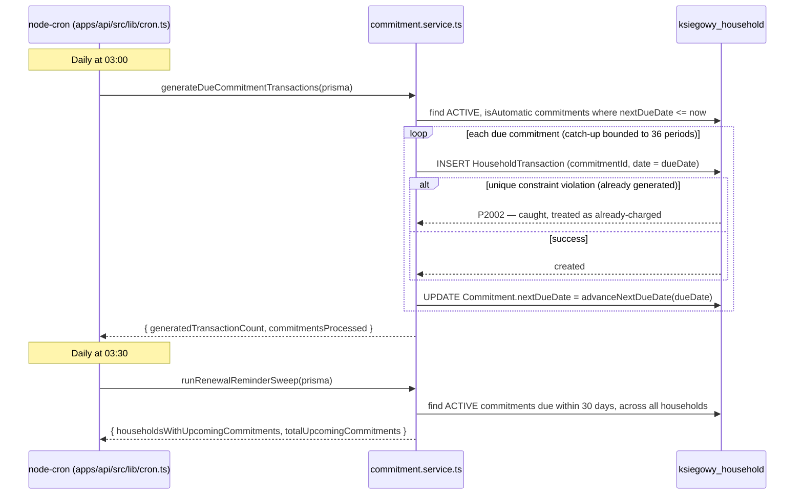

# Household Mode (Personal Budgeting) — Backend Spec

Phase 1 backend for the household/personal-budgeting bounded context: household tenancy, the ledger, budget envelopes, and commitments (insurance/loans/subscriptions/utilities). This document covers the backend only — see the implementation plan for the frontend route tree and mode-switch chrome.

## Package boundary

- **`services/household/`** (`@ksiegowy/household-service`) owns the household Prisma schema, its own migrations, its own generated Prisma client (`src/generated/client`, gitignored, regenerated by `pnpm --filter @ksiegowy/household-service build`), and every domain/service class under `src/domain/*.service.ts`. Zero Fastify imports — pure TypeScript taking a Prisma client + validated input, returning domain results or throwing plain `Error`s.
- **`apps/api`** depends on the package (`workspace:*`) and is the only thing that talks Fastify: `apps/api/src/routes/household/*.routes.ts` are thin controllers — schema validation, membership guard, one call into the package, HTTP mapping. No household query logic exists inside `apps/api`.
- **`apps/api/src/plugins/household-database.ts`** constructs the household Prisma client via the package's `createHouseholdDatabase(url)` factory and decorates `fastify.householdDatabase`, mirroring `plugins/prisma.ts`'s exact shape (client-injection option for tests, `$connect`/`$disconnect` only when the plugin owns the client).

## Auth: no JWT `households` claim

Every household route calls `requireHouseholdMembership()` (`apps/api/src/routes/household/household-membership-guard.ts`), which does a **live** lookup against `fastify.householdDatabase`'s `HouseholdMembership` unique index (`householdId_userId`) — not a JWT claim. A removed household member loses access immediately; a `companies` JWT claim would have let them keep private-account visibility for up to the access-token TTL (15 minutes).

The same guard call also fires a fire-and-forget `refreshMembershipIdentitySnapshot()` so the caller's own `userEmail`/`displayName` on their membership row stays current without a cross-database sync mechanism.

`GET /auth/me` (`apps/api/src/routes/auth/google.ts`) does its own live `listHouseholdsForUser()` query and returns `households: [{ id, role, name }]` alongside the existing `companies` array — `name` is included directly so the frontend session loader doesn't need a second round trip (the `companies` claim has no name, which is why `loadAuthSession` today makes two sequential calls; household should not repeat that).

## Private-account visibility

`visibleAccountIds(prisma, householdId, userId)` in `household-account.service.ts` is the **only** place any query builds an account-visibility filter (`SHARED` accounts, plus `PRIVATE` accounts owned by the caller). Every list and every aggregate — the accounts endpoint, transaction listing, envelope spend, the dashboard aggregate, the 6-month chart — sources its `accountId IN (...)` clause from this one function. A private account owned by someone else is **omitted** from the results entirely, never returned with a redacted/null balance.

## Ledger: transfers

`HouseholdTransaction.amount` is signed (positive = money in, negative = money out) — there's no separate direction enum. A transfer between two accounts is two rows sharing one `transferGroupId` (negative on the source account, positive on the destination), created together by `createTransfer()` in `household-transaction.service.ts`. Every income/expense/envelope/report query adds `transferGroupId IS NULL` to exclude transfers from spend and income totals — moving money into a savings account is never double-counted as an expense and an income.

Deleting one leg of a transfer (`deleteTransaction()`) deletes both linked rows, so a transfer can never be left unbalanced.

## Categorization rules

`categorization-rule.service.ts`'s `matchCategoryForPayee()` resolves a payee to a category with this precedence:

1. An **exact** match always wins over any substring match.
2. Among substring matches, the **longest pattern** wins.
3. Ties are broken by the **most recently created** rule.

Rules are **never** auto-created on a recategorization — `recategorizeTransaction()` only creates a rule when the caller explicitly opts in (`applyToFutureFromPayee: true`), matching the "also apply to future transactions from this payee" checkbox on the recategorize action. Automatically upserting a rule on every correction would silently redirect all future purchases from a payee the moment a user recategorized one transaction.

New transactions (`createTransaction()`) and confirmed statement-import rows (`confirmStatementImport()`) both call `matchCategoryForPayee()` when no explicit `categoryId` is given, tagging the result `categorizationSource: 'RULE'` / `'IMPORT'` respectively.

## Statement import (CSV)

`statement-import.service.ts` hand-rolls its own CSV parser (`parseCsvStatement()`, no new dependency — same escaping shape as `apps/api/src/routes/reports.ts`'s `csvField`/`csvRow` helpers, just for reading instead of writing) and a two-step flow:

1. **`previewStatementImport()`** — parses the CSV per an explicit column mapping (date/amount/payee/description indices — bank export formats vary too much for auto-detection to be worth building yet), flags rows as duplicates by matching `date + amount + payee` against existing transactions on the account, and persists nothing.
2. **`confirmStatementImport()`** — the caller passes the rows it wants to keep (after reviewing the preview and dropping any duplicates); creates one `HouseholdTransaction` per row, all sharing one `importBatchId`, `categorizationSource: 'IMPORT'`, with categorization rules applied per row.

## Budget envelopes

`BudgetEnvelope` stores only `categoryId` + `monthlyLimit`. "Spent this month" is a **computed grouped-SUM query at read time** (`listEnvelopesWithSpend()`), excluding transfers and scoped to the caller's visible accounts — not a denormalized write-time counter, so it never drifts when an import is rolled back or a transaction is edited. `calculateSafeToSpend()` sums each envelope's remaining budget (clamped at zero for over-budget envelopes).

> **Known limitation** (ponytail-flagged in the schema): there's no per-period limit snapshot, so changing a limit today changes the displayed progress for past months too. Add a `BudgetEnvelopePeriod` table only if historical-limit auditing becomes a real ask.

## Commitments

`Commitment` is a single table with nullable type-specific columns (`INSURANCE | LOAN | SUBSCRIPTION | UTILITY | OTHER`) rather than per-type sub-tables — Prisma has no table inheritance, and per-type tables would force a `UNION` for the one register/reminder/dashboard query that spans every type.

- **Amortization** (`calculateAmortizationSchedule()`) is a pure function computed on every read from `principal`/`interestRate`/`termMonths` — never stored.
- **Due-date advancement** (`advanceNextDueDate()`) adds one billing period (`WEEKLY`/`MONTHLY`/`QUARTERLY`/`YEARLY`) using UTC calendar math.

### Commitment → transaction cron flow

**Idempotency**: `@@unique([commitmentId, date])` on `HouseholdTransaction` (Postgres treats `NULL` `commitmentId` values as distinct, so manual transactions are never affected) makes the insert step safe to retry. The insert and the `nextDueDate` advancement are deliberately **not** wrapped in one database transaction — Postgres aborts the rest of a transaction after a constraint violation, so a failed insert would also block the update that advances the due date. Running them as two independent statements is still correct: if the process crashes between them, the next cron run's insert attempt safely no-ops (`P2002`) and the due date still advances.

**`isAutomatic`**: a commitment paid by standing order/direct debit (`isAutomatic: true`, the default) is the only kind this cron ever touches — a manually-paid commitment (`isAutomatic: false`) is skipped entirely (no transaction generated, `nextDueDate` left untouched) since there is no way to know it was actually paid without a household member entering it. It still surfaces via `listUpcomingCommitments()` so it isn't silently forgotten; there is no automated reconciliation between a manual entry and the commitment it settles yet.

The renewal-reminder sweep is intentionally **log-only** in Phase 1 — no email/push channel exists yet for the household side. The dashboard's "upcoming" section (`listUpcomingCommitments()`) already surfaces the same data on every page load without needing the cron to persist anything; wire an actual notification channel when one exists.

## Dashboard aggregate

`GET /households/:householdId/dashboard` (`dashboard.routes.ts`) is the one endpoint that composes everything a dashboard needs in a single round trip, per the project's "minimize database round trips" rule: visible accounts with balances, safe-to-spend, envelopes with spend, upcoming commitments, and the 6-month income/expense chart — fired concurrently via `Promise.all`, not sequentially. It stays a thin controller: every one of those calls is an existing package function, composed here rather than duplicated.

## API surface

| Route file | Endpoints |
|---|---|
| `households.routes.ts` | `GET /households`, `POST /households`, `GET /households/:householdId`, `GET /households/:householdId/members` |
| `accounts.routes.ts` | `GET/POST /households/:householdId/accounts`, `GET/PATCH /households/:householdId/accounts/:accountId` |
| `categories.routes.ts` | `GET/POST /households/:householdId/categories`, `PATCH/DELETE .../categories/:categoryId`, `GET/POST /households/:householdId/categorization-rules`, `DELETE .../categorization-rules/:ruleId` |
| `transactions.routes.ts` | `GET/POST /households/:householdId/transactions`, `GET/PATCH/DELETE .../transactions/:transactionId`, `PATCH .../transactions/:transactionId/recategorize`, `POST /households/:householdId/transfers`, `POST .../statement-imports/preview`, `POST .../statement-imports/confirm` |
| `envelopes.routes.ts` | `GET/POST /households/:householdId/envelopes`, `PATCH/DELETE .../envelopes/:envelopeId`, `GET .../envelopes/safe-to-spend` |
| `commitments.routes.ts` | `GET/POST /households/:householdId/commitments`, `GET/PATCH .../commitments/:commitmentId`, `GET .../commitments/upcoming`, `GET .../commitments/:commitmentId/amortization-schedule` |
| `dashboard.routes.ts` | `GET /households/:householdId/dashboard` |

Every route (except the household-creation `POST /households` itself) runs `requireHouseholdMembership()` before touching data.

## Deployment note

`HOUSEHOLD_DATABASE_URL` must point at a reachable Postgres database before `apps/api` can start (the plugin eagerly `$connect()`s unless a client is injected, e.g. in tests). Run `pnpm --filter @ksiegowy/household-service exec prisma migrate deploy` (or `migrate dev` locally) against that database before first boot — see the root README's database section for the two-database Docker Compose setup.
