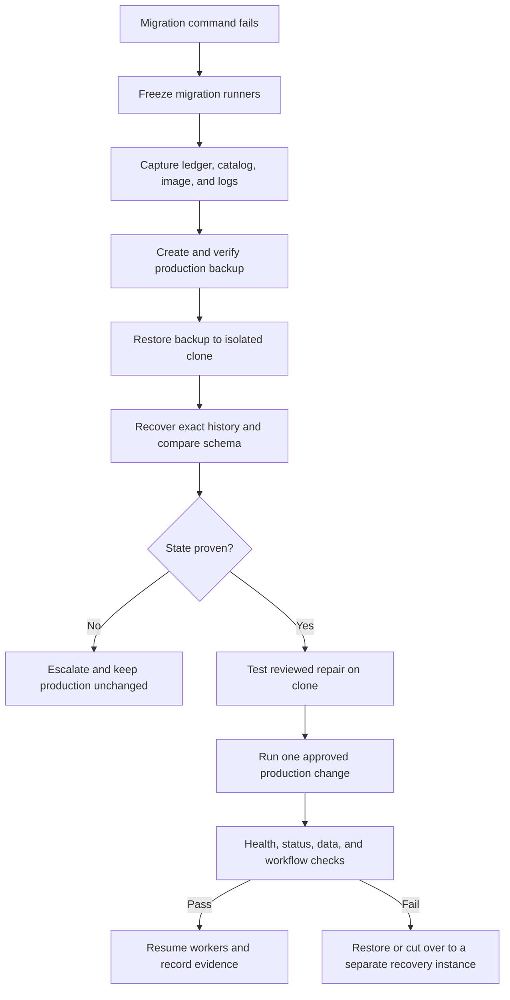

# Production Migration Recovery Runbook

This runbook covers a Prisma migration failure or migration-history mismatch
when the production PostgreSQL database must remain intact. It is deliberately
clone-first: production is inspected and backed up, while all schema repair is
proved against an isolated copy before any production ledger change.

## Non-negotiable rules

- Never run `prisma migrate reset`, `prisma migrate dev`, or `prisma db push` against production.
- Never drop, recreate, clean, or restore over the production database for a migration incident.
- Stop the migration runner after the first non-zero result. Do not retry blindly.
- Do not edit a migration that has succeeded in any environment. A failed-only migration may be corrected only after release inventory proves it was never successfully applied.
- Do not create an empty migration folder to hide a migration that is present in the database but missing from the image.
- `prisma migrate resolve` changes Prisma's migration ledger; it does not repair the database schema.
- Keep connection strings, migration logs, dumps, and certificates out of chat, tickets, and ordinary application logs.

The existing [`PostgreSQL Restore Runbook`](./restore-postgresql.md) is a data
restore procedure. Its restore script uses a dump containing `--clean` and must
therefore be used only against a newly provisioned recovery target or during an
approved disaster cutover, never as a shortcut for migration recovery.

## What this repository currently provides

- `backup-postgres` creates a compressed logical `pg_dump` plus a checksum and manifest.
- Remote publication is staged, but the current remote check proves artifact presence, not a remote checksum or a successful restore.
- `restore-postgres` verifies the downloaded checksum and requires `DB_RESTORE_CONFIRMED=yes`, but it is still destructive to its target.
- WAL archiving, `pg_basebackup`, and point-in-time recovery are not configured by this repository.

PostgreSQL documents that `pg_dump` produces a consistent snapshot while the
database remains online, but also that logical dumps cannot be used for WAL
replay. If the production recovery objective is smaller than the logical-backup
interval, configure and drill a separate base-backup plus WAL-archiving solution.

## Immediate decision tree

| Evidence | Safe action |
|---|---|
| `migrate deploy` fails and `_prisma_migrations.finished_at` is null; schema is proven unchanged | Fix the root cause on a recovery branch, mark the failed migration rolled back, then redeploy the corrected migration. |
| Failed migration partially changed the schema | Reproduce the state on the clone. Either complete the exact remaining steps and mark it applied, or create a reviewed forward repair. |
| A migration is marked applied in the database but its folder is missing from the image | Recover the exact original folder from the release artifact, image, tag, or CI workspace before deploying anything else. |
| The migration source or database state is ambiguous | Freeze migrations and escalate to the database owner. Do not use `resolve` to guess. |
| Data or schema corruption is already affecting the service | Restore to a separate instance from the newest verified backup or PITR target, validate it, and cut over. Do not clean the current production database in place. |

### Applying this to the recent constraint incident

The error naming a missing foreign-key constraint is a schema/history mismatch,
not proof that the database is safe to retry. First compare the actual
constraint definitions and the failed migration's first failing statement on
the clone. If the expected constraint is absent but another constraint exists,
the repair must preserve the real production relationship and be tested against
that exact state. Never drop the differently named production constraint by
guessing its identity.

## Phase 0 — Freeze and capture evidence

1. Announce a migration freeze. Stop CI/CD migration steps, scheduled workers,
   and operator scripts that can write schema. Keep the application running only
   if the current release is compatible with the current schema.
2. Record the release image digest, Git commit, Prisma version, PostgreSQL
   version, operator, UTC time, and the exact failing command.
3. Capture the migration ledger without changing it:

   ```sql
   SELECT migration_name, started_at, finished_at, rolled_back_at, checksum, logs
   FROM "_prisma_migrations"
   ORDER BY started_at, migration_name;
   ```

4. Capture the relevant schema objects from `pg_catalog`, including constraint
   names and definitions. For a foreign key incident:

   ```sql
   SELECT pg_namespace.nspname AS schema_name,
          pg_class.relname AS table_name,
          pg_constraint.conname AS constraint_name,
          pg_get_constraintdef(pg_constraint.oid) AS constraint_definition
   FROM pg_constraint
   JOIN pg_class ON pg_class.oid = pg_constraint.conrelid
   JOIN pg_namespace ON pg_namespace.oid = pg_class.relnamespace
   WHERE pg_namespace.nspname = 'public'
   ORDER BY pg_class.relname, pg_constraint.conname;
   ```

5. Save a schema-only dump and the application migration directory as incident
   evidence. Do not modify either copy.

For this repository's Docker deployment, the status command is:

```bash
docker compose exec api /app/node_modules/.bin/prisma migrate status \
  --schema prisma/schema.prisma
```

Run database queries through the production PostgreSQL administration path;
the service name `postgres` is only a local Compose example.

## Phase 1 — Create a verified recovery point

Run the existing backup job before any production schema write. Production
must have remote mode configured with at least one protected destination.

```bash
docker compose --profile backup run --rm \
  -e DB_BACKUP_ENABLED=true \
  -e DB_BACKUP_ENVIRONMENT_NAME=production \
  backup-postgres
```

Then verify all three artifacts exist in the remote final directory and verify
the downloaded `.sql.gz` with its `.sha256` file. Record the artifact name,
checksum, manifest, and remote location in the incident record.

If remote checksum verification or the backup job fails, stop here. The
existing local artifact is not a sufficient production safety argument.

## Phase 2 — Restore only to an isolated clone

Use a separate PostgreSQL instance whenever possible, with the same PostgreSQL
major version as production. Do not use the production database, its named
volume, or an existing database that contains application data.

For the repository's plain SQL dump, restore into a newly provisioned empty
database:

```bash
createdb -T template0 jpk_recovery_YYYYMMDD
gzip -dc postgresql-production-<timestamp>.sql.gz \
  | psql -X --set ON_ERROR_STOP=on "$RECOVERY_DATABASE_URL"
```

The clone is the place to test migration status, catalog queries, SQL repair,
application startup, and smoke tests. Keep the original production database
available for comparison until the incident is closed.

## Phase 3 — Reconcile history and schema on the clone

First compare the database ledger with the migration directory shipped in the
exact production image. A migration present in the ledger but absent on disk
must be recovered byte-for-byte from the release artifact, image, Git tag, or
CI workspace. Verify its checksum against `_prisma_migrations` and commit the
recovered file to the recovery branch.

Do not use a blank replacement, a newly generated migration with the old name,
or a whole-database rebaseline to conceal the missing history. Baselining is a
one-time workflow for adopting Prisma Migrate on an existing database, not a
repair shortcut for an established production ledger.

Use Prisma 6 commands for this repository. `migrate diff` is read-only; its
output is evidence or a reviewed SQL candidate, not permission to execute it:

```bash
pnpm --filter @ksiegowy/api exec prisma migrate diff \
  --from-url "$RECOVERY_DATABASE_URL" \
  --to-schema-datamodel prisma/schema.prisma \
  --script > recovery-forward.sql
```

Review the output against the full PostgreSQL catalog. Prisma's diff covers
Prisma-supported features, so separately check extensions, views, triggers,
functions, permissions, indexes, foreign keys, and any manually managed SQL.

### Failed migration with no schema change

Only after the clone proves that the failed migration made no changes, and the
corrected migration has passed on the clone, resolve the failed row and deploy:

```bash
/app/node_modules/.bin/prisma migrate resolve \
  --rolled-back <failed-migration-name> \
  --schema prisma/schema.prisma

/app/node_modules/.bin/prisma migrate deploy \
  --schema prisma/schema.prisma
```

Run the commands against the clone first. Use the production connection only
after the release artifact, SQL, and approval record are identical.

### Failed migration with partial changes

Do not guess which statements ran. On the clone, reproduce the failure and
inspect the exact post-failure state. The approved choices are:

1. complete the exact remaining migration steps with reviewed SQL, then mark
   the migration applied; or
2. create a new forward repair migration, deploy it, and resolve the failed
   migration only when the resulting schema exactly matches the migration
   history.

For the first choice, `prisma db execute` changes the schema without updating
the migration table. The SQL must be reviewed, tested on the clone, and
preserved with the incident record before using it on production:

```bash
/app/node_modules/.bin/prisma db execute \
  --url "$RECOVERY_DATABASE_URL" \
  --file reviewed-recovery.sql

/app/node_modules/.bin/prisma migrate resolve \
  --applied <failed-migration-name> \
  --schema prisma/schema.prisma
```

Never use `--applied` merely because the command failed or because the desired
objects appear to exist. Prove the complete post-migration schema and data
invariants first.

## Kubernetes migration Job requirements

The migration Job should connect to the PostgreSQL Service through the cluster
network. It does not need `hostPort`, `NodePort`, or a host-published database
port. The application Secret should contain a `DATABASE_URL` targeting the
intended Service and its database port, normally `5432`.

For this repository's Argo hook, harden the Job with:

```yaml
spec:
  backoffLimit: 0
  activeDeadlineSeconds: 900
  template:
    spec:
      restartPolicy: Never
      containers:
        - name: prisma-migrate
          image: registry.example.com/ksiegowy-vibe-api@sha256:<immutable-digest>
          imagePullPolicy: IfNotPresent
```

The existing TCP wait loop may remain as an availability check, but Prisma is
the final database and credential check. Keep migration logs in centralized
logging before applying short Job TTL cleanup, and run only one migration hook
per release. A deterministic SQL failure should fail Argo synchronization for
manual investigation, not silently retry several times.

## Phase 4 — Production change window

1. Build and publish one immutable API image containing the reviewed migration
   directory. Record its digest and migration manifest.
2. Confirm the current application is compatible with the intended schema. If
   not, deploy an expand/contract-compatible application first.
3. Pause schema-changing workers and take the final pre-change backup.
4. Run the already proven `resolve`/repair sequence once. Do not run migration
   commands from a laptop with an unpinned checkout.
5. Run `migrate deploy` from the release job, not from the API boot command.
6. Verify `migrate status`, `/health`, `/ready`, representative company access,
   and the affected workflow. Watch logs and database locks.
7. Re-enable workers only after the smoke checks pass.

## Rollback and escalation

Application rollback does not undo a successful schema migration. Prefer a
backward-compatible application release followed by a forward migration.

If the schema or data is unsafe, restore the verified artifact to a new
PostgreSQL instance, validate it, and cut traffic over. If WAL/PITR is
available, choose a recovery target after the last known-good transaction and
retain the original instance for investigation. Do not run the existing
`restore-postgres` command against production as a migration rollback.

Escalate instead of proceeding when any of these is true:

- the migration source cannot be recovered exactly;
- the checksum does not match the production ledger;
- the failed migration's partial state cannot be proven;
- the only proposed fix drops or recreates production data;
- the backup cannot be independently verified or restored to a clone.

## Required release gates before enabling production JPK migrations

- [ ] CI applies every migration to a fresh PostgreSQL 17 database.
- [ ] CI restores the latest production backup to a disposable database and runs status plus schema/catalog checks.
- [ ] Every production image contains a recorded migration manifest and Git commit.
- [ ] Failed migrations alert on a row with `finished_at IS NULL AND rolled_back_at IS NULL`.
- [ ] Backup monitoring checks freshness, checksum, remote integrity, and periodic restore success.
- [ ] A separate PostgreSQL base-backup plus WAL/PITR procedure is configured if the logical-backup RPO is insufficient.
- [ ] The recovery drill is performed quarterly and after migration infrastructure changes.

## Authoritative references

- [Prisma: Patching and hotfixing](https://www.prisma.io/docs/orm/prisma-migrate/workflows/patching-and-hotfixing)
- [Prisma: `migrate resolve`](https://www.prisma.io/docs/cli/migrate/resolve)
- [Prisma: Baselining a database](https://www.prisma.io/docs/orm/v7/prisma-migrate/workflows/baselining)
- [Prisma: `migrate diff`](https://docs.prisma.io/docs/cli/migrate/diff)
- [PostgreSQL 17: SQL dump](https://www.postgresql.org/docs/17/backup-dump.html)
- [PostgreSQL 17: Continuous archiving and PITR](https://www.postgresql.org/docs/17/continuous-archiving.html)


