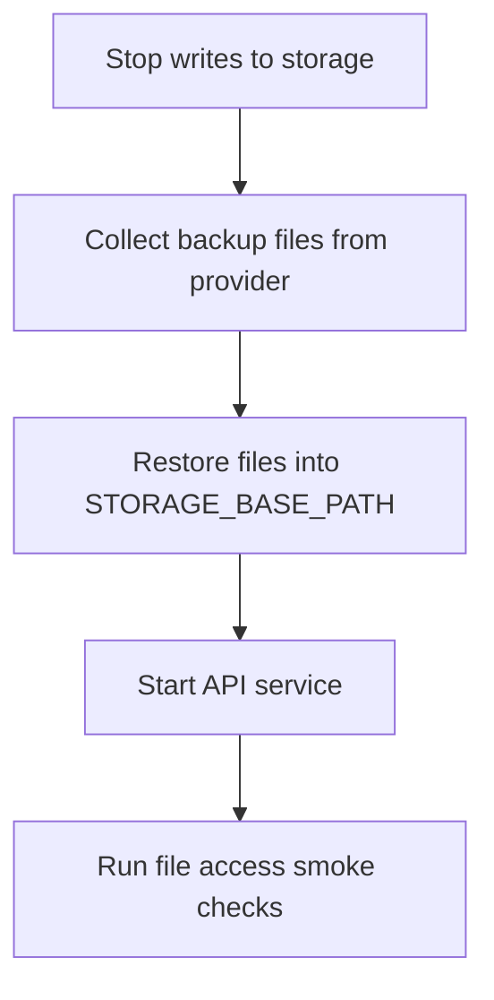

# File Backup Restore Runbook

This runbook covers restoring files backed up by current file backup flows (company Google Drive and platform iCloud).

## Scope

- Backup providers:
  - Google Drive (OAuth/API upload, company-scoped)
  - iCloud local sync (macOS path copy)
  - iCloud via `rclone sync` (Linux/VPS)
- Restored target: `STORAGE_BASE_PATH` (default `./storage`)
- Scheduled Google Drive execution path: host cron + one-shot `backup-gdrive-scheduled` service
- Google Drive can also run from manual admin trigger and invoice-issued async trigger

## Preconditions

1. Maintenance window is active.
2. API writes are stopped (`docker compose stop api`) or application is in read-only mode.
3. You know the target restore directory (host path behind `STORAGE_BASE_PATH`).
4. You have operator access to Google Drive or iCloud backup location.
5. For Google Drive restores, you know the target `companyId` scope.

## Restore Flow



## Procedure

### 1) Stop application writes

```bash
docker compose stop api
```

Also ensure no manual import scripts are writing to `STORAGE_BASE_PATH`.

### 2) Restore from provider

Choose provider used by your environment.

#### Option A — iCloud local sync backup (macOS)

Copy from `ICLOUD_BACKUP_PATH` back to storage path:

```bash
rsync -a --delete "${ICLOUD_BACKUP_PATH%/}/" "${STORAGE_BASE_PATH%/}/"
```

#### Option B — iCloud rclone backup (Linux/VPS)

```bash
rclone sync "${ICLOUD_RCLONE_REMOTE}:${ICLOUD_RCLONE_DEST}" "${STORAGE_BASE_PATH}"
```

#### Option C — Google Drive backup

Google Drive backup stores files under a company-scoped structure:

```text
<BACKUP_DESTINATION_ROOT>/
└── files/
    └── <environment>/
        └── company-<companyId>/
            ├── invoices/
            └── incoming/
```

Use Drive UI or Drive API tooling to download required files from `company-<companyId>` and restore them into the matching folder under `STORAGE_BASE_PATH/<companyId>/...`.

Canonical layout example:

- `BACKUP_DESTINATION_ROOT=ksiegowy-vibe-backups`
- `<environment>` comes from `DB_BACKUP_ENVIRONMENT_NAME` and defaults to `local`

Backward compatibility note: this file layout stays canonical for Google Drive backups. For PostgreSQL remote publishing, `BACKUP_DESTINATION_ROOT` is an explicit opt-in; when it is unset, legacy `DB_BACKUP_REMOTE_BASE_PATH/<environment>/...` destinations remain in use.

Expected scope/limitations:

- Google Drive restore is **company-scoped**. Restoring one company does not restore data for other companies.
- Backup coverage is file-content only. It does not restore PostgreSQL metadata (run `docs/restore-postgresql.md` separately when needed).
- Scheduled company Google Drive execution is best-effort per slot and has no catch-up for missed slots during downtime.

### 3) Start API

```bash
docker compose start api
```

### 4) Smoke checks

1. Open invoice list and download at least one PDF.
2. Open an incoming invoice attachment.
3. Generate one new invoice PDF to confirm write path works.

## Evidence to capture

- Restore date/time
- Provider used
- Target directory
- Number of restored files (estimated or exact)
- Smoke-check outcome
- Issues and follow-up actions

## Related docs

- [Google Drive Backup Setup](./google-drive-backup-setup.md)
- [PostgreSQL Restore Runbook](./restore-postgresql.md)
- [Backup Restore Drill](./backup-restore-drill.md)
