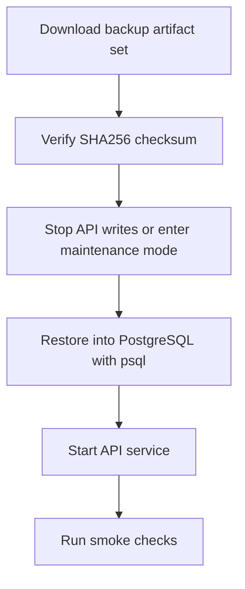

# PostgreSQL Restore Runbook (Initial)

This runbook covers restoring a PostgreSQL logical backup created by `backup-postgres`.

## Scope

- Applies to artifacts generated by `ops/backup/run-postgres-backup.sh`
- Artifact set:
  - `postgresql-<environment>-<timestamp>.sql.gz`
  - `postgresql-<environment>-<timestamp>.sql.gz.sha256`
  - `postgresql-<environment>-<timestamp>.manifest.json`
- Option A keeps one shared PostgreSQL database unchanged, so each artifact set is a full logical backup of the whole shared database
- Remote publishing layout is `<BACKUP_DESTINATION_ROOT>/postgresql/<environment>/<timestamp>/...` only when `BACKUP_DESTINATION_ROOT` is explicitly set
- When `BACKUP_DESTINATION_ROOT` is unset, backward-compatible PostgreSQL remote destinations remain `DB_BACKUP_REMOTE_BASE_PATH/<environment>/<timestamp>/...`
- Point-in-time recovery (WAL-based) is **not** part of this slice

## Preconditions

1. You have shell access to the Docker host.
2. You have the backup artifact set downloaded locally.
3. You know the target database credentials (`POSTGRES_USER`, `POSTGRES_PASSWORD`, `POSTGRES_DB`).
4. You have a maintenance window (restore overwrites database objects).
5. All database writers can be stopped or isolated during restore.

## Restore Flow



## Step-by-step

### 1) Verify artifact integrity

Run in directory where backup files are stored:

Linux:

```bash
sha256sum -c postgresql-<environment>-<timestamp>.sql.gz.sha256
```

macOS:

```bash
shasum -a 256 -c postgresql-<environment>-<timestamp>.sql.gz.sha256
```

Expected result: `OK`.

### 2) Isolate concurrent access before restore

Stop API writes and any other process that can write to PostgreSQL:

```bash
docker compose stop api
```

Also ensure:

1. Host cron job for `backup-postgres` is temporarily disabled.
2. No migration/seeding scripts are running.
3. No ad-hoc SQL clients are writing to the target database.

Optionally terminate active sessions for the target database right before restore:

```bash
docker compose exec -T postgres psql -U "$POSTGRES_USER" -d postgres -c "SELECT pg_terminate_backend(pid) FROM pg_stat_activity WHERE datname = '$POSTGRES_DB' AND pid <> pg_backend_pid();"
```

### 3) Restore database from logical dump

```bash
gzip -dc postgresql-<environment>-<timestamp>.sql.gz | docker compose exec -T postgres psql -v ON_ERROR_STOP=1 -U "$POSTGRES_USER" -d "$POSTGRES_DB"
```

Notes:
- `-v ON_ERROR_STOP=1` makes restore fail immediately on SQL error.
- Backup dump is generated with `--clean --if-exists`, so existing objects are replaced.
- If needed, restore into a separate database first and then swap.

### 4) Start API container again

```bash
docker compose start api
```

### 5) Smoke checks

Run at minimum:

```bash
curl -fsS http://localhost:3001/health
curl -fsS http://localhost:3001/ready
```

Then validate in UI:

1. Login works.
2. Company list loads.
3. Invoice list loads for at least one company.

## Rollback approach when restore is invalid

If restored data is invalid:

1. Stop API: `docker compose stop api`
2. Restore a different known-good artifact with the same procedure.
3. Start API: `docker compose start api`
4. Re-run smoke checks.

## Ownership and evidence

For every restore event, record:

- Operator name
- Date/time
- Artifact name
- Duration
- Outcome and follow-up actions
