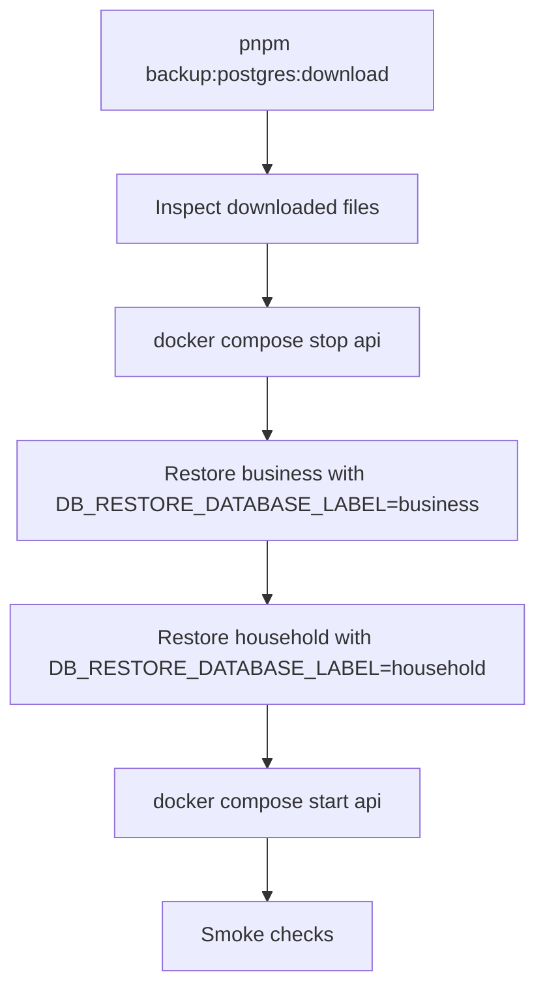

# PostgreSQL Restore Runbook

This runbook covers restoring a PostgreSQL logical backup created by `backup-postgres`.

## Scope

- Applies to artifacts generated by `ops/backup/run-postgres-backup.sh`
- This is a destructive data-restore procedure for a newly provisioned recovery target or an approved disaster cutover.
- For a failed Prisma migration or migration-history mismatch, use [Production Migration Recovery](./production-migration-recovery.md) first; do not restore over production.
- **Two databases, restored independently**: business/company (`POSTGRES_DB`) and household/personal-mode (`HOUSEHOLD_POSTGRES_DB`). The default combined backup dumps both, sharing one timestamp. A per-database backup selects one label and may have a different timestamp from the other database. Artifact sets are distinguished by `<database-label>` (`business` or `household`):
  - `postgresql-<database-label>-<environment>-<timestamp>.sql.gz`
  - `postgresql-<database-label>-<environment>-<timestamp>.sql.gz.sha256`
  - `postgresql-<database-label>-<environment>-<timestamp>.manifest.json`
- Select which database to restore with `DB_RESTORE_DATABASE_LABEL=business|household` (default `business`) — a full recovery is two separate restore runs, one per label, and the two artifacts do not need matching timestamps.
- Each artifact set is a full logical backup of its own database — restoring one never touches the other.
- Remote publishing layout: `<BACKUP_DESTINATION_ROOT>/postgresql/<environment>/<timestamp>/...`; a combined run stores both artifact sets, while a per-database run stores only its selected set.
- Point-in-time recovery (WAL-based) is **not** part of this slice

## Automated restore (recommended)

### Step 1 — Download the latest backup from Google Drive

```bash
pnpm backup:postgres:download
```

This fetches the most recent complete artifact set for each selected database in
the `production` environment from Google Drive and places it in
`DB_BACKUP_LOCAL_PATH` (default `./backups/postgresql`). With the default
`DB_BACKUP_DATABASE_LABEL=all`, the two selected artifact sets may come from
different timestamps. To download only one label, set
`DB_BACKUP_DATABASE_LABEL=business` or `household` for this command. It verifies
the SHA256 checksum after download.

### Step 2 — Inspect the downloaded files

```bash
ls -lh backups/postgresql/
```

Confirm the timestamp matches the backup you intend to restore.

### Step 3 — Stop the API

```bash
docker compose stop api
```

Also ensure no cron jobs or migration scripts are writing to the database.

Optionally terminate active sessions:

```bash
docker compose exec -T postgres psql -U "$POSTGRES_USER" -d postgres -c \
  "SELECT pg_terminate_backend(pid) FROM pg_stat_activity WHERE datname = '$POSTGRES_DB' AND pid <> pg_backend_pid();"
```

### Step 4 — Restore

Restore each database separately (defaults to `business`):

```bash
DB_RESTORE_CONFIRMED=yes DB_RESTORE_DATABASE_LABEL=business pnpm restore:postgres
DB_RESTORE_CONFIRMED=yes DB_RESTORE_DATABASE_LABEL=household pnpm restore:postgres
```

Restoring one label never touches the other database. The `business` and
`household` backup commands each create a full logical database backup; they do
not create per-company or per-household subsets.

To restore a specific artifact instead of the latest for that label:

```bash
DB_RESTORE_CONFIRMED=yes DB_RESTORE_DATABASE_LABEL=business DB_RESTORE_ARTIFACT_NAME=postgresql-business-production-20260531T201833Z.sql.gz pnpm restore:postgres
```

The script verifies the SHA256 checksum before restoring and runs the SQL
restore as one transaction, so an SQL error rolls back the restore instead of
leaving a partially restored target. The target is still destructive because
the dump contains cleanup statements; use a newly provisioned recovery target.

### Step 5 — Start the API and run smoke checks

```bash
docker compose start api
curl -fsS http://localhost:3001/health
curl -fsS http://localhost:3001/ready
```

Then validate in UI: login, company list, invoice list.

## Restore flow



## Rollback approach when restore is invalid

1. Stop API: `docker compose stop api`
2. Restore a different known-good artifact using `DB_RESTORE_ARTIFACT_NAME=<filename>`
3. Start API: `docker compose start api`
4. Re-run smoke checks.

## Manual restore (fallback)

Use this when the automated scripts are unavailable or you need fine-grained control.

### Preconditions

1. Shell access to the Docker host.
2. Backup artifact set downloaded locally.
3. Target database credentials known.
4. Maintenance window available.

### 1) Verify artifact integrity

Linux:
```bash
sha256sum -c postgresql-<database-label>-<environment>-<timestamp>.sql.gz.sha256
```

macOS:
```bash
shasum -a 256 -c postgresql-<database-label>-<environment>-<timestamp>.sql.gz.sha256
```

### 2) Isolate concurrent access

```bash
docker compose stop api
```

### 3) Restore database

`<database-label>` is `business` or `household` — target the matching database (`$POSTGRES_DB` or `$HOUSEHOLD_POSTGRES_DB`):

```bash
# business
gzip -dc postgresql-business-<environment>-<timestamp>.sql.gz | docker compose exec -T postgres psql --single-transaction -v ON_ERROR_STOP=1 -U "$POSTGRES_USER" -d "$POSTGRES_DB"

# household
gzip -dc postgresql-household-<environment>-<timestamp>.sql.gz | docker compose exec -T postgres psql --single-transaction -v ON_ERROR_STOP=1 -U "$POSTGRES_USER" -d "$HOUSEHOLD_POSTGRES_DB"
```

### 4) Start API

```bash
docker compose start api
```

### 5) Smoke checks

```bash
curl -fsS http://localhost:3001/health
curl -fsS http://localhost:3001/ready
```

## Ownership and evidence

For every restore event, record:
- Operator name
- Date/time
- Artifact name
- Duration
- Outcome and follow-up actions
