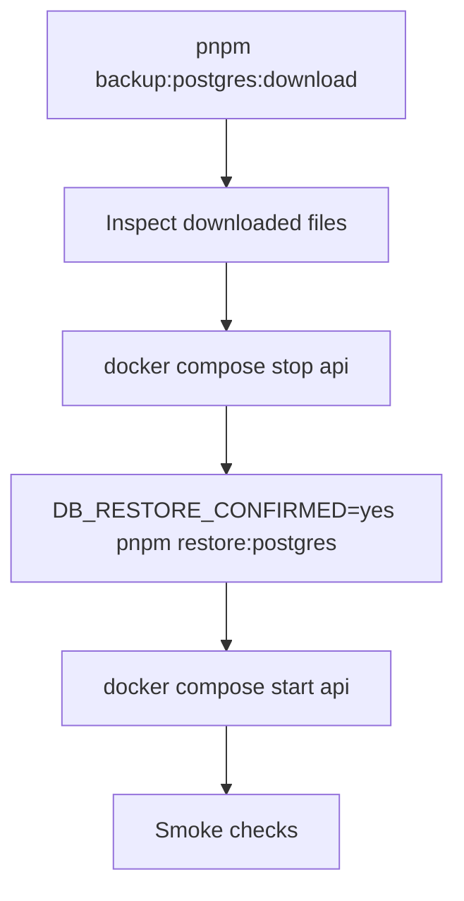

# PostgreSQL Restore Runbook

This runbook covers restoring a PostgreSQL logical backup created by `backup-postgres`.

## Scope

- Applies to artifacts generated by `ops/backup/run-postgres-backup.sh`
- Artifact set:
  - `postgresql-<environment>-<timestamp>.sql.gz`
  - `postgresql-<environment>-<timestamp>.sql.gz.sha256`
  - `postgresql-<environment>-<timestamp>.manifest.json`
- Option A keeps one shared PostgreSQL database unchanged, so each artifact set is a full logical backup of the whole shared database
- Remote publishing layout: `<BACKUP_DESTINATION_ROOT>/postgresql/<environment>/<timestamp>/...`
- Point-in-time recovery (WAL-based) is **not** part of this slice

## Automated restore (recommended)

### Step 1 — Download the latest backup from Google Drive

```bash
pnpm backup:postgres:download
```

This fetches the most recent artifact set for the `production` environment from Google Drive and places it in `DB_BACKUP_LOCAL_PATH` (default `./backups/postgresql`). It verifies the SHA256 checksum after download.

### Step 2 — Inspect the downloaded files

```bash
ls -lh backups/postgresql/
```

Confirm the timestamp matches the backup you intend to restore.

### Step 3 — Stop the API

```bash
docker compose stop api
```

Also ensure no cron jobs or migration scripts are writing to the database.

Optionally terminate active sessions:

```bash
docker compose exec -T postgres psql -U "$POSTGRES_USER" -d postgres -c \
  "SELECT pg_terminate_backend(pid) FROM pg_stat_activity WHERE datname = '$POSTGRES_DB' AND pid <> pg_backend_pid();"
```

### Step 4 — Restore

```bash
DB_RESTORE_CONFIRMED=yes pnpm restore:postgres
```

To restore a specific artifact instead of the latest:

```bash
DB_RESTORE_CONFIRMED=yes DB_RESTORE_ARTIFACT_NAME=postgresql-production-20260531T201833Z.sql.gz pnpm restore:postgres
```

The script verifies the SHA256 checksum before restoring and stops immediately on any SQL error.

### Step 5 — Start the API and run smoke checks

```bash
docker compose start api
curl -fsS http://localhost:3001/health
curl -fsS http://localhost:3001/ready
```

Then validate in UI: login, company list, invoice list.

## Restore flow



## Rollback approach when restore is invalid

1. Stop API: `docker compose stop api`
2. Restore a different known-good artifact using `DB_RESTORE_ARTIFACT_NAME=<filename>`
3. Start API: `docker compose start api`
4. Re-run smoke checks.

## Manual restore (fallback)

Use this when the automated scripts are unavailable or you need fine-grained control.

### Preconditions

1. Shell access to the Docker host.
2. Backup artifact set downloaded locally.
3. Target database credentials known.
4. Maintenance window available.

### 1) Verify artifact integrity

Linux:
```bash
sha256sum -c postgresql-<environment>-<timestamp>.sql.gz.sha256
```

macOS:
```bash
shasum -a 256 -c postgresql-<environment>-<timestamp>.sql.gz.sha256
```

### 2) Isolate concurrent access

```bash
docker compose stop api
```

### 3) Restore database

```bash
gzip -dc postgresql-<environment>-<timestamp>.sql.gz | docker compose exec -T postgres psql -v ON_ERROR_STOP=1 -U "$POSTGRES_USER" -d "$POSTGRES_DB"
```

### 4) Start API

```bash
docker compose start api
```

### 5) Smoke checks

```bash
curl -fsS http://localhost:3001/health
curl -fsS http://localhost:3001/ready
```

## Ownership and evidence

For every restore event, record:
- Operator name
- Date/time
- Artifact name
- Duration
- Outcome and follow-up actions
