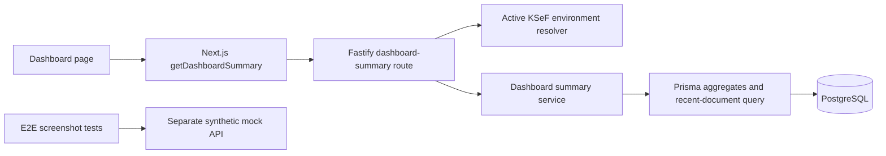

# Dashboard Summary Read Model

## Purpose

The authenticated dashboard uses one environment-aware read model instead of aggregating a limited page of invoices in the browser.

Endpoint:

```text
GET /companies/:companyId/dashboard-summary
```

The active KSeF environment is resolved from the request header, active-environment cookie, or company default, using the same resolver as invoice routes.

## Response contract

```text
environment
totalInvoices
contractorCount
ksefCounts.accepted
ksefCounts.pending
ksefCounts.rejected
ksefCounts.notSubmitted
salesByMonth[]
  year
  month
  gross
  vat
  invoiceCount
currentMonth
  gross
  vat
  invoiceCount
attention.rejected
attention.notSubmitted
attention.incoming
recentInvoices[]
```

All monetary values are returned as strings with two decimal places. Aggregation is performed with Prisma Decimal values in the API.

## Semantics

- KPI counts use issued invoices and the active environment's `InvoiceKsefState`.
- `notSubmitted` includes issued invoices with no active-environment state or a `NOT_SENT` state.
- Pending includes `SUBMITTED`, `QUEUED`, and `OFFLINE_QUEUED` states.
- Sales buckets include only issued invoices accepted by KSeF.
- Incoming attention includes `UPLOADED`, `OCR_PROCESSING`, `OCR_DONE`, and `OCR_FAILED` documents.
- Recent documents include the latest six documents in the active environment, including drafts.
- The E2E mock API implements the same contract with synthetic data; it is not a production data source.

## Data flow



## Verification

```bash
pnpm --filter @ksiegowy/api test -- src/services/dashboard-summary.service.test.ts
pnpm --filter @ksiegowy/api typecheck
pnpm --filter @ksiegowy/web typecheck
pnpm --filter @ksiegowy/e2e exec playwright test tests/dashboard.spec.ts --project=chromium --grep "summary-backed|KSeF clearance"
```
