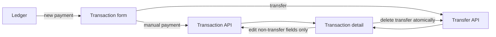
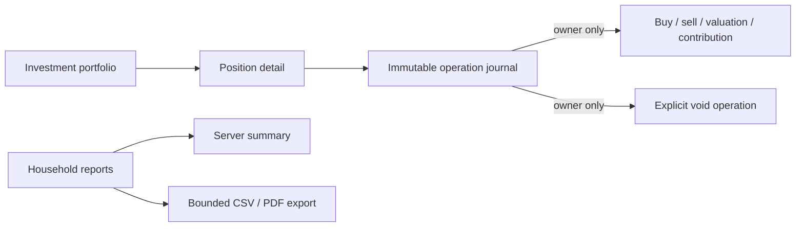

# Household frontend — Phase 1 and Phase 2 implementation notes

This note records the shipped frontend behavior for personal mode. It does not
change the household architecture or backend contract.

## Interaction boundaries

- Editing a transaction sends only `payee`, `categoryId`, `tag`, `note`, and
  `date`; nullable classification fields are sent as `null` when cleared.
- Transfer legs remain deletable together, but cannot be edited from the
  detail view. Transfer amounts and badges use neutral styling. The frontend
  blocks transfer edits, but the backend still permits transfer `PATCH` requests.
- Recurring and future-categorization controls are not exposed in the manual
  transaction form until a supported workflow exists.

## Resilience and input rules

- Household page data errors are allowed to reach the existing route error UI;
  an actual empty response still renders its empty state.
- Decimal input accepts Polish comma decimals and regular, non-breaking, or
  narrow non-breaking grouping spaces. Invalid non-empty opening balances are
  rejected instead of becoming zero.
- Commitment amounts and loan percentage input are normalized before submit;
  weekly frequency and required insurance/account/date/loan-term validation
  are supported.
- Calendar dates are formatted and defaulted without UTC conversion, avoiding
  date drift in local time zones. Displayed percentages use the shared Polish
  formatter.

## Mobile and accessibility

- Mobile household navigation keeps the desktop navigation unchanged, gives
  every item a practical 44px touch target at 320px, and adds a central,
  labelled `Dodaj płatność` link to `/household/ledger/new`.
- The central payment action and the five-position Goals/More mobile navigation
  are implemented.
- AccountPicker uses a focused listbox with stable option IDs,
  `aria-activedescendant`, Arrow/Home/End navigation, Enter/Space selection,
  and focus restoration after Escape, selection, or an outside close when the
  listbox owns focus. Empty account collections disable the trigger.
- Ledger filters expose labels, a named direction group, and pressed state for
  direction choices. Mobile buttons retain a 44px minimum target.
- Transaction forms associate amount and note labels with their controls;
  transaction direction and commitment type segmented controls expose their
  selected state with `aria-pressed`.

## Phase 2 — Goals

The Goals route tree is real routed UI, not modal state:

- `/household/goals` — overview, available surplus, competing-goal allocation,
  and fixed-rule projection disclosure.
- `/household/goals/new` — conditional one-off/ongoing/no-ceiling goal form.
- `/household/goals/:goalId` — progress, account balance, lifecycle actions,
  movement history, totals, and projection details.
- `/household/goals/:goalId/edit` — goal editing subject to backend lifecycle
  and post-movement immutability rules.
- `/household/goals/:goalId/add` and `/withdraw` — confirmed add/withdraw
  transfers with refreshed balances and movement history.
- `/household/goals/:goalId/rules` — fixed-day, percentage-over-threshold, and
  round-up automation rule management.
- `/household/more` — the household secondary navigation destination.

`api-client.ts`, `api.ts`, and `api-types.ts` expose the goal overview, CRUD,
movement, and automation-rule contracts. Goal errors are mapped to stable,
non-sensitive user messages. Projection copy explicitly says that percentage
and round-up rules are variable and are not forecast; the UI does not imply a
production guarantee or security approval.

Goal detail uses a labelled progress bar, table headings for movement history,
visible lifecycle/status text, confirmation for archiving, disabled submit
states during transfer confirmation, and the shared account listbox. Archived
goals hide mutation links and render read-only forms. Private goals omitted by
the backend render the generic financial error state rather than leaking their
existence.

The five-position mobile household navigation remains touchable at 320px,
including the central labelled `Dodaj płatność` action, `Cele`, and `Więcej`.
Goal forms preserve associated labels, keyboard-operable segmented controls,
pressed/selected state, focus-visible controls, and practical 44px touch targets.

## Phase 3 — Investments and reports

The investment and reporting routes are server-rendered by default, with client
components limited to form submissions, explicit voiding, period selection, and
file downloads:

- `/household/investing` shows visible positions, current values, cost basis,
  valuation completeness, target allocation, and drift. Missing valuations and
  incomplete target allocations remain explicit instead of being inferred.
- `/household/investing/new`, `/[positionId]/edit`, and
  `/[positionId]/transactions/new` expose only the backend-supported manual
  investment contract. Buy and sell operations require positive units; valuation
  updates may be zero; contributions do not accept units.
- `/household/investing/[positionId]` shows the operation journal and allows
  mutation controls only for the position owner. Voiding is explicit and keeps
  the journal traceable; archived positions are read-only.
- `/household/investing/contributions` shows recorded contribution history and
  only displays IKZE headroom when the backend supplies a limit, source, and
  `USER_CONFIRMED` evidence.
- `/household/reports` uses URL-backed preset or custom inclusive periods shorter
  than one year. Cash flow, category comparison, net worth, data quality, and
  informational IKZE evidence are rendered from server responses. No forecast,
  market data, PIT calculation, or tax advice is presented.
- CSV/PDF downloads use the same bounded period and safe stable-code error
  mapping as report reads. Unknown backend details are not shown to users.

Phase 3 focused unit coverage is in `apps/web/src/lib/household-*test.ts` for
investment input rules, report periods, and financial error mapping.

## Phase 2 regression coverage

`apps/e2e/tests/household-goals.spec.ts` covers empty and conditional goal
creation, accessible progress and projection disclosure, add/withdraw transfers
and validation, pause/resume/archive lifecycle, all three automation forms,
competing-goal allocation, private-goal omission, mobile navigation, and failed
goal reads. Latest final verification: 9 Goals tests passed serially and 9 in
parallel. Final Phase 1 household regression coverage passed 7/7.

The broader full-E2E diagnostic is separate from these focused gates: serial
execution reported 66 passed, 3 failed, and 3 skipped; parallel execution
reported 55 passed, 14 failed, and 3 skipped. Persistent failures are
`dashboard.spec.ts:342` (expects `/onboarding`, received `/onboarding/company`)
and `navigation.spec.ts:9` and `:79` (expects 5 links, received 6 including
Compliance). Additional parallel-only failures are caused by shared mutable
mock state.

## Regression coverage

- `apps/e2e/tests/household-phase1-ux.spec.ts` permanently covers the Phase 1
  UX blockers and accessibility paths. The temporary UX audit capture spec and
  screenshot directory are absent.
