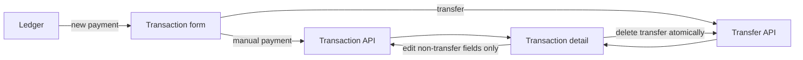

# Household frontend — Phase 1 implementation notes

This note records the shipped frontend behavior for personal mode. It does not
change the household architecture or backend contract.

## Interaction boundaries

- Editing a transaction sends only `payee`, `categoryId`, `tag`, `note`, and
  `date`; nullable classification fields are sent as `null` when cleared.
- Transfer legs remain deletable together, but cannot be edited from the
  detail view. Transfer amounts and badges use neutral styling. The frontend
  blocks transfer edits, but the backend still permits transfer `PATCH` requests.
- Recurring and future-categorization controls are not exposed in the manual
  transaction form until a supported workflow exists.

## Resilience and input rules

- Household page data errors are allowed to reach the existing route error UI;
  an actual empty response still renders its empty state.
- Decimal input accepts Polish comma decimals and regular, non-breaking, or
  narrow non-breaking grouping spaces. Invalid non-empty opening balances are
  rejected instead of becoming zero.
- Commitment amounts and loan percentage input are normalized before submit;
  weekly frequency and required insurance/account/date/loan-term validation
  are supported.
- Calendar dates are formatted and defaulted without UTC conversion, avoiding
  date drift in local time zones. Displayed percentages use the shared Polish
  formatter.

## Mobile and accessibility

- Mobile household navigation keeps the desktop navigation unchanged, gives
  every item a practical 44px touch target at 320px, and adds a central,
  labelled `Dodaj płatność` link to `/household/ledger/new`.
- The central payment action is implemented; the full Goals/More mobile
  navigation redesign remains deferred.
- AccountPicker uses a focused listbox with stable option IDs,
  `aria-activedescendant`, Arrow/Home/End navigation, Enter/Space selection,
  and focus restoration after Escape, selection, or an outside close when the
  listbox owns focus. Empty account collections disable the trigger.
- Ledger filters expose labels, a named direction group, and pressed state for
  direction choices. Mobile buttons retain a 44px minimum target.
- Transaction forms associate amount and note labels with their controls;
  transaction direction and commitment type segmented controls expose their
  selected state with `aria-pressed`.

## Regression coverage

- `apps/e2e/tests/household-phase1-ux.spec.ts` permanently covers the Phase 1
  UX blockers and accessibility paths. The temporary UX audit capture spec and
  screenshot directory are absent.
