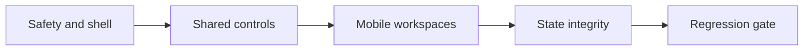

# Mobile-first UX remediation reference

## Status

- Status: implemented baseline; release and operational validation remains
- Document type: implementation reference
- Source: static mobile UX/UI audit, 2026-09-07
- Target widths: 320px, 360px, 390px, 430px
- Owner: UX/UI architect; implementation: frontend engineer; security review: SecOps/Security Auditor
- Scope: interaction, layout, and environment-context transport contracts. Business rules remain defined by the API and domain services.
- Recorded verification: the environment-aware API test entry records 140 tests passing and a clean API typecheck. The Playwright suite contains the mobile width/theme, route, profile-menu, and visual-baseline coverage described below.
- This baseline does not claim that the current Prisma migrations were applied to a shared database, that live KSeF flows were verified, or that iOS Safari manual checks were completed.

## Implementation notes — 2026-09-08

- The shell remounts the environment indicator when the active company changes, so the displayed state cannot leak between companies.
- The company default environment is independent from the user's active environment cookie.
- The shell does not change or persist the active environment; the dedicated settings/context flow remains the owner of that state.
- Direct PDF and source-file URLs carry the selected environment as a validated query parameter because browser navigations cannot attach the environment header.
- KSeF credential status is safe to read for company members: only `hasToken` is returned, never the credential value. Missing status fails closed in action controls.

## 1. Required design constants

These constants describe the contract. Implement them through the existing Aurora Solid CSS variables and Tailwind theme rather than creating a second runtime token system.

```ts
interface MobileInteractionTokens {
  sideMargin: number;
  minimumTouchTarget: number;
  preferredControlHeight: number;
  compactControlHeight: number;
  interactiveGap: number;
  fieldFontSize: number;
  bottomNavigationHeight: number;
  bottomNavigationItems: number;
}

export const mobileInteractionTokens: MobileInteractionTokens = {
  sideMargin: 16,
  minimumTouchTarget: 44,
  preferredControlHeight: 48,
  compactControlHeight: 44,
  interactiveGap: 8,
  fieldFontSize: 16,
  bottomNavigationHeight: 64,
  bottomNavigationItems: 4,
};

export const ksefEnvironmentPresentation = {
  TEST: {
    label: 'TEST',
    tone: 'warning',
    description: 'Środowisko testowe — dokumenty nie wywołują skutków prawnych.',
  },
  PRODUCTION: {
    label: 'PRODUKCJA',
    tone: 'error',
    description: 'Środowisko produkcyjne — operacje mogą wywołać skutki prawne.',
  },
} as const;
```

Do not map `PRODUCTION` to `success`. Production is an operating context, not a successful result. Use dedicated environment semantics even if their visual values currently alias `warning` and `error` tokens.

## 2. Shell and thumb-zone contract

### Mobile header

Order:

1. Brand and session actions.
2. Active company.
3. Passive KSeF environment indicator.

The environment indicator remains visible in the shell and does not change context. Environment changes belong in the dedicated settings/context flow, so the header cannot accidentally switch the data scope.

Security behavior:

- Never change environment from the shell indicator.
- Environment changes must use the dedicated settings/context flow and its existing confirmation and persistence rules.

### Mobile bottom navigation

Render five equal-width icon-only slots:

```ts
export const mobileNavigation = [
  { destination: '/dashboard', label: 'Start', icon: 'overview' },
  { destination: '/dashboard/incoming', label: 'Zakupy', icon: 'incoming' },
  { destination: 'assistant', label: 'Asystent podatkowy AI', icon: 'assistant' },
  { destination: '/dashboard/invoices', label: 'Sprzedaż', icon: 'outgoing' },
  { destination: 'more', label: 'Więcej', icon: 'more' },
] as const;

export const mobileMoreDestinations = [
  { destination: '/dashboard/contractors', label: 'Kontrahenci', icon: 'contractors' },
  { destination: '/dashboard/compliance', label: 'Raporty & JPK', icon: 'compliance' },
  { destination: '/dashboard/settings', label: 'Ustawienia', icon: 'settings' },
] as const;
```

The center slot is a disabled, icon-only placeholder for the planned AI tax assistant. The fifth slot is the `Więcej` button, not a route. It opens a bottom sheet containing contractors, reports, and settings. The sheet uses dialog semantics, has an accessible name, traps focus while open, closes with Escape and backdrop activation, and restores focus to `Więcej`. Each slot is at least 44px high, and visible labels are omitted from the bottom bar while accessible labels remain available to assistive technology. The active state must also be conveyed with `aria-current="page"`, not color alone.

The navigation region reserves `64px + env(safe-area-inset-bottom)`. Main content receives matching bottom padding so no control can be covered.

## 3. Shared control contract

Apply this contract to `Button`, `Input`, `Select`, and `Textarea` before route-specific fixes.

```ts
export const sharedControlBlueprint = {
  minimumHeight: 44,
  preferredFieldHeight: 48,
  minimumInlinePadding: 12,
  mobileTextSize: 16,
  focusRingWidth: 2,
  focusRingOffset: 2,
  disabledOpacityOnly: false,
} as const;
```

- No interactive descendant may be nested inside another interactive element. When `Button` renders a link, it is the link; callers must not wrap it in `Link`.
- Icon-only controls require an accessible name and a 44px square hit area.
- Field labels remain visible. Placeholder text is never the only label.
- Invalid fields set `aria-invalid="true"` and reference one stable error element through `aria-describedby`.
- Loading buttons preserve their width, set `aria-disabled="true"`, and expose a text status; spinner-only feedback is insufficient.
- Disabled styling must use disabled tokens and cursor/state semantics, not reduced opacity alone.

## 4. Data workspace behavior

### Contractors and service catalogue

At widths below 1024px, replace horizontally dependent tables and split panels with a stacked list/detail flow:

1. List rows are full-width links or buttons with 44px minimum height.
2. Primary identity and one decision-relevant secondary value remain visible.
3. Opening a row navigates to, or reveals, a dedicated detail view with an explicit back action.
4. No primary action may require horizontal scrolling.

Desktop tables may remain. Keyboard users must be able to activate every row action without relying on a row-level mouse handler.

### Invoice forms

- Stack date and payment fields in one column below 640px.
- Use `type="text"` with `inputMode="decimal"` for Polish decimal input where the existing format parser accepts comma decimals.
- Do not parse user-entered monetary values with `parseFloat`.
- Put the primary save/continue action in the final thumb-zone action group; do not add a permanently sticky action bar unless route tests demonstrate a reachability problem.

### Dialogs

KSeF import and production confirmation dialogs require:

```ts
export const dialogBlueprint = {
  role: 'dialog',
  ariaModal: true,
  minimumActionHeight: 44,
  initialFocus: 'least-destructive-action',
  closeOnEscape: true,
  restoreFocus: true,
  trapFocus: true,
} as const;
```

Do not use `window.confirm`. Destructive and legally consequential actions need an in-page explanation and deterministic focus behavior.

## 5. Loading, empty, error, and success states

Every new or revised data-driven component must implement all four states.

```ts
export const dataStateContract = {
  loading: {
    blocksInteraction: false,
    preservesLayout: true,
    announcement: 'polite',
  },
  empty: {
    distinguishesNoDataFromFiltering: true,
    offersSingleRelevantAction: true,
  },
  error: {
    neverMasqueradesAsEmpty: true,
    retainsPreviousDataWhenSafe: true,
    retryTargetMinimumSize: 44,
  },
  success: {
    usesStatusAnnouncement: true,
    motion: 'opacity-transform-only',
  },
} as const;
```

- Loading: use geometry-matched skeletons; avoid layout shift.
- Empty: explain what is absent and provide one safe next action.
- Filtered empty: state that filters produced no results and offer **Wyczyść filtry**.
- Error: show a clear retry action and preserve the distinction from zero records.
- Success motion: a short scale/opacity pop is permitted; reduced-motion mode removes scaling.
- Validation failure: a subtle horizontal wobble is permitted only when it does not move focus or content layout; reduced-motion mode removes it.

## 6. Verification matrix

Each affected route must be checked at 320, 360, 390, and 430px in both themes.

```ts
export const mobileVerification = {
  widths: [320, 360, 390, 430],
  themes: ['light', 'dark'],
  requirements: [
    'No viewport-level horizontal overflow',
    'All interactive targets are at least 44 by 44 pixels',
    'Main content is not covered by bottom navigation',
    'Focused fields are visible above the software keyboard',
    'Environment and company context remain visible',
    'Errors are not rendered as empty states',
    'Keyboard focus order follows visual order',
    'Reduced motion removes nonessential transforms',
  ],
} as const;
```

Required automated coverage:

1. Five icon-only bottom-navigation items fit on one row at every target width.
2. `Więcej` opens and closes accessibly and restores focus.
3. The shell exposes the active KSeF environment without offering an accidental context switch.
4. Environment changes remain owned by the dedicated settings/context flow.
5. Shared controls meet 44px geometry; text-entry controls compute to at least 16px on mobile.
6. Contractor, service catalogue, outgoing invoice, and incoming invoice routes have no viewport-level horizontal overflow.
7. Loading, true-empty, filtered-empty, and request-error fixtures produce distinct UI.

## 7. Implementation order

1. **Safety and shell:** passive environment indicator, canonical environment tones, five-slot icon-only navigation.
2. **Shared controls:** 44px targets, 16px mobile fields, invalid/loading contracts, nested-interactive cleanup.
3. **Mobile workspaces:** contractors and service catalogue, then invoice forms and incoming review.
4. **State integrity:** separate loading, empty, filtered-empty, and error rendering.
5. **Regression gate:** Playwright width/theme matrix and geometry assertions.



Frontend implementation must be reviewed with the SecOps/Security Auditor before production-environment switching or KSeF submission changes merge.

## 8. Release and operational gates

The implemented baseline is not production release sign-off. Complete and record these gates before enabling the remediation against a real environment:

- [ ] Apply the current Prisma migration set to a real staging database from the immutable release artifact; inspect migration status and run schema/data preflight checks. This document does not claim that migrations have been applied.
- [ ] Create and independently verify a staging or pre-production backup, checksum, and isolated restore/preflight before any production schema change.
- [ ] Exercise authorized live KSeF TEST and controlled PRODUCTION flows, including interrupted submission handling and manual reconciliation. No live KSeF or reconciliation result is claimed here.
- [ ] Manually verify iOS Safari at the target widths, including software-keyboard focus/scroll behavior, safe-area insets, and bottom-navigation clearance.
- [ ] Record the rollback decision: an application rollback does not undo a successful Prisma migration. Use a backward-compatible application release or forward migration; if schema or data is unsafe, restore to an isolated instance and cut over rather than resetting production.
