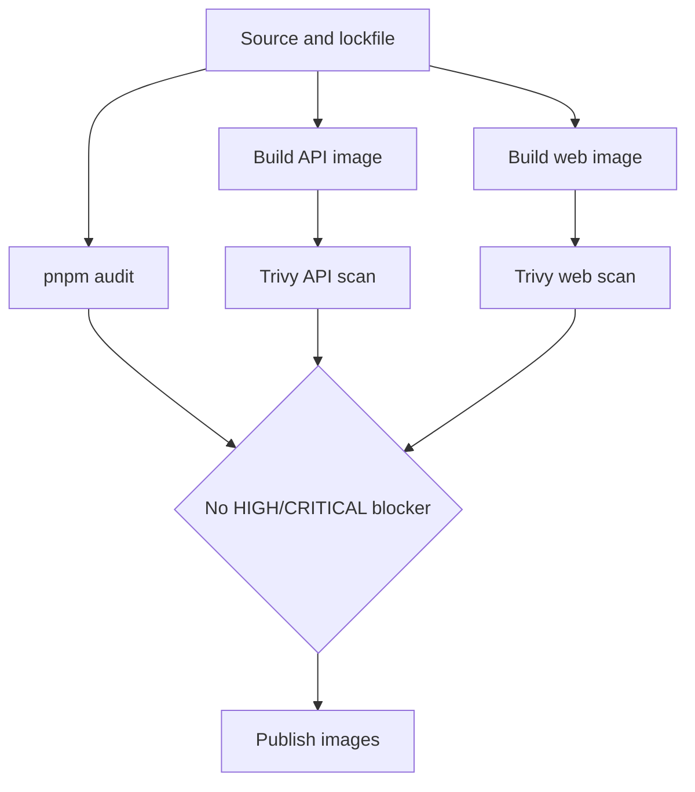

# Security vulnerability remediation

Status: implementation in progress; verify the release images with the
deployment scanner before publishing.

## Implemented controls

- Updated the API and web runtimes to Node.js 24.
- Moved the API runtime from Debian Bookworm to Debian Trixie.
- Upgrade OS packages during both final image builds.
- Install only production Node.js dependencies in the API runner.
- Remove npm and npx from both final images because they are not used at
  runtime.
- Replaced the vulnerable `node-tesseract-ocr` wrapper with a bounded direct
  `tesseract` child-process call and guaranteed temporary-file cleanup.
- Replaced `pdf2pic`/GraphicsMagick PDF rendering with bounded Poppler
  `pdftocairo` rendering capped at five pages.
- Upgraded Next.js, Puppeteer, Fastify JWT, SWC, Vitest, and affected workspace
  dependency trees.
- Added lockfile overrides for transitive high-severity JavaScript packages.

## Verification gate

Required checks:

1. `pnpm audit --audit-level=high` has no high or critical findings.
2. API and web Docker builds complete successfully.
3. Trivy scans the final runner images, not intermediate build stages.
4. OCR, XML validation, PDF generation, and web production build smoke checks
   pass.

The API still requires Poppler, Tesseract with Polish language data,
`libxml2-utils`, and Puppeteer's pinned Chrome for Testing build at runtime. They cannot be removed without
moving those production capabilities to separate services. Distro findings
without a fixed package in the configured Debian repository remain an
upstream-image maintenance item and must not be marked as fixed by policy
exception.

PDF generation retains `--no-sandbox` because the Chrome for Testing archive has
no setuid sandbox helper and the production container disables unprivileged user
namespaces. Re-enable the browser sandbox when the container runtime provides a
supported sandbox boundary.
