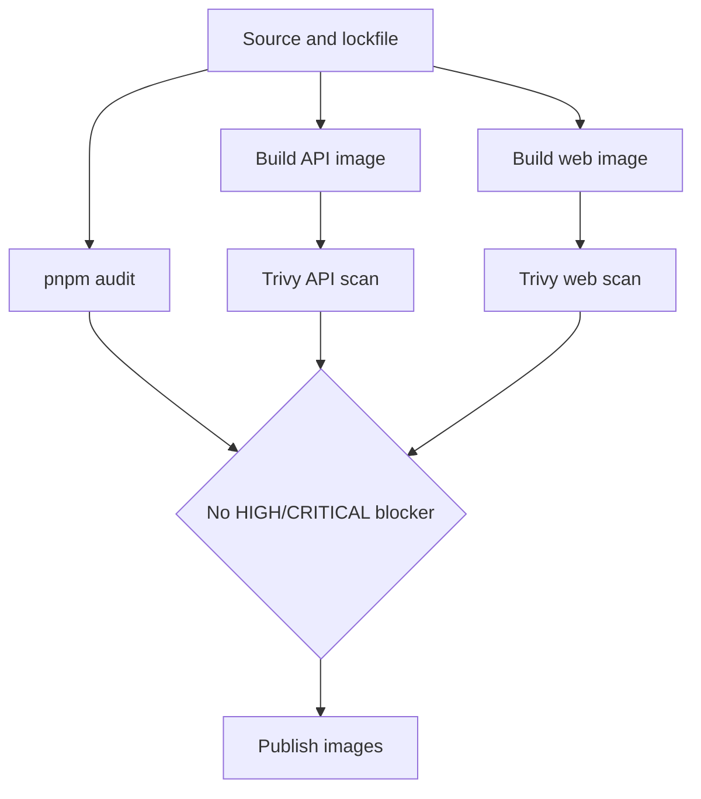

# Security vulnerability remediation

Status: Phase 6 in progress; API image is being rebuilt on Alpine and must
reach zero unaccepted HIGH/CRITICAL findings before release promotion.

## Implemented controls

- Updated the API and web runtimes to Node.js 24.
- Moved the API runtime from Debian Bookworm to Debian Trixie, then isolated
  the API runner on Alpine after the Debian image retained unresolved OS CVEs.
- Upgrade OS packages during final image builds.
- Install only production Node.js dependencies in the API runner.
- Install production Node.js dependencies inside the Alpine stage so optional
  native packages use musl-compatible bindings.
- Remove npm and npx from both final images because they are not used at
  runtime.
- Replaced the vulnerable `node-tesseract-ocr` wrapper with a bounded direct
  `tesseract` child-process call and guaranteed temporary-file cleanup.
- Replaced `pdf2pic`/GraphicsMagick PDF rendering with bounded Poppler
  `pdftocairo` rendering capped at five pages.
- Upgraded Next.js, Puppeteer, Fastify JWT, SWC, Vitest, and affected workspace
  dependency trees.
- Added lockfile overrides for transitive high-severity JavaScript packages.

## Verification gate



Required checks:

1. `pnpm audit --audit-level=high` has no high or critical findings.
2. API and web Docker builds complete successfully.
3. Trivy scans the final runner images, not intermediate build stages.
4. OCR, XML validation, PDF generation, and web production build smoke checks
   pass.

The API still requires Poppler, Tesseract with Polish language data,
`libxml2-utils`, and Chromium at runtime. They cannot be removed without
moving those production capabilities to separate services. The downloaded
Chrome for Testing archive is excluded from the runner; Puppeteer uses the
current Alpine Chromium package instead.

PDF generation retains `--no-sandbox` because the Chrome for Testing archive has
no setuid sandbox helper and the production container disables unprivileged user
namespaces. Re-enable the browser sandbox when the container runtime provides a
supported sandbox boundary.

## Phase 5 verification evidence — 2026-09-17

The final local runner images were scanned with Trivy `0.74.0`. The vulnerability
database metadata reported:

```text
UpdatedAt:   2026-09-16T13:02:23.823752185Z
DownloadedAt: 2026-09-16T19:46:11.023837142Z
```

| Image | Immutable local image digest | HIGH/CRITICAL result |
|-------|-----------------------------|----------------------|
| API | `sha256:f6db44fb950139709bf9af155769acc44ef273794c51492c934d3215caabe662` | 97 records / 33 unique OS CVEs, all without a fixed version |
| Web | `sha256:310fa464399db7c43b7d50747e1b6b048d07f17d308294ed24fed51cba5e501a` | 0 |

`--ignore-unfixed` returns zero for both images. The API image still fails the
`block-high-critical` policy because those findings are confirmed but currently
unfixable in the configured Debian repositories. The affected packages are
runtime requirements of Poppler, Tesseract, XML validation, and their system
dependencies; removing them would remove production functionality.

Compensating controls are: non-root runtime user, production-only Node.js
dependencies, no npm/npx in final images, no Debian Chromium or GraphicsMagick,
bounded PDF/OCR execution, five-page OCR limit, temporary-file cleanup, and
fresh-image scanning before every promotion. The repository maintainer owns the
follow-up; reassess after the next Debian security metadata refresh and no later
than 2026-09-24. Do not promote these local artifacts or create a blanket policy
exemption until the API image reaches zero unaccepted HIGH/CRITICAL findings.

Registry publication and Homelab GitOps rollout were not performed because this
repository contains only generic OCI publication; registry credentials and the
environment-specific operations repository are intentionally outside its scope.

## Phase 6 — CI security checks and clean API image

Status: implementation started on 2026-09-17.

### Goal

Make the final API image pass the existing `block-high-critical` policy with
zero unaccepted HIGH/CRITICAL findings, while retaining invoice PDF generation,
PDF OCR, Polish Tesseract support, and XML validation.

### Current evidence

- The refreshed Debian Trixie API image still reported 97 records and 33 unique
  OS CVEs; none had a fixed version in the configured Debian repository.
- The findings came from the Debian runtime layer and its required image/PDF/OCR
  dependency tree, not from a missing application-only exclusion.
- The API runner contained a broken Prisma runtime layout: generated client
  files were created in the builder but were not copied into the final image.

### Implemented Phase 6 changes

- Change the API runner to `node:24-alpine`.
- Upgrade Alpine packages during the image build.
- Install only Alpine Chromium, Poppler, Tesseract Polish data, XML utilities,
  and certificates in the runner.
- Remove the downloaded Chrome for Testing archive from the production image.
- Configure Puppeteer to use `/usr/bin/chromium`.
- Generate both glibc and musl Prisma engines and copy the generated client to a
  stable runtime path.

### Acceptance criteria

- [x] API image builds from a clean Docker build.
- [x] Trivy reports zero HIGH/CRITICAL vulnerabilities with unfixed findings
      included.
- [x] `node`, `pdftocairo`, `tesseract`, `xmllint`, and Chromium execute in the
      final image.
- [x] API starts with the copied Prisma client, loads `pdf-parse`, and returns
      `GET /health` with HTTP 200.
- [x] PDF generation, five-page OCR limit, XML validation, unit tests, and the
      production build pass.
- [ ] Only after the API image is clean: add the CI security workflow as a
      required release gate.

### Phase 6 verification evidence — 2026-09-17

The final API image was built with `docker build --pull --no-cache` and scanned
with Trivy `0.74.0` using the `HIGH,CRITICAL` severity filter and unfixed
findings included:

| Image | Immutable local image ID | Result |
|-------|--------------------------|--------|
| API | `sha256:95ec7973c9753b6296075d0b06a371709c95055db16bb2f94ed340ff54e971ff` | 0 HIGH/CRITICAL vulnerabilities |

The current Compose rebuild produced API image
`sha256:400a296e5ea3f2f5df3a8615efaf3eb0a8bb441a9237bd2e14d7687a356b6503`.
The image loads `@napi-rs/canvas` and `pdf-parse` successfully, and the running
API returned HTTP 200 from `/health` without the previous native-binding
warnings.

Runtime smoke checks passed for Node.js `v24.21.0`, Prisma Client loading,
Poppler `pdftocairo`, Tesseract `5.5.2`, `xmllint`, Alpine Chromium
`152.0.7977.82`, and Chromium PDF generation.

Repository checks passed:

- `pnpm typecheck`
- `pnpm lint`
- `pnpm test` — 260 tests passed
- `pnpm build`
- `pnpm audit --audit-level=high` — 14 low/moderate findings, no high/critical

The API image is clean. PostgreSQL-backed startup verification and the CI
security workflow remain open Phase 6 work.

### Validation commands

```bash
docker build --pull --no-cache -t ksiegowy-vibepl-api:phase6 -f apps/api/Dockerfile .
docker run --rm -v /var/run/docker.sock:/var/run/docker.sock \
  -v trivy-cache:/root/.cache aquasec/trivy:0.74.0 image \
  --scanners vuln --severity HIGH,CRITICAL --exit-code 1 \
  ksiegowy-vibepl-api:phase6
pnpm typecheck
pnpm lint
pnpm test
pnpm build
```

### Rollback

If Alpine breaks a required runtime capability, restore the previous Debian
runner only as a temporary development fallback. Do not promote it while the
strict image scan reports unaccepted HIGH/CRITICAL findings. The preferred
follow-up is a separate hardened PDF/OCR service rather than a blanket scanner
exception.
