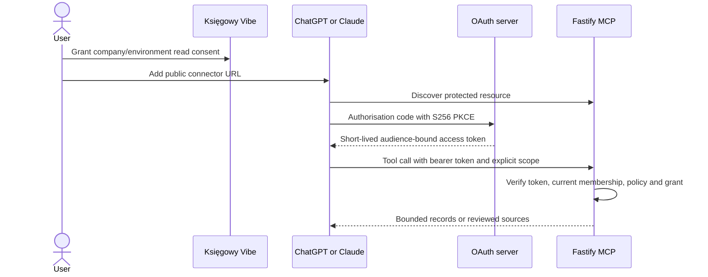

# Tax advisor

Implementation branch: `feat/tax-advisor`. Tracking: [TRY-160](https://linear.app/trysoft/issue/TRY-160/epic-implement-the-contextual-tax-advisor), phases TRY-161–TRY-166. Design reference: `docs/redesign/kv-redesign-platform-personal.html`, screens 15–19. The [implementation plan](../../spec/tax-advisor-implementation-plan.md) tracks remaining release gates.

## What is implemented

- A 400px desktop dock, mobile modal sheet, header/mobile entry points, Command/Ctrl+J, Escape, and a full `/dashboard/advisor` page.
- Explicit-send conversations, monthly briefing prompts, private history, deletion, cancellation, and invoice/incoming-document Explain buttons. Explain carries the document identifier and issue month; the user still chooses whether to include records.
- Company processing policy, encrypted per-membership API credentials, model discovery, and a synthetic connection test. Tests can incur provider charges; opening a panel never generates an answer automatically.
- OpenRouter, OpenAI API, Anthropic API and operator-hosted Ollama transports. A selected model must support JSON Schema output. Provider/model IDs are entered or discovered, rather than baked into the application.
- Read-only MCP tools, external OAuth token verification, signed-in company/environment consent, grant expiry and revocation for ChatGPT and Claude.
- Reviewed-source loading and period selection. **No reviewed tax corpus ships with this change.** Without one, tax-mode requests stop before a paid model call. Record explanations remain available.

Not yet released: validated live subscription integrations, accountant-reviewed tax evaluation, contractor-specific explanations, dismissible inline insights, scheduled briefings, tax-regime comparison, and advisor-initiated accounting mutations. There is no bank ledger or cash forecast in this slice.

## First use

1. Review and apply migration `20260919080000_tax_advisor` to the intended database and generate Prisma Client. Compose startup does not apply it automatically. Use the repository migration/backup runbooks for production; the setup UI calls out a missing advisor migration.
2. Set the existing `ENCRYPTION_KEY` to the installation's 32-byte hex encryption key; do not rotate it independently of existing encrypted records. Keep `CORS_ORIGIN` equal to the browser application's origin. `ADVISOR_ENABLED` may remain false during provider setup.
3. In **Settings → Doradca** or the advisor panel's **Dostawcy i konfiguracja** control, save a provider/model and API credential. An ADMIN selects the company's allowed providers and enables its policy. Credentials belong to the current membership, not every colleague. The API also allows the settings and credential routes while `ADVISOR_ENABLED` is false, so setup is not hidden behind the runtime switch.
4. Set `ADVISOR_ENABLED=true` in the API environment and restart the API to allow tests and advisor questions. Company policy and explicit record consent still apply.
5. For embedded chat, run the synthetic connection test, then open the advisor. Select the company/environment in the existing application controls and a month in the composer. Check the record-disclosure checkbox before including company facts. TEST selects synthetic accounting records; it does not make API calls free.
5. Send a record question or use **Podsumowanie okresu**. Inspect the calculation and evidence sections. Tax questions require the reviewed corpus below.

Ollama's address is configured by the operator through `ADVISOR_OLLAMA_URL`, including `/v1`, for example `http://ollama:11434/v1`. The API contacts that address; a browser user's laptop is not automatically reachable. Restrict the Ollama network service to authorised infrastructure. No user-supplied arbitrary model endpoint is accepted.

## Request and evidence contracts

Shared TypeScript contracts live in `packages/types/src/advisor.ts`. Runtime validation lives in `apps/api/src/services/advisor/advisor-contract.ts`.

Every context includes one company, explicit TEST/PRODUCTION environment, `YYYY-MM` period, question kind (`records` or `tax`), record-consent flag and optional document ID/kind. The server obtains company/user access from current database membership, never model input or a stale JWT company list. A selected document must belong to the selected company/environment/month.

The model receives only the question, up to four previous question texts when record consent is enabled, bounded invoice evidence, server-calculated amounts and applicable reviewed excerpts. It does not receive provider secrets, NIP/PESEL, addresses, bank details, arbitrary attachments, OCR bodies, item descriptions or invoice notes. Text the user enters in their question still goes to the chosen provider.

All totals cover the selected month, even when a single document is selected:

| Calculation | Meaning |
| --- | --- |
| `issuedGross`, `issuedVat` | ISSUED outgoing invoices, excluding FORMAL corrections; null correction mode and cancellation delta amounts are included |
| `acceptedGross` | The same scope restricted to ACCEPTED KSeF state in the selected environment |
| `invoiceCount` | Number of outgoing financial documents in the issued scope |

Calculations use Prisma Decimal and remain separate by currency. They are not VAT payable, deductible input VAT, payment-ledger balances or tax-return totals. Incoming documents are evidence with review status, not assumed deductible purchases. At most 20 outgoing and 20 incoming documents are sent; a truncation flag explains that amounts still cover the full month.

Dashboard accepted-sales buckets now share the formal-correction exclusion and explicitly use PLN, matching their currency label. KPI document counts still include formal corrections. Contractor/report read models have their own existing semantics; the advisor does not reuse or claim reconciliation with those totals in this release.

The model returns bounded structured text, status, assumptions, questions and evidence/source IDs. Unknown IDs are rejected. Reported tax guidance requires a cited supplied source. Server-owned calculations, source links and provenance are attached after validation. The UI renders plain text and application-constructed links. Schema/citation checks cannot prove that every sentence is legally correct: reviewed evaluation remains a release gate.

Transport schemas omit unsupported string/array length constraints and describe those bounds to the model; the complete Zod schema still validates every returned answer. This supports Anthropic both directly and through OpenRouter without weakening application-side limits. See [Anthropic structured-output constraints](https://platform.claude.com/docs/en/build-with-claude/structured-outputs).

## API and lifecycle

Browser routes use the existing authenticated session and require the exact configured Origin on mutations. Every response is `Cache-Control: no-store`. Base path: `/companies/:companyId/advisor`.

| Route | Purpose |
| --- | --- |
| `GET /settings`, `PATCH /policy` | Masked settings; ADMIN-only company policy |
| `PUT /connections/:provider`, `DELETE /connections/:provider` | Save encrypted personal key/model; disconnect |
| `POST /connections/:provider/test`, `GET /connections/:provider/models` | Synthetic structured-output test; model discovery |
| `GET /conversations`, `POST /conversations` | Own unexpired history; create pinned-provider/model conversation |
| `GET /conversations/:conversationId`, `DELETE /conversations/:conversationId` | Own history detail/deletion |
| `POST /conversations/:conversationId/messages` | UUID request ID, question, scope; validated answer via SSE |
| `GET /connectors`, `PUT /connectors/:client`, `DELETE /connectors/:client` | Own subscription grants; PUT body `{ "days": 30 }` |

Conversation and connector mutations require `x-ksef-environment: TEST|PRODUCTION`; settings are shared across environments within a membership. A conversation cannot switch provider/model. Connection changes require a new conversation.

SSE carries `status`, `answer`, `error`, `done` events. Only a fully validated answer is displayed. There is no raw model-token stream. Client disconnect/cancel and the 60-second deadline abort the provider call. A completed duplicate request returns the existing answer; reusing an ID with different input fails. A database membership row lock and atomic turn claim prevent concurrent duplicate provider calls across API processes. A pending turn older than two minutes is reported/reconciled as failed after a process interruption.

Limits: 4,000 question characters, 100 conversations per membership, 100 turns per conversation, one active request per membership, six submissions per minute and a ten-second provider-request reservation (also used by tests/discovery). History lists return the newest 50 conversations. Failed requests do not silently retry or switch providers. A manually repeated question can incur another charge.

Membership, policy, session validity and connection identity are rechecked before saving an answer. Credentials are never returned. The hourly cron deletes expired conversations (cascading to turns) and grants. History is hidden immediately at expiration. Company history retention is 1–30 days from conversation creation; lowering retention also shortens existing expiry. Deleting a company membership cascades credentials, conversations and grants. Provider-owned storage/backups follow separate retention policies.

## Reviewed tax source corpus

Set `ADVISOR_TAX_SOURCES_PATH` to an operator-controlled JSON array. A missing path means no sources; malformed configured data fails closed. Limit: 128 KB, 40 unique entries; at most eight applicable entries are supplied. In Docker, mount the file read-only and use its container path.

Each entry requires:

| Field | Contract |
| --- | --- |
| `id`, `title`, `section` | Stable citation identifier and human-readable legal location |
| `url` | HTTPS official `*.gov.pl` source, no embedded credentials |
| `effectiveFrom`, `effectiveUntil` | Inclusive ISO dates covering the entire requested month |
| `reviewedAt`, `reviewExpiresAt` | ISO dates covering today's date |
| `reviewedBy` | Identifiable reviewer responsible for checking applicability |
| `excerpt` | Reviewed excerpt, at most 2,000 characters |

The corpus SHA-256 digest is persisted as provenance. There is no automatic web retrieval or claim that uploaded source metadata itself constitutes legal review. Changes within a month require narrower supported questions or a later day-level contract; the current selector excludes sources that do not cover the full month. If more than eight entries apply, only the first eight are provided; curate ordering for the supported question set. Topic retrieval and a larger corpus are future work.

Before enabling tax guidance, appoint a source owner and qualified reviewer, populate only supported VAT/invoice topics, and evaluate the Polish question set in the plan. No invented review dates or unreviewed tax rates are seeded.

## ChatGPT and Claude subscription connectors

This is an **external conversation mode**. The user chats in ChatGPT or Claude, whose tools read authorised facts from Księgowy Vibe. It does not embed the consumer subscription's generation service in this application. No ChatGPT/Claude subscription token or password is collected. Host-generated statements are outside local answer validation and local conversation retention.

The Fastify application is an OAuth **resource server**. A maintained external authorisation server (reference deployment: Keycloak) handles login, consent, authorisation-code exchange, S256 PKCE, exact registered redirect URIs and refresh-token policy. Existing Google login remains independent. No new home-grown OAuth authorisation server is implemented here.

Operator configuration:

| Variable | Value |
| --- | --- |
| `ADVISOR_MCP_PUBLIC_URL` | Public HTTPS resource URL ending in `/advisor/mcp`; optional reverse-proxy prefix is supported |
| `ADVISOR_OAUTH_ISSUER` | Exact HTTPS issuer string in access tokens |
| `ADVISOR_OAUTH_JWKS_URL` | Operator-trusted HTTPS signing-key endpoint |
| `ADVISOR_OAUTH_CHATGPT_CLIENT_ID` | Registered ChatGPT OAuth client identifier |
| `ADVISOR_OAUTH_CLAUDE_CLIENT_ID` | Separate registered Claude OAuth client identifier |

Configure the issuer to:

1. Publish OAuth/OIDC discovery; register each actual host's exact callback URLs. Require authorisation-code flow and S256 PKCE. Disable implicit/password grants. Configure the host's client ID/secret through its connector setup; those secrets never belong in the advisor UI.
2. Issue signed RS256 or ES256 access tokens with `iss`, `sub`, `iat`, `exp`, `aud` equal to the exact resource URL, and `scope` containing `advisor:read`. Access token age is limited to 15 minutes, with five seconds of clock tolerance. Configure the resource indicator/audience for this API, not a general-purpose account token.
3. Emit `client_id` or Keycloak `azp` matching the configured client. If both exist, they must match.
4. Provision an immutable, administrator-managed `ksiegowy_user_id` claim mapping the issuer identity to the existing `User.id`. **Never map it from a user-editable profile attribute or a submitted user ID.** Verify the mapping using a synthetic account before granting access.
5. Configure refresh/identity revocation at the issuer. API-side grant deletion or membership removal blocks the next tool call immediately. Issuer token revocation otherwise follows token expiry; remote introspection is not performed.

The API advertises protected-resource metadata at `/.well-known/oauth-protected-resource/advisor/mcp`. The bearer challenge points to the URL under the public API prefix, if any. Forward that route through the same reverse proxy as `/advisor/mcp`. POST uses the maintained MCP SDK's stateless Streamable HTTP transport with JSON responses; authenticated GET/DELETE return 405. Browser cookies are never connector credentials. Unknown browser origins are rejected; server-to-server host calls may omit Origin.

Each tool requires explicit `companyId`, `environment`, and `period`. `get_invoice_evidence` also requires document ID/kind:

- `get_company_context`: bounded documents and monthly calculations.
- `get_period_summary`: monthly calculations only.
- `get_invoice_evidence`: selected document evidence plus monthly calculations.
- `get_tax_sources`: currently reviewed sources applicable to the selected period.

An ADMIN first allows the external client in the company policy. The signed-in user then grants a chosen client read-only access to a specific company/environment for up to 30 days. Grants bind membership, issuer, client and environment; changing issuer/client configuration invalidates old grants. Every tool call checks the current grant, membership and policy before reading and again before returning facts. Revocation is available in the same Settings section. No accounting writes are exposed, including for VIEWER users.



**Release gate:** demonstrate this configuration on the target ChatGPT and Claude accounts. Their plan/admin eligibility, callback registration and current discovery behavior must be checked in those products. This repository's mocked protocol/token checks do not establish that real-client integration has passed.

Official references: [MCP authorization](https://modelcontextprotocol.io/specification/2025-11-25/basic/authorization), [Keycloak OIDC](https://www.keycloak.org/securing-apps/oidc-layers), [Keycloak administration](https://www.keycloak.org/docs/latest/server_admin/), [Claude custom connectors](https://support.claude.com/en/articles/11175166-get-started-with-custom-connectors-using-remote-mcp), [ChatGPT developer mode](https://platform.openai.com/docs/guides/developer-mode).

## Verification and rollout

Local results (2026-09-19): 161 API tests passed across 29 files; two Playwright advisor flows passed at 1440px and 390px, including the 400px dock width, explicit consent/send, calculations, evidence links, Escape and focus restoration. API/web TypeScript checks, Prisma schema validation and the targeted lint check passed (lint emits the repository's existing Next.js root-directory warning). The production web Docker build passed after adding the imported shared advisor contract to the builder stage. `docker compose up -d --build postgres api web` built and started all three containers. During later use, the unset runtime flag was found to hide provider settings; settings and credential routes have been decoupled from the runtime request flag so users can configure providers first. Dependency audit reports no high/critical advisories; 7 moderate and 4 low advisories remain in existing dependencies. The newly introduced MCP dependency path to `qs` is pinned to patched 6.16.0.

Automated checks use mocked providers and synthetic browser records. No real tax records, live paid model requests, or deployed OAuth issuer are needed. The API test script currently forwards `--` such that the documented filtered command runs the full suite.

```bash
pnpm --filter @ksiegowy/api test -- src/services/advisor
pnpm --filter @ksiegowy/api typecheck
pnpm --filter @ksiegowy/web typecheck
pnpm --filter @ksiegowy/e2e test -- tests/advisor.spec.ts --project=chromium --reporter=line
pnpm audit --audit-level=high
```

Before production: apply the additive migration to a disposable restored database, verify retention/cascade behavior, run one approved request against each enabled provider/model, verify proxy SSE handling, complete real-client OAuth checks, and complete tax review. Disable `ADVISOR_ENABLED` to stop advisor processing and connector reads; existing accounting flows continue. Keep the additive tables until retained data is handled. Logs contain operation/request IDs and safe error codes, not questions, documents or credentials.
