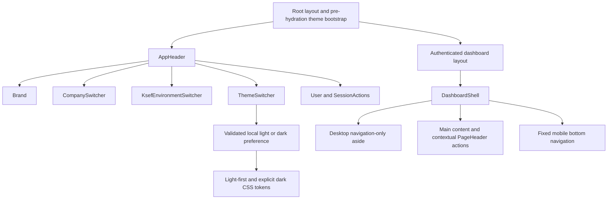

# Dashboard Light-Mode Redesign Implementation Plan

> **For agentic workers:** REQUIRED SUB-SKILL: Use superpowers:subagent-driven-development (recommended) or superpowers:executing-plans to implement this plan task-by-task. Steps use checkbox (`- [ ]`) syntax for tracking.

**Goal:** Deliver a light-first authenticated dashboard shell with persistent theme choice, global company/KSeF context, navigation-only desktop sidebar, and contextual page actions while preserving routes, permissions, session behavior, and business data flows.

**Architecture:** Keep the root layout and dashboard pages as Server Components. Add one small client-only `ThemeSwitcher`; a pre-hydration root-layout script sets a validated `data-theme` value before React hydrates, while existing semantic CSS variables provide complete light and dark palettes. Move existing company and KSeF controls into `AppHeader`, reduce `DashboardShell` to semantic navigation/content layout, and reuse existing page controls in `PageHeader` rather than introducing a global action registry.

**Tech Stack:** Next.js 15.1 App Router, React 19, TypeScript 5.8, Tailwind CSS 4 semantic variables, existing components, Playwright 1.59.1, pnpm 10 workspace; no new runtime or development dependency.

---

## Constraints and decisions

- Implement only presentation, composition, accessibility, and tests. Do not touch API, database, authentication, accounting, KSeF business logic, routes, or permission calculations.
- Keep Server Components as the default. Only `ThemeSwitcher`, the existing switchers, and existing interactive incoming actions remain Client Components.
- Persist theme only in `localStorage` under `ksiegowy-theme`; do not add a cookie, provider, global store, or dependency. Theme never leaves the browser and never influences server data.
- Accept only literal `light` and `dark` values from browser storage. Any missing, malformed, or inaccessible value resolves to `light`.
- Use `data-theme="light|dark"` on `<html>`. Keep every current semantic token name so existing Tailwind classes continue to work.
- Use current Tailwind v4 palette variables and semantic CSS variables rather than scattering literal colors through components. Final token values must pass the contrast checks in Task 6; visual values require UX approval because this plan intentionally does not prescribe literal brand color values.
- Preserve the existing company cookie write plus `router.refresh()` and KSeF cookie write plus `router.refresh()` exactly. Only presentation props/classes may change in those controls.
- Remove `SidebarQuickActions.tsx`; do not replace it with a second action configuration object.
- Keep the existing mobile bottom navigation. Do not add a drawer, command palette, theme package, icon package, or state-management package.
- This plan contains no commit steps because the task explicitly requires no commit.

## Exact file map

### Create

- `apps/web/src/lib/theme.ts` — shared theme type, storage key, value guard, and static pre-hydration script.
- `apps/web/src/components/organisms/ThemeSwitcher.tsx` — accessible two-state client button that updates `<html>` and local storage.
- `apps/e2e/tests/dashboard.spec.ts-snapshots/dashboard-light-desktop-chromium-linux.png` — reviewed desktop light baseline generated in the pinned Playwright container.
- `apps/e2e/tests/dashboard.spec.ts-snapshots/dashboard-dark-desktop-chromium-linux.png` — reviewed desktop dark baseline generated in the pinned Playwright container.
- `apps/e2e/tests/dashboard.spec.ts-snapshots/dashboard-light-mobile-chromium-linux.png` — reviewed mobile light baseline generated in the pinned Playwright container.

### Modify

- `apps/web/src/app/globals.css` — light-first semantic palette, complete explicit dark palette, restrained ambient canvas, focus/reduced-motion/scroll-obscuring safeguards.
- `apps/web/src/app/layout.tsx` — execute the static theme bootstrap before hydration, suppress only the expected `<html>` attribute mismatch, and pass authenticated context to `AppHeader`.
- `apps/web/src/app/dashboard/layout.tsx` — retain authentication enforcement but stop passing company/KSeF data into `DashboardShell`.
- `apps/web/src/components/organisms/AppHeader.tsx` — compose brand, company, KSeF, theme, user, and session controls in semantic desktop/mobile layout.
- `apps/web/src/components/CompanySwitcher.tsx` — add compact header-safe sizing/truncation without changing cookie or refresh behavior.
- `apps/web/src/components/KsefEnvironmentSwitcher.tsx` — make the compact header composition explicit and route all labels through translations without changing cookie or refresh behavior.
- `apps/web/src/components/organisms/DashboardShell.tsx` — navigation-only semantic sidebar, shrink-safe main content, retained safe mobile navigation.
- `apps/web/src/components/organisms/DashboardNavigation.tsx` — quiet active/inactive states, retained route matching and `aria-current`, touch target sizing.
- `apps/web/src/components/atoms/Surface.tsx` — make shared panels more opaque and restrained in both themes using existing semantic tokens.
- `apps/web/src/components/molecules/PageHeader.tsx` — make the action region wrap/stack without causing horizontal overflow.
- `apps/web/src/app/dashboard/page.tsx` — make overview invoice/incoming actions contextual at every width.
- `apps/web/src/app/dashboard/incoming/page.tsx` — place upload and KSeF sync controls in `PageHeader.actions`.
- `apps/web/src/app/dashboard/incoming/UploadButton.tsx` — retain file-input upload behavior as a compact contextual action; remove the redundant large action card/drag surface.
- `apps/web/src/app/dashboard/incoming/KsefSyncButton.tsx` — retain existing modal/sync behavior with a compact contextual trigger.
- `apps/web/src/app/dashboard/contractors/page.tsx` — use `PageHeader.actions` for the existing permission-gated create action.
- `apps/web/src/lib/translations.ts` — add theme/header/KSeF labels and remove the dead `dashboard.quickActions` branch after contextual actions use existing page labels.
- `apps/e2e/tests/dashboard.spec.ts` — light default, theme persistence/no-flash, header context, contextual actions, and visual baselines.
- `apps/e2e/tests/navigation.spec.ts` — navigation-only desktop sidebar, active state, mobile bottom navigation, and no duplicate context controls.
- `apps/e2e/tests/incoming.spec.ts` — contextual header upload/sync controls and retained sync modal behavior.
- `apps/e2e/tests/contractors.spec.ts` — contextual create action remains available.
- `apps/e2e/playwright.config.ts` — add a Linux-stable visual project and snapshot path naming while retaining the existing functional Chromium project.
- `README.md` — replace obsolete sidebar quick-action documentation with the new shell/theme behavior and verification commands.
- `docs/superpowers/specs/2026-08-21-dashboard-light-mode-redesign-design.md` — record implementation status, final component boundaries, and verification evidence after completion.

### Delete

- `apps/web/src/components/organisms/SidebarQuickActions.tsx` — no consumer remains after contextual actions are verified.

### Explicitly unchanged

- `apps/web/src/app/dashboard/invoices/page.tsx` — already exposes outgoing invoice creation in `PageHeader.actions`.
- `apps/web/src/app/dashboard/settings/page.tsx` — settings and company/KSeF configuration already remain in contextual settings sections.
- All `apps/api/**`, Prisma, packages, route paths, middleware, auth/session handlers, and API clients.

## Task 1: Lock the light/dark theme contract with failing browser tests

**Files:**

- Modify: `apps/e2e/tests/dashboard.spec.ts`
- Modify: `apps/e2e/playwright.config.ts`

- [ ] **Step 1: Add failing default-theme and persistence tests**

Add these behavior tests to `apps/e2e/tests/dashboard.spec.ts`:

```ts
test('dashboard defaults to light theme and persists an explicit dark choice', async ({ authenticatedPage: page }) => {
  await page.goto('/dashboard');

  await expect(page.locator('html')).toHaveAttribute('data-theme', 'light');

  const themeSwitcher = page.getByRole('button', { name: 'Włącz ciemny motyw' });
  await expect(themeSwitcher).toHaveAttribute('aria-pressed', 'false');
  await themeSwitcher.click();

  await expect(page.locator('html')).toHaveAttribute('data-theme', 'dark');
  await expect(page.getByRole('button', { name: 'Włącz jasny motyw' })).toHaveAttribute('aria-pressed', 'true');
  await expect.poll(() => page.evaluate(() => localStorage.getItem('ksiegowy-theme'))).toBe('dark');

  await page.reload();
  await expect(page.locator('html')).toHaveAttribute('data-theme', 'dark');
});

test('stored theme is applied before hydration', async ({ authenticatedPage: page }) => {
  await page.addInitScript(() => localStorage.setItem('ksiegowy-theme', 'dark'));
  await page.route('**/_next/static/**/*.js', async (route) => {
    await new Promise((resolve) => setTimeout(resolve, 250));
    await route.continue();
  });

  await page.goto('/dashboard', { waitUntil: 'domcontentloaded' });
  await expect(page.locator('html')).toHaveAttribute('data-theme', 'dark');
});

test('invalid stored theme falls back to light', async ({ authenticatedPage: page }) => {
  await page.addInitScript(() => localStorage.setItem('ksiegowy-theme', '<script>alert(1)</script>'));
  await page.goto('/dashboard', { waitUntil: 'domcontentloaded' });

  await expect(page.locator('html')).toHaveAttribute('data-theme', 'light');
});
```

- [ ] **Step 2: Make visual snapshot naming explicit without changing default E2E execution**

In `apps/e2e/playwright.config.ts`, build the project list from the existing project plus a visual project only when `VISUAL_REGRESSION=true`:

```ts
const projects = [
  {
    name: 'chromium',
    use: { ...devices['Desktop Chrome'] },
  },
  ...(process.env.VISUAL_REGRESSION === 'true'
    ? [{
        name: 'chromium-linux',
        testMatch: /dashboard\.spec\.ts/,
        use: { ...devices['Desktop Chrome'] },
      }]
    : []),
];
```

Pass `projects` to `defineConfig`. Keep the existing functional project unchanged. Default `pnpm test:e2e` must not run or require visual baselines; pinned Linux visual commands explicitly set the environment variable. Do not add screenshot tolerance; a changed baseline must remain visible to reviewers.

- [ ] **Step 3: Run the focused tests and confirm the intended failure**

Run:

```bash
pnpm --filter @ksiegowy/e2e exec playwright test tests/dashboard.spec.ts --project=chromium --grep "theme"
```

Expected: FAIL because `<html>` has no `data-theme` attribute and no theme-switch button exists.

## Task 2: Implement light-first tokens and no-flash theme bootstrap

**Files:**

- Create: `apps/web/src/lib/theme.ts`
- Create: `apps/web/src/components/organisms/ThemeSwitcher.tsx`
- Modify: `apps/web/src/app/globals.css`
- Modify: `apps/web/src/app/layout.tsx`
- Modify: `apps/web/src/components/organisms/AppHeader.tsx`
- Modify: `apps/web/src/components/atoms/Surface.tsx`
- Modify: `apps/web/src/lib/translations.ts`
- Test: `apps/e2e/tests/dashboard.spec.ts`

- [ ] **Step 1: Add one shared, validated theme contract**

Create `apps/web/src/lib/theme.ts` with no browser access at module evaluation time:

```ts
export type Theme = 'light' | 'dark';

export const THEME_STORAGE_KEY = 'ksiegowy-theme';

export function isTheme(value: unknown): value is Theme {
  return value === 'light' || value === 'dark';
}

export const THEME_BOOTSTRAP_SCRIPT = `
(() => {
  let theme = 'light';
  try {
    const storedTheme = localStorage.getItem('${THEME_STORAGE_KEY}');
    theme = storedTheme === 'dark' || storedTheme === 'light' ? storedTheme : 'light';
  } catch {}
  document.documentElement.dataset.theme = theme;
})();
`;
```

The empty catch is intentional: blocked browser storage must not prevent rendering, and the already assigned light default remains.

- [ ] **Step 2: Add translated, visible theme control labels**

Add this exact translation branch to `apps/web/src/lib/translations.ts`:

```ts
theme: {
  label: "Motyw",
  switchToLight: "Włącz jasny motyw",
  switchToDark: "Włącz ciemny motyw",
},
```

Also add header/KSeF labels used later:

```ts
header: {
  // retain existing subtitle/nav entries
  companyContext: "Aktywna firma",
  ksefContext: "Środowisko KSeF",
},
ksefEnvironmentSwitcher: {
  selectEnvironment: "Wybierz aktywne środowisko KSeF",
},
```

Merge into the existing `header` object rather than creating a duplicate key.

- [ ] **Step 3: Implement the smallest client-only switcher**

Create `apps/web/src/components/organisms/ThemeSwitcher.tsx`:

```tsx
'use client';

import { useSyncExternalStore } from 'react';
import { isTheme, THEME_STORAGE_KEY, type Theme } from '../../lib/theme';
import { t } from '../../lib/translations';

const themeChangeEventName = 'ksiegowy-theme-change';

function subscribeToThemeChange(onStoreChange: () => void) {
  window.addEventListener(themeChangeEventName, onStoreChange);
  return () => window.removeEventListener(themeChangeEventName, onStoreChange);
}

function getBrowserTheme(): Theme {
  const activeTheme = document.documentElement.dataset.theme;
  return isTheme(activeTheme) ? activeTheme : 'light';
}

export function ThemeSwitcher() {
  const theme = useSyncExternalStore(subscribeToThemeChange, getBrowserTheme, () => 'light');

  const toggleTheme = () => {
    const nextTheme: Theme = theme === 'dark' ? 'light' : 'dark';
    document.documentElement.dataset.theme = nextTheme;
    try {
      localStorage.setItem(THEME_STORAGE_KEY, nextTheme);
    } catch {
      // Browser storage can be blocked; the in-memory theme still applies.
    }
    window.dispatchEvent(new Event(themeChangeEventName));
  };

  const isDark = theme === 'dark';

  return (
    <button
      type="button"
      onClick={toggleTheme}
      aria-pressed={isDark}
      aria-label={isDark ? t.theme.switchToLight : t.theme.switchToDark}
      className="inline-flex min-h-11 min-w-11 items-center justify-center rounded-full border border-outline bg-surface-panel px-3 text-sm font-semibold text-foreground transition hover:bg-surface-raised focus-visible:outline-2 focus-visible:outline-offset-2 focus-visible:outline-primary"
    >
      <span aria-hidden="true">{isDark ? '☀' : '☾'}</span>
      <span className="sr-only">{t.theme.label}</span>
    </button>
  );
}
```

The storage catch is intentional: blocked storage must not prevent the in-memory theme change or the event that updates accessible state. `useSyncExternalStore` supplies a stable light server snapshot and reads the bootstrapped DOM value after hydration without a state-setting effect.

- [ ] **Step 4: Mount the switcher in the existing authenticated header**

In `apps/web/src/components/organisms/AppHeader.tsx`, import `ThemeSwitcher` and render `<ThemeSwitcher />` after the avatar fallback and before `<SessionActions />`. Do not move company/KSeF context yet; Task 3 changes the full header contract after this isolated theme slice passes.

- [ ] **Step 5: Apply the bootstrap before hydration in the root Server Component**

In `apps/web/src/app/layout.tsx`, import `Script` from `next/script`, import `THEME_BOOTSTRAP_SCRIPT`, and render:

```tsx
<html lang="pl" data-theme="light" suppressHydrationWarning>
  <body className={`${inter.variable} ${manrope.variable} bg-background text-foreground antialiased`}>
    <Script id="theme-bootstrap" strategy="beforeInteractive">
      {THEME_BOOTSTRAP_SCRIPT}
    </Script>
    <AppHeader user={session?.user ?? null} />
    {children}
  </body>
</html>
```

Keep metadata, fonts, `lang="pl"`, and session error handling unchanged. `beforeInteractive` is supported in the root layout by Next.js 15 and places the static script in initial HTML before Next.js application code. Suppress hydration warnings only on `<html>`, where the bootstrap intentionally changes `data-theme`.

- [ ] **Step 6: Convert `globals.css` to light-first semantic values**

In `apps/web/src/app/globals.css`:

1. Keep `@import`, all `@source` lines, and `@theme inline` mappings.
2. Make `:root` and `html[data-theme='light']` use `color-scheme: light` and define every current semantic token plus `--success-soft`.
3. Use the Tailwind v4 palette variables already provided by `@import "tailwindcss"`: an emerald-tinted near-white `--background`, white/light neutral surfaces, slate foreground/muted/outline, indigo primary, and AA-capable emerald/amber/rose semantic pairs.
4. Move the current dark declarations unchanged under `html[data-theme='dark']`, add a matching dark `--success-soft`, and keep `color-scheme: dark` there. Do not derive dark mode with filters or inversion.
5. Add `--color-success-soft: var(--success-soft)` to `@theme inline` because current code already references `bg-success-soft`.
6. Replace the current blue/cyan body aura with one restrained green-tinted ambient treatment in light mode and a separate restrained dark treatment. Panels must remain readable without the aura.
7. Change global focus to at least a 2 CSS-pixel indicator whose computed color has at least 3:1 contrast against adjacent light and dark surfaces.
8. Add `scroll-padding-top` for the sticky header and `scroll-padding-bottom` for mobile navigation; retain the current reduced-motion block.

Use this selector shape so default rendering remains light even if JavaScript is unavailable:

```css
:root,
html[data-theme='light'] {
  color-scheme: light;
  --background: color-mix(in oklab, var(--color-emerald-50) 35%, var(--color-white));
  --surface: var(--color-white);
  --surface-muted: var(--color-slate-50);
  --surface-panel: var(--color-white);
  --surface-raised: var(--color-slate-100);
  --foreground: var(--color-slate-950);
  --muted: var(--color-slate-600);
  --outline: var(--color-slate-500);
  --primary: var(--color-indigo-600);
  --primary-strong: var(--color-indigo-700);
  --primary-soft: var(--color-indigo-100);
  --primary-ink: var(--color-white);
  --secondary-surface: var(--color-slate-100);
  --secondary-ink: var(--color-slate-900);
  --success: var(--color-emerald-100);
  --success-soft: var(--color-emerald-50);
  --success-ink: var(--color-emerald-900);
  --warning: var(--color-amber-100);
  --warning-ink: var(--color-amber-950);
  --error: var(--color-rose-600);
  --error-soft: var(--color-rose-100);
  --error-ink: var(--color-rose-950);
}

```

Mechanically rename the existing `:root` selector to `html[data-theme='dark']` before inserting the light block, preserving every current dark declaration byte-for-byte. Then add `color-scheme: dark` and a dark `--success-soft` value alongside the existing semantic status tokens. This guarantees a complete independent dark palette without duplicating the dark values in this plan.

- [ ] **Step 7: Restrain shared panel treatment without changing its API**

In `apps/web/src/components/atoms/Surface.tsx`, retain the existing `tone` and `shape` unions. Replace translucent/glow-heavy tone classes with solid or near-opaque semantic surfaces and `shadow-soft`; do not add a new tone:

```ts
const toneClasses: Record<NonNullable<SurfaceProps['tone']>, string> = {
  base: 'bg-surface',
  muted: 'bg-surface-muted',
  raised: 'bg-surface-raised shadow-soft',
  glass: 'bg-surface-panel/95 shadow-soft',
};
```

- [ ] **Step 8: Run focused and static verification**

Run:

```bash
pnpm --filter @ksiegowy/web typecheck
pnpm --filter @ksiegowy/web lint
pnpm --filter @ksiegowy/e2e exec playwright test tests/dashboard.spec.ts --project=chromium --grep "theme"
```

Expected: all commands PASS; reload retains dark, and an invalid stored value produces light.

## Task 3: Compose authenticated context in `AppHeader`

**Files:**

- Modify: `apps/e2e/tests/dashboard.spec.ts`
- Modify: `apps/web/src/app/layout.tsx`
- Modify: `apps/web/src/components/organisms/AppHeader.tsx`
- Modify: `apps/web/src/components/CompanySwitcher.tsx`
- Modify: `apps/web/src/components/KsefEnvironmentSwitcher.tsx`
- Modify: `apps/web/src/lib/translations.ts`
- Test: `apps/e2e/tests/dashboard.spec.ts`

- [ ] **Step 1: Add a failing header composition test**

Add:

```ts
test('authenticated header exposes company, KSeF, theme, and session controls in order', async ({ authenticatedPage: page }) => {
  await page.goto('/dashboard');

  const header = page.getByRole('banner');
  await expect(header.getByRole('link', { name: 'Księgowy Vibe logo' })).toBeVisible();
  await expect(header.getByText('Test Company Sp. z o.o.', { exact: true })).toBeVisible();
  await expect(header.getByLabel('Wybierz aktywne środowisko KSeF')).toHaveValue('TEST');
  await expect(header.getByText('TEST', { exact: true }).first()).toBeVisible();
  await expect(header.getByRole('button', { name: 'Włącz ciemny motyw' })).toBeVisible();
  await expect(header.getByRole('button', { name: /Wyloguj/ })).toBeVisible();

  const interactiveLabels = await header.locator('a, select, button').evaluateAll((elements) =>
    elements.map((element) => element.getAttribute('aria-label') ?? element.textContent?.trim()),
  );
  expect(interactiveLabels.indexOf('Wybierz aktywne środowisko KSeF'))
    .toBeLessThan(interactiveLabels.findIndex((label) => label === 'Włącz ciemny motyw'));
});
```

- [ ] **Step 2: Run it and confirm context is absent**

Run:

```bash
pnpm --filter @ksiegowy/e2e exec playwright test tests/dashboard.spec.ts --project=chromium --grep "authenticated header"
```

Expected: FAIL because company and KSeF controls are not yet in `AppHeader`; the theme control added in Task 2 already passes.

- [ ] **Step 3: Expand `AppHeader` with typed presentation props**

In `apps/web/src/app/layout.tsx`, replace the Task 2 `AppHeader` render with:

```tsx
<AppHeader
  user={session?.user ?? null}
  companies={session?.companies ?? []}
  activeCompanyId={session?.activeCompanyId ?? null}
  activeKsefEnvironment={session?.activeKsefEnvironment ?? 'TEST'}
/>
```

Use this prop contract in `apps/web/src/components/organisms/AppHeader.tsx`:

```ts
interface AppHeaderProps {
  user: AuthenticatedUser | null;
  companies: Company[];
  activeCompanyId: string | null;
  activeKsefEnvironment: KsefEnvironment;
}
```

Import the existing `Company`, `KsefEnvironment`, `CompanySwitcher`, `KsefEnvironmentSwitcher`, and new `ThemeSwitcher`. For authenticated users, render logical DOM order exactly as:

```tsx
<header className="sticky top-0 z-40 border-b border-outline bg-surface-panel/95 backdrop-blur-sm">
  <div className="mx-auto flex max-w-7xl flex-wrap items-center gap-3 px-4 py-3 sm:px-6 lg:flex-nowrap lg:px-8">
    <div className="min-w-0 shrink-0">
      {/* retain existing brand link, image, and translated subtitle */}
    </div>

    {user ? (
      <div className="flex min-w-0 flex-1 flex-wrap items-center justify-end gap-3">
        <div className="min-w-0 flex-1 basis-full sm:basis-auto">
          <CompanySwitcher companies={companies} activeCompanyId={activeCompanyId} compact />
        </div>
        <KsefEnvironmentSwitcher activeEnvironment={activeKsefEnvironment} compact />
        <ThemeSwitcher />
        {/* retain user identity, avatar fallback, and SessionActions */}
      </div>
    ) : null}
  </div>
</header>
```

Keep the outer header fully covered and opaque enough that scrolled content cannot bleed through gutters. Do not duplicate company or KSeF state in React context.

- [ ] **Step 4: Make `CompanySwitcher` compact without changing behavior**

Add optional `compact?: boolean` to `CompanySwitcher`. Keep `COOKIE_MAX_AGE`, cookie content, `SameSite=Lax`, and `router.refresh()` unchanged. Apply compact width classes through the existing component:

```tsx
<Select
  value={activeCompanyId ?? ''}
  onChange={handleChange}
  aria-label={t.companySwitcher.selectCompany}
  title={companies.find((company) => company.id === activeCompanyId)?.name}
  className={compact ? 'min-w-0 sm:w-56' : 'max-w-full'}
>
```

For one company, render its full value through `title` and a touch-sized truncated visible span:

```tsx
<span title={companies[0]?.name} className="flex min-h-11 min-w-0 items-center truncate rounded-md bg-surface-raised px-3 text-sm font-semibold text-foreground">
  {companies[0]?.name}
</span>
```

- [ ] **Step 5: Make KSeF compact and translated without changing behavior**

Retain the existing cookie constants, environment classes, select options, and refresh call. Replace hardcoded labels with `t.header.ksefContext` and `t.ksefEnvironmentSwitcher.selectEnvironment`. In compact mode render the visible `TEST`/`PRODUCTION` badge adjacent to the select so state is not communicated by color alone; keep both labels literal.

- [ ] **Step 6: Run focused verification**

Run:

```bash
pnpm --filter @ksiegowy/web typecheck
pnpm --filter @ksiegowy/web lint
pnpm --filter @ksiegowy/e2e exec playwright test tests/dashboard.spec.ts --project=chromium --grep "authenticated header|theme"
```

Expected: PASS. Manually switch company/KSeF once against the mock and confirm URL stays unchanged while the route refreshes.

## Task 4: Reduce `DashboardShell` to navigation and content

**Files:**

- Modify: `apps/e2e/tests/navigation.spec.ts`
- Modify: `apps/web/src/app/dashboard/layout.tsx`
- Modify: `apps/web/src/components/organisms/DashboardShell.tsx`
- Modify: `apps/web/src/components/organisms/DashboardNavigation.tsx`
- Delete: `apps/web/src/components/organisms/SidebarQuickActions.tsx`
- Test: `apps/e2e/tests/navigation.spec.ts`

- [x] **Step 1: Add failing navigation-only shell tests**

Add:

```ts
test('desktop sidebar contains navigation only and one active page', async ({ authenticatedPage: page }) => {
  await page.setViewportSize({ width: 1280, height: 800 });
  await page.goto('/dashboard');

  const sidebar = page.getByRole('complementary');
  const navigation = sidebar.getByRole('navigation', { name: 'Nawigacja dashboardu' });

  await expect(navigation.getByRole('link')).toHaveCount(5);
  await expect(navigation.getByRole('link', { name: 'Przegląd' })).toHaveAttribute('aria-current', 'page');
  await expect(sidebar.getByText('Szybkie działania')).toHaveCount(0);
  await expect(sidebar.getByText('Aktywna firma')).toHaveCount(0);
  await expect(sidebar.getByLabel('Wybierz aktywne środowisko KSeF')).toHaveCount(0);
});

test('mobile keeps bottom navigation and hides desktop sidebar', async ({ authenticatedPage: page }) => {
  await page.setViewportSize({ width: 390, height: 844 });
  await page.goto('/dashboard');

  await expect(page.getByRole('complementary')).toBeHidden();
  await expect(page.getByRole('navigation', { name: 'Mobilna nawigacja dashboardu' })).toBeVisible();
  await expect(page.getByRole('navigation', { name: 'Mobilna nawigacja dashboardu' }).getByRole('link')).toHaveCount(5);
});
```

- [x] **Step 2: Run them and confirm old sidebar content fails the contract**

Run:

```bash
pnpm --filter @ksiegowy/e2e exec playwright test tests/navigation.spec.ts --project=chromium --grep "navigation only|mobile keeps"
```

Expected: FAIL because the sidebar still contains quick actions/company/KSeF and the shell is not yet simplified.

- [x] **Step 3: Remove dashboard context props from the shell boundary**

Change `DashboardShellProps` to:

```ts
interface DashboardShellProps {
  children: ReactNode;
}
```

In `apps/web/src/app/dashboard/layout.tsx`, retain:

```ts
await requireAuthSession('/dashboard');
```

Then render only:

```tsx
<DashboardShell>{children}</DashboardShell>
```

This keeps the protected-layout behavior while root `getAuthSession()` supplies header presentation data. Do not move auth to the client.

- [x] **Step 4: Render semantic navigation-only desktop shell**

In `DashboardShell.tsx`:

- Remove imports and renders for `CompanySwitcher`, `KsefEnvironmentSwitcher`, and `SidebarQuickActions`.
- Keep the existing `navigationItems` unchanged.
- Render one desktop `<aside>` containing the optional non-interactive “Workspace” label and one `<nav>`/`DashboardNavigation`.
- Render children in `<main id="dashboard-content" tabIndex={-1}>` with `min-w-0` and bottom padding large enough for the fixed mobile navigation including `env(safe-area-inset-bottom)`.
- Keep the bottom navigation below `lg`; give each link at least a 44×44 CSS-pixel target.
- Ensure the desktop grid uses `minmax(0, 1fr)` and never gives the main column a fixed minimum width.

The target skeleton is:

```tsx
<div className="min-h-screen bg-background text-foreground">
  <div className="mx-auto grid max-w-7xl gap-6 px-4 py-4 sm:px-6 lg:grid-cols-[15rem_minmax(0,1fr)] lg:px-8 lg:py-6">
    <aside className="hidden lg:block">
      <Surface tone="base" className="sticky top-24 p-4">
        <p className="px-3 pb-3 text-xs font-medium uppercase tracking-wider text-muted">Workspace</p>
        <nav aria-label="Nawigacja dashboardu">
          <DashboardNavigation items={navigationItems} />
        </nav>
      </Surface>
    </aside>
    <main id="dashboard-content" tabIndex={-1} className="min-w-0 space-y-8 pb-32 lg:pb-0">
      {children}
    </main>
  </div>
  {/* retain fixed mobile navigation with safe-area bottom padding */}
</div>
```

- [x] **Step 5: Quiet navigation styling while preserving route matching**

Do not change `isActivePath()`, item data, or `usePathname()`. Replace gradient/glow active classes with solid semantic classes. Desktop and mobile inactive states remain readable; active state has text/icon plus `aria-current="page"` so it does not rely on color alone. Add `min-h-11` to desktop links and preserve the existing taller mobile links.

- [x] **Step 6: Delete dead persistent quick-action code**

Delete `apps/web/src/components/organisms/SidebarQuickActions.tsx`. Verify no remaining import or usage:

```bash
rg "SidebarQuickActions|Szybkie działania|Najczęstsze skróty robocze" apps/web/src
```

Expected at this point: only the `translations.ts` quick-action branch remains; Task 5 deletes that dead branch after contextual labels are verified.

- [x] **Step 7: Run shell verification**

Run:

```bash
pnpm --filter @ksiegowy/web typecheck
pnpm --filter @ksiegowy/web lint
pnpm --filter @ksiegowy/e2e exec playwright test tests/navigation.spec.ts --project=chromium
```

Expected: PASS; five desktop links and five mobile links retain existing destinations and active route matching.

## Task 5: Put actions beside the content they affect

**Files:**

- Modify: `apps/e2e/tests/dashboard.spec.ts`
- Modify: `apps/e2e/tests/incoming.spec.ts`
- Modify: `apps/e2e/tests/contractors.spec.ts`
- Modify: `apps/web/src/app/dashboard/page.tsx`
- Modify: `apps/web/src/app/dashboard/incoming/page.tsx`
- Modify: `apps/web/src/app/dashboard/incoming/UploadButton.tsx`
- Modify: `apps/web/src/app/dashboard/incoming/KsefSyncButton.tsx`
- Modify: `apps/web/src/app/dashboard/contractors/page.tsx`
- Modify: `apps/web/src/components/molecules/PageHeader.tsx`
- Modify: `apps/web/src/lib/translations.ts`

- [x] **Step 1: Replace obsolete dashboard quick-action tests with contextual behavior tests**

Delete the assertions for “Szybkie działania” and “Najczęstsze skróty robocze”. Add:

```ts
test('dashboard exposes contextual destinations without a persistent quick-action panel', async ({ authenticatedPage: page }) => {
  await page.goto('/dashboard');

  const main = page.getByRole('main');
  await expect(main.getByRole('link', { name: 'Nowa faktura' })).toHaveAttribute('href', '/dashboard/invoices/new');
  await expect(main.getByRole('link', { name: 'Przejdź do OCR' })).toHaveAttribute('href', '/dashboard/incoming');
  await expect(page.getByText('Szybkie działania')).toHaveCount(0);
  await expect(page.getByRole('navigation', { name: 'Nawigacja dashboardu' }).getByRole('link', { name: 'Ustawienia' })).toHaveAttribute('href', '/dashboard/settings');
});
```

Add to `incoming.spec.ts`:

```ts
test('incoming actions are reachable from the page header', async ({ authenticatedPage: page }) => {
  await page.goto('/dashboard/incoming');

  const header = page.getByRole('main').locator('header').first();
  await expect(header.getByRole('heading', { name: 'Faktury przychodzące' })).toBeVisible();
  await expect(header.getByRole('button', { name: 'Prześlij fakturę' })).toBeVisible();
  await expect(header.getByRole('button', { name: 'Importuj z KSeF' })).toBeVisible();
});
```

Keep the existing modal test. Remove expectations for the old upload and import cards.

- [x] **Step 2: Run focused tests and confirm the old placement fails**

Run:

```bash
pnpm --filter @ksiegowy/e2e exec playwright test tests/dashboard.spec.ts tests/incoming.spec.ts tests/contractors.spec.ts --project=chromium --grep "contextual|page header|contractors list page loads"
```

Expected: FAIL because dashboard actions are hidden at desktop and incoming actions are below the header.

- [x] **Step 3: Promote dashboard overview actions at every width**

In `apps/web/src/app/dashboard/page.tsx`, remove `className="lg:hidden"` from the two action links. Keep existing routes, labels, and button variants. Do not add a settings action to the page header: the settings destination remains a named item in both primary navigation surfaces and its controls remain in settings sections.

- [x] **Step 4: Reduce incoming upload to its existing file-input action**

Keep `uploadFile`, accepted file types, upload state/error, KSeF environment header, and route push exactly. Remove drag state, drag handlers, `Surface`, marketing copy, and drop-zone layout. Render:

```tsx
<>
  <Button
    type="button"
    variant="secondary"
    disabled={uploading}
    onClick={() => inputRef.current?.click()}
    aria-describedby="incoming-upload-help"
  >
    {uploading ? t.incoming.uploading : t.incoming.uploadButton}
  </Button>
  <p id="incoming-upload-help" className="sr-only">{t.incoming.uploadCard.helpText}</p>
  <input
    ref={inputRef}
    type="file"
    accept=".pdf,.jpg,.jpeg,.png,.webp,.tiff"
    className="sr-only"
    tabIndex={-1}
    onChange={(event) => { void handleChange(event); }}
  />
  {error ? <p className="basis-full text-sm text-error-ink" role="alert">{error}</p> : null}
</>
```

The visible button remains the keyboard target; the hidden native file input still provides the browser file chooser.

- [x] **Step 5: Reduce KSeF sync to its existing modal trigger**

Keep date defaults, active-environment lookup, token detection, production confirmation, sync request, result/error handling, and modal markup. Remove only the outer two `Surface` wrappers and explanatory card. Render the trigger before the conditional modal:

```tsx
<Button type="button" onClick={() => setIsModalOpen(true)} aria-label={t.incoming.ksefSync.button}>
  {t.incoming.ksefSync.button}
</Button>
```

Restore visible focus on the two date inputs by removing `focus:outline-none` and using the shared focus-visible outline/ring classes. Do not change production confirmation behavior in this redesign.

- [x] **Step 6: Place incoming controls in `PageHeader.actions`**

In `apps/web/src/app/dashboard/incoming/page.tsx`:

```tsx
<PageHeader
  eyebrow={t.incoming.pageEyebrow}
  title={t.incoming.pageTitle}
  description={t.incoming.pageDescription}
  actions={
    <>
      <UploadButton companyId={companyId} />
      <KsefSyncButton companyId={companyId} ksefCredentialStatuses={ksefCredentialStatuses} />
    </>
  }
/>
```

Delete the old two-column action-card grid. Keep metrics, empty state, table, and pagination unchanged.

- [x] **Step 7: Use the existing `PageHeader.actions` boundary for contractors**

Replace the custom wrapping div in `apps/web/src/app/dashboard/contractors/page.tsx` with:

```tsx
<PageHeader
  eyebrow={t.contractors.pageEyebrow}
  title={t.contractors.pageTitle}
  description={t.contractors.pageDescription}
  actions={canEdit ? (
    <Link href="/dashboard/contractors/new">
      <Button>{t.contractors.addButton}</Button>
    </Link>
  ) : null}
/>
```

Keep `canEdit` exactly `ADMIN || ACCOUNTANT`; do not expose creation to `VIEWER`.

- [x] **Step 8: Make the shared action region shrink-safe**

In `PageHeader.tsx`, keep the public props unchanged and change the root element from `<div>` to semantic `<header>`. Ensure the root has `min-w-0`, the text column can shrink, and actions use `w-full flex-wrap` below `sm` and content width above it. Buttons must wrap instead of causing horizontal scroll.

- [x] **Step 9: Remove dead quick-action translations**

Delete the complete `dashboard.quickActions` object from `apps/web/src/lib/translations.ts`. The live contextual controls use `dashboard.createInvoice`, `dashboard.goToIncoming`, `outgoingInvoices.addButton`, `incoming.uploadButton`, `incoming.ksefSync.button`, `contractors.addButton`, and `nav.settings`; do not rename those existing labels.

Run:

```bash
rg "quickActions|Szybkie działania|Najczęstsze skróty robocze" apps/web/src
```

Expected: no output.

- [x] **Step 10: Run contextual-action verification**

Run:

```bash
pnpm --filter @ksiegowy/web typecheck
pnpm --filter @ksiegowy/web lint
pnpm --filter @ksiegowy/e2e exec playwright test tests/dashboard.spec.ts tests/incoming.spec.ts tests/invoices.spec.ts tests/contractors.spec.ts --project=chromium
```

Expected: PASS. Outgoing invoice creation, incoming upload/sync, contractor creation, and settings remain reachable without `SidebarQuickActions`.

## Task 6: Verify responsive and accessibility behavior

**Files:**

- Modify: `apps/e2e/tests/dashboard.spec.ts`
- Modify: `apps/e2e/tests/navigation.spec.ts`
- Modify: `apps/web/src/app/globals.css`
- Modify: `apps/web/src/components/organisms/AppHeader.tsx`
- Modify: `apps/web/src/components/organisms/DashboardShell.tsx`
- Modify: `apps/web/src/components/organisms/DashboardNavigation.tsx`
- Modify: `apps/web/src/components/molecules/PageHeader.tsx`

- [x] **Step 1: Add viewport, overflow, target-size, and focus tests**

Add a table-driven test to `dashboard.spec.ts`:

```ts
for (const viewport of [
  { name: 'mobile', width: 390, height: 844 },
  { name: 'lg', width: 1024, height: 768 },
  { name: 'xl', width: 1280, height: 800 },
  { name: '2xl', width: 1536, height: 900 },
]) {
  test(`dashboard shell fits ${viewport.name} without horizontal overflow`, async ({ authenticatedPage: page }) => {
    await page.setViewportSize({ width: viewport.width, height: viewport.height });
    await page.goto('/dashboard');

    const dimensions = await page.evaluate(() => ({
      viewport: document.documentElement.clientWidth,
      content: document.documentElement.scrollWidth,
    }));
    expect(dimensions.content).toBeLessThanOrEqual(dimensions.viewport);

    const themeBox = await page.getByRole('button', { name: 'Włącz ciemny motyw' }).boundingBox();
    expect(themeBox?.width).toBeGreaterThanOrEqual(44);
    expect(themeBox?.height).toBeGreaterThanOrEqual(44);
  });
}

test('keyboard focus follows header controls and remains visible', async ({ authenticatedPage: page }) => {
  await page.setViewportSize({ width: 390, height: 844 });
  await page.goto('/dashboard');

  await page.keyboard.press('Tab');
  let focusedElement = page.locator(':focus');
  await expect(focusedElement).toBeVisible();

  for (let index = 0; index < 12; index += 1) {
    const outlineStyle = await focusedElement.evaluate((element) => getComputedStyle(element).outlineStyle);
    expect(outlineStyle).not.toBe('none');
    await page.keyboard.press('Tab');
    focusedElement = page.locator(':focus');
    if (await focusedElement.getAttribute('aria-label') === 'Włącz ciemny motyw') break;
  }

  await expect(page.getByRole('button', { name: 'Włącz ciemny motyw' })).toBeFocused();
});

test('mobile navigation does not cover a focused page action', async ({ authenticatedPage: page }) => {
  await page.setViewportSize({ width: 390, height: 844 });
  await page.goto('/dashboard');

  const action = page.getByRole('main').getByRole('link', { name: 'Nowa faktura' });
  await action.focus();
  await expect(action).toBeFocused();

  const actionBox = await action.boundingBox();
  const mobileNavigationBox = await page.getByRole('navigation', { name: 'Mobilna nawigacja dashboardu' }).boundingBox();
  expect(actionBox).not.toBeNull();
  expect(mobileNavigationBox).not.toBeNull();
  expect((actionBox?.y ?? 0) + (actionBox?.height ?? 0)).toBeLessThanOrEqual(mobileNavigationBox?.y ?? 0);
});
```

- [ ] **Step 2: Run tests and record every failing viewport**

Run:

```bash
pnpm --filter @ksiegowy/e2e exec playwright test tests/dashboard.spec.ts tests/navigation.spec.ts --project=chromium --grep "fits|keyboard focus|mobile"
```

Expected before final responsive polish: at least one narrow-width or focus assertion may fail. Fix the owning component; do not weaken assertions.

- [ ] **Step 3: Apply minimal responsive corrections at owning components**

Correct only the component that owns each failure:

- `AppHeader`: one or two rows below `lg`; no company/KSeF/theme/session control is `display:none`; long values truncate with `title` preserving the full value.
- `DashboardShell`: `min-w-0` main column, semantic `<main>`, safe mobile bottom padding, opaque fixed navigation surface.
- `DashboardNavigation`: at least 44×44 touch targets and visible text/icon active distinction.
- `PageHeader`: action wrapping/stacking; no absolute positioning.
- `globals.css`: sticky-header and fixed-navigation scroll padding; reduced motion remains effective.

Do not introduce custom breakpoints. Use Tailwind’s existing `sm`, `lg`, `xl`, and `2xl` breakpoints.

- [x] **Step 4: Perform contrast review against representative shared components**

At both themes inspect computed foreground/background/border colors for:

- `Input`, `Select`, `Textarea`, `FloatingLabelInput`, and `FloatingLabelSelect`;
- `Badge`, `StatusChip`, KSeF TEST/PRODUCTION badge;
- `Surface`, invoice table, incoming table, settings panels;
- primary, secondary, ghost, and danger buttons;
- focus-visible outline.

Pass thresholds: normal text 4.5:1; large text and meaningful graphical/control boundaries 3:1; focus indicator 3:1 against adjacent surfaces. If a token fails, change the semantic token in `globals.css`; do not patch individual pages with literal colors.

- [ ] **Step 5: Verify landmarks and state semantics**

Use Playwright locators to confirm exactly one visible desktop primary navigation above `lg`, exactly one visible mobile primary navigation below `lg`, one `<main>`, one `<header>`, one desktop `<aside>` above `lg`, `aria-current="page"` on one current nav link, and `aria-pressed` on the theme switcher. `TEST` and `PRODUCTION` remain literal visible text.

- [x] **Step 6: Re-run responsive/a11y checks**

Run:

```bash
pnpm --filter @ksiegowy/e2e exec playwright test tests/dashboard.spec.ts tests/navigation.spec.ts --project=chromium --grep "fits|keyboard focus|navigation only|mobile keeps|authenticated header"
```

Expected: PASS at 390, 1024, 1280, and 1536 CSS-pixel widths with no horizontal document overflow or fixed-navigation overlap.

## Task 7: Add reviewed visual regression baselines

**Files:**

- Modify: `apps/e2e/tests/dashboard.spec.ts`
- Modify: `apps/e2e/playwright.config.ts`
- Create: `apps/e2e/tests/dashboard.spec.ts-snapshots/dashboard-light-desktop-chromium-linux.png`
- Create: `apps/e2e/tests/dashboard.spec.ts-snapshots/dashboard-dark-desktop-chromium-linux.png`
- Create: `apps/e2e/tests/dashboard.spec.ts-snapshots/dashboard-light-mobile-chromium-linux.png`

- [ ] **Step 1: Add deterministic screenshot tests**

Add:

```ts
test('visual: dashboard light desktop', async ({ authenticatedPage: page }, testInfo) => {
  test.skip(testInfo.project.name !== 'chromium-linux');
  await page.setViewportSize({ width: 1280, height: 800 });
  await page.addInitScript(() => localStorage.removeItem('ksiegowy-theme'));
  await page.goto('/dashboard');
  await expect(page).toHaveScreenshot('dashboard-light-desktop.png', { animations: 'disabled', fullPage: true });
});

test('visual: dashboard dark desktop', async ({ authenticatedPage: page }, testInfo) => {
  test.skip(testInfo.project.name !== 'chromium-linux');
  await page.setViewportSize({ width: 1280, height: 800 });
  await page.addInitScript(() => localStorage.setItem('ksiegowy-theme', 'dark'));
  await page.goto('/dashboard');
  await expect(page).toHaveScreenshot('dashboard-dark-desktop.png', { animations: 'disabled', fullPage: true });
});

test('visual: dashboard light mobile', async ({ authenticatedPage: page }, testInfo) => {
  test.skip(testInfo.project.name !== 'chromium-linux');
  await page.setViewportSize({ width: 390, height: 844 });
  await page.addInitScript(() => localStorage.removeItem('ksiegowy-theme'));
  await page.goto('/dashboard');
  await expect(page).toHaveScreenshot('dashboard-light-mobile.png', { animations: 'disabled', fullPage: true });
});
```

- [ ] **Step 2: Configure baseline paths for the pinned Linux project**

Set this top-level template in `defineConfig`:

```ts
snapshotPathTemplate: '{testDir}/{testFileDir}/{testFileName}-snapshots/{arg}-{projectName}{ext}',
```

Only the conditionally enabled `chromium-linux` project reaches screenshot assertions, so this yields the three exact paths in the file map without changing default functional output. The baseline must be generated in Linux because Playwright documents host-dependent rendering.

- [ ] **Step 3: Generate baselines in the pinned Playwright environment**

Run from repository root:

```bash
docker run --rm --ipc=host --env CI=true -e VISUAL_REGRESSION=true -v "$PWD:/work" -w /work mcr.microsoft.com/playwright:v1.59.1-noble bash -lc "corepack enable && pnpm install --frozen-lockfile && pnpm --filter @ksiegowy/e2e exec playwright test tests/dashboard.spec.ts --project=chromium-linux --grep 'visual:' --update-snapshots"
```

Expected: three PNG files are written under `apps/e2e/tests/dashboard.spec.ts-snapshots/` and the command passes after generating them.

- [ ] **Step 4: Review each baseline manually**

Confirm all three images show:

- green-tinted light canvas and near-white panels in light mode;
- complete, readable dark palette in dark mode;
- brand/company/KSeF/theme/session controls in the header;
- no duplicate company/KSeF sidebar controls;
- navigation-only desktop sidebar;
- contextual overview actions;
- visible mobile bottom navigation without covered content;
- no unintended clipping, transparent sticky gutters, glow-heavy navigation, or horizontal overflow.

Reject and fix CSS/component ownership issues before accepting a baseline; never update a baseline merely to make a changed test pass.

- [ ] **Step 5: Verify baselines without update mode**

Run:

```bash
docker run --rm --ipc=host --env CI=true -e VISUAL_REGRESSION=true -v "$PWD:/work" -w /work mcr.microsoft.com/playwright:v1.59.1-noble bash -lc "corepack enable && pnpm install --frozen-lockfile && pnpm --filter @ksiegowy/e2e exec playwright test tests/dashboard.spec.ts --project=chromium-linux --grep 'visual:'"
```

Expected: PASS with zero unexpected pixel differences.

## Task 8: Update durable documentation

**Files:**

- Modify: `README.md`
- Modify: `docs/superpowers/specs/2026-08-21-dashboard-light-mode-redesign-design.md`

- [ ] **Step 1: Correct obsolete README shell documentation**

Replace the current Frontend Branding bullet that says sidebar quick actions are scrollable with these facts:

- the root header is the sole global brand anchor;
- authenticated header contains company, KSeF, theme, and session context;
- desktop sidebar contains navigation only;
- light is the default with local explicit dark preference;
- page actions live in relevant page headers;
- mobile retains persistent bottom navigation in a reserved shell region with a scrollable main content area.

Add exact focused commands:

```bash
pnpm --filter @ksiegowy/web typecheck
pnpm --filter @ksiegowy/web lint
pnpm --filter @ksiegowy/e2e exec playwright test tests/dashboard.spec.ts tests/navigation.spec.ts tests/incoming.spec.ts
```

- [ ] **Step 2: Record implementation status and final architecture in the approved spec**

Change status from `Approved design specification` to `Implemented` only after all Task 9 checks pass. Add a dated implementation section listing the actual files changed, test commands, and this Mermaid diagram:



Document that theme is client presentation state only and that no API/database/auth/business contract changed.

- [ ] **Step 3: Verify documentation paths and commands**

Run:

```bash
rg "SidebarQuickActions|quick actions never overlap|Szybkie działania" README.md docs/superpowers/specs/2026-08-21-dashboard-light-mode-redesign-design.md
```

Expected: no obsolete claim that quick actions remain in the sidebar. Historical problem statements in the design spec may retain the component name only where clearly described as removed.

## Task 9: Final security review and verification

**Files:**

- Verify all files in the file map; no production code change is planned in this task.

- [ ] **Step 1: Review client-side trust boundaries**

Confirm all points:

- `localStorage` theme input is whitelisted to `light|dark`; invalid input is never interpolated into markup, a selector, class list, URL, or server request.
- The bootstrap script is a static source constant with no user/session/company data interpolation. Record that a future strict CSP must nonce or hash this first-party inline script; do not weaken CSP with unrestricted inline script execution.
- Auth and refresh tokens remain in existing `httpOnly` cookies; no token moves to JavaScript storage.
- Company/KSeF cookies retain existing `SameSite=Lax`, route-refresh behavior, and accepted values. Theme work does not change CSRF posture.
- No `dangerouslySetInnerHTML` renders untrusted data. If Next.js inline `Script` serialization is used, only `THEME_BOOTSTRAP_SCRIPT` is supplied.
- No user email, company data, KSeF token, invoice data, or session state is persisted or logged by theme code.
- No third-party script, analytics, package, remote font, or runtime dependency is added.
- Existing permission gating remains: contractor creation stays `ADMIN|ACCOUNTANT`, settings remain role-gated, and no client-only visibility check replaces server enforcement.

- [ ] **Step 2: Check scope mechanically**

Run:

```bash
git diff --name-only
git diff -- apps/api packages
```

Expected: the first command lists only file-map paths; the second command has no output.

- [ ] **Step 3: Run all targeted static checks**

Run:

```bash
pnpm --filter @ksiegowy/web typecheck
pnpm --filter @ksiegowy/web lint
pnpm --filter @ksiegowy/e2e exec tsc --noEmit
```

Expected: all commands exit 0 with no TypeScript or ESLint errors.

- [ ] **Step 4: Run all changed functional E2E suites**

Run:

```bash
pnpm --filter @ksiegowy/e2e exec playwright test tests/dashboard.spec.ts tests/navigation.spec.ts tests/incoming.spec.ts tests/invoices.spec.ts tests/contractors.spec.ts --project=chromium
```

Expected: PASS, including authentication redirect, existing routes, company/KSeF controls, session action visibility, theme persistence, page actions, route matching, and mobile navigation.

- [ ] **Step 5: Run the complete repository quality gates**

Run:

```bash
pnpm typecheck
pnpm lint
pnpm test
pnpm build
```

Expected: all commands exit 0. No API/database test or build behavior changes.

- [ ] **Step 6: Run final visual regression in the pinned Linux environment**

Run:

```bash
docker run --rm --ipc=host --env CI=true -e VISUAL_REGRESSION=true -v "$PWD:/work" -w /work mcr.microsoft.com/playwright:v1.59.1-noble bash -lc "corepack enable && pnpm install --frozen-lockfile && pnpm --filter @ksiegowy/e2e exec playwright test tests/dashboard.spec.ts --project=chromium-linux --grep 'visual:'"
```

Expected: all three reviewed light/dark desktop/mobile baselines pass unchanged.

- [ ] **Step 7: Complete manual acceptance matrix**

Using one company, multiple companies including a long name, and both KSeF environments, verify:


| Viewport | Theme          | Required result                                                                                                                                       |
| -------- | -------------- | ----------------------------------------------------------------------------------------------------------------------------------------------------- |
| 390×844  | light and dark | Header uses at most two usable rows; company, KSeF, theme, and session controls remain reachable; actions wrap; bottom nav covers no focused control. |
| 1024×768 | light and dark | Desktop sidebar appears with navigation only; main content has no horizontal overflow; sticky header fully covers scrolling content.                  |
| 1280×800 | light and dark | Header control order is intact; contextual actions remain beside page content; panels and text pass contrast review.                                  |
| 1536×900 | light and dark | Content remains bounded/readable; no excessive glow/gradient treatment; navigation active state remains clear.                                        |


Also verify public home/login pages remain readable in the light default and continue to omit authenticated company/KSeF/session controls.

- [ ] **Step 8: Confirm every acceptance criterion**

1. Task 2 + default-theme test: no preference resolves to light.
2. Task 2 + visual baselines: green-tinted canvas, light panels, dark readable text, restrained indigo identity.
3. Task 3 + header test: brand/company/KSeF/theme/session in header with no sidebar duplicates.
4. Tasks 1–3: keyboard-accessible named/stateful theme control, persistence, pre-hydration application, no business-data effect.
5. Task 4: desktop sidebar contains navigation only and dead quick-action file is deleted.
6. Task 5 + E2E: outgoing creation, incoming access/upload/sync, contractor creation, and company settings remain reachable contextually or through named primary navigation/settings sections.
7. Task 6: `lg`, `xl`, and `2xl` have no unintended horizontal scroll or sticky-header obstruction.
8. Task 6: mobile bottom navigation remains, actions are reachable, and focused controls are not covered.
9. Tasks 3, 4, and 6: `aria-current`, `aria-pressed`, visible focus, contrast, text-backed environment state, and 44×44 touch targets.
10. Tasks 3, 4, 5, and 9: company/KSeF/session/permissions/route behavior remains unchanged and E2E passes.
11. File map + scope check: no API, database, accounting, KSeF business, or auth implementation change.
12. Tasks 7 and 9: typecheck, lint, tests, build, targeted E2E, and reviewed desktop/mobile light/dark visual baselines pass.

If any row or criterion is not demonstrably satisfied, fix the owning earlier task and rerun its focused command before marking implementation complete.

## References verified for this plan

- Next.js 15 `next/script`: `beforeInteractive` is supported in the root layout and emitted into initial HTML before application code.
- Next.js 15 root layouts: root layout owns `<html>`/`<body>` and may read request cookies/server session data while retaining Server Component boundaries.
- Tailwind CSS 4 theme variables: regular semantic variables can feed `@theme inline` utility mappings; no configuration package is required.
- Playwright visual comparisons: `toHaveScreenshot()` baselines are host-sensitive, so baselines are generated and checked in the pinned Linux Playwright image.

