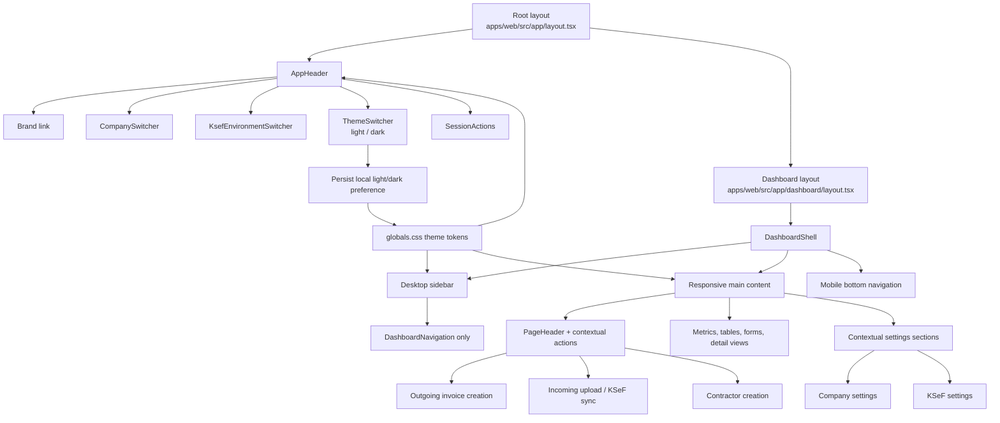

# Dashboard Light-Mode Redesign Specification

**Status:** Implemented  
**Date:** 2026-08-21  
**Recommended approach:** Option 1 — content-first dashboard with a navigation-only sidebar

## Problem and goal

The dashboard currently uses a dark, glass-heavy visual system and asks the desktop sidebar to carry three different responsibilities: navigation, persistent quick actions, and active-company/KSeF context. That makes the primary navigation compete with operational controls, repeats context in multiple places, and leaves the dashboard dependent on a dark canvas for hierarchy.

The goal is to make the dashboard calmer and easier to scan in light mode while preserving the product's indigo identity. The redesign must:

- establish a light visual baseline with a subtle green-tinted canvas;
- keep company and KSeF context permanently available without placing it in a sidebar card;
- make the sidebar a predictable navigation surface only;
- remove persistent `SidebarQuickActions` without removing the actions themselves;
- provide a deliberate light/dark theme switcher;
- preserve existing routes, company switching, KSeF environment switching, permissions, and business behavior.

This is a presentation and information-architecture change. It is not a change to accounting, KSeF, authentication, or company data behavior.

## Scope

### In scope

- Light theme tokens and dashboard surface hierarchy in `apps/web/src/app/globals.css`.
- Theme selection and persistence, including an accessible header theme switcher.
- Header composition containing:
  - the existing Księgowy Vibe brand;
  - active company switcher;
  - KSeF environment switcher;
  - light/dark theme switcher;
  - existing authenticated-user/session controls.
- Desktop sidebar simplification to navigation only.
- Removal of the persistent `SidebarQuickActions` render path and its desktop-only layout dependency.
- Removal of the active-company card from the sidebar.
- Moving quick actions to contextual page locations, using existing routes and components where possible.
- Responsive desktop and mobile behavior for header, sidebar, content, controls, and actions.
- Accessibility, focus, contrast, and reduced-motion requirements.
- Visual regression and targeted E2E coverage for the changed shell behavior.

### Non-goals

- No API, database, route, permission, or authentication changes.
- No redesign of invoice tables, invoice detail blocks, or invoice form behavior already covered by `docs/specs/invoices-workspace-ux-fixes.md`.
- No replacement of the existing brand asset in `apps/web/src/components/brand/assets/logo.png`.
- No new dashboard feature set, analytics model, notification center, or command palette.
- No removal of quick-action destinations; only their persistent sidebar placement is removed.
- No requirement to support user-created themes or arbitrary color customization.

## Recommended layout — Option 1

Option 1 keeps the current two-column desktop model but gives each region one clear job:

```text
┌─────────────────────────────────────────────────────────────────────┐
│ Brand      Company      KSeF context      Theme      User/session   │
├───────────────────┬─────────────────────────────────────────────────┤
│ Sidebar            │ Page header                     Context actions │
│                   │                                                     │
│ Overview           │ Metrics / status / primary work surface          │
│ Outgoing invoices  │                                                     │
│ Incoming invoices  │                                                     │
│ Contractors        │                                                     │
│ Settings           │                                                     │
└───────────────────┴─────────────────────────────────────────────────┘
```

### Header

`AppHeader` remains the single global brand anchor. On desktop, the header uses a full-width light surface or opaque backdrop so sticky scrolling cannot show content through its gutters, matching the existing sticky-header concern documented in `docs/specs/invoices-workspace-ux-fixes.md`.

The header order is:

1. brand link and subtitle;
2. active company control;
3. KSeF context control with a visible `TEST` or `PRODUCTION` status;
4. theme switcher;
5. user identity and `SessionActions`.

The company and KSeF controls may collapse into a compact grouped control at narrower widths, but both must remain reachable without opening the sidebar. They must continue to use the existing `CompanySwitcher` and `KsefEnvironmentSwitcher` behavior unless a purely presentational wrapper is required.

### Sidebar

On desktop, `DashboardNavigation` is the only functional content in the sidebar. The sidebar may retain a short non-interactive label such as “Workspace” if it improves orientation, but it must not contain:

- `SidebarQuickActions`;
- an active-company card;
- a second KSeF environment switcher;
- duplicate branding.

The sidebar should be visually quieter than the content area: solid or lightly tinted light surface, restrained border, no large gradient action treatment, and no competing card stack. The active navigation item may retain indigo emphasis, but the primary action gradient and glow should not be used as the default treatment for every navigation state.

### Main content and contextual actions

Actions should appear beside the content they affect, not in a permanent global panel:

- dashboard creation and incoming-invoice actions belong in `PageHeader` actions on all widths where there is sufficient room;
- outgoing invoice creation belongs in the outgoing-invoices page header;
- incoming upload and KSeF sync remain in the incoming-invoices page header;
- contractor creation remains in the contractors page header;
- company and KSeF configuration actions remain in settings sections;
- row-level and detail-level actions remain beside the relevant invoice or contractor.

The implementation should reuse existing links, labels, translations, and `Button` variants. Do not recreate the quick-action data in a second permanent component. If `SidebarQuickActions.tsx` has no remaining consumer after the move, delete it rather than leaving dead UI code.

## Light theme principles

The light theme is the primary presentation for this redesign. It should feel like an accounting workspace, not a marketing landing page.

- Preserve indigo as the primary identity color for active navigation, links, focus indicators, and primary actions.
- Use a very subtle green-tinted canvas for `--background` and page-level ambient treatment. The tint should be perceptible as warmth/freshness, not read as green branding.
- Use near-white neutral panels for cards, tables, forms, and the header; distinguish surfaces with value, border, and spacing before using shadows.
- Keep the existing semantic colors for success, warning, and error, recalibrated for light-background contrast.
- Use dark foreground text and a substantially darker muted text token than the current dark-mode muted value.
- Keep gradients and aura shadows exceptional. A primary action may use solid indigo or a restrained gradient; navigation should not look like a set of calls to action.
- Preserve `Inter` for body text and `Manrope` for display text as currently loaded by `apps/web/src/app/layout.tsx`.
- Define a complete dark palette rather than deriving dark mode by inverting light values. Existing dark mode remains available through the switcher.

Theme behavior must be explicit: the switcher toggles `light` and `dark`, persists the user's choice locally, and applies the choice before or during hydration without a visible flash where practical. If no choice exists, use light mode for this redesign. The implementation must not change server-side business data based on theme.

## Responsive behavior

### Desktop (`lg` and wider)

- Keep a persistent navigation sidebar beside the main content.
- Keep the global header visible and sticky with an opaque/fully covered background.
- Show company, KSeF, theme, and session controls in the header with compact spacing.
- Keep contextual page actions in page headers; do not add a replacement persistent quick-action panel.
- Ensure the main content can shrink without forcing the viewport into horizontal scrolling.

### Tablet and mobile (below `lg`)

- Hide the desktop sidebar and retain the existing bottom navigation pattern from `DashboardShell` unless testing demonstrates a clear usability failure.
- Keep the global header usable in one or two rows. Company and KSeF controls may move into a compact second row or an accessible overflow region; they must not be silently removed.
- Keep the theme switcher reachable with a minimum 44px target.
- Render contextual actions in the relevant `PageHeader`, allowing them to wrap or stack rather than truncate.
- Reserve a persistent mobile navigation region in the shell so it never covers form controls, table actions, or submit buttons.
- Maintain readable content at narrow widths without requiring horizontal scrolling for primary navigation or page-level actions.

## Accessibility requirements

- Use semantic `header`, `aside`, `nav`, `main`, and heading structure; keep one clearly identified primary dashboard navigation.
- Every icon-only control, including the theme switcher if icon-only, has an accessible name and a visible tooltip or adjacent text where appropriate.
- Expose theme state with a programmatically determinable label/state, for example `aria-pressed` for a two-state toggle or an equivalent native control.
- Preserve `aria-current="page"` on the active navigation link.
- Keep keyboard access to company switching, KSeF switching, theme switching, session actions, and contextual actions in logical DOM order.
- Preserve a visible `:focus-visible` indicator with at least 3:1 contrast against adjacent surfaces; do not use `outline-none` without a replacement.
- Meet WCAG 2.2 AA contrast targets: 4.5:1 for normal text, 3:1 for large text and meaningful graphical boundaries, and 3:1 for controls where applicable.
- Use targets of at least 44×44 CSS pixels for mobile and touch controls, including navigation and theme controls.
- Do not rely on color alone to communicate `TEST`, `PRODUCTION`, success, warning, error, or active navigation; retain text and/or an icon/shape distinction.
- Respect `prefers-reduced-motion: reduce`; theme changes and navigation state must not depend on animation.
- Keep `html lang="pl"` and use the existing translation layer for user-facing strings. Add translations rather than hardcoding new labels.
- Verify the sticky header and persistent mobile navigation do not obscure focused elements or meaningful content.

## Component and file impact map

| Path | Expected impact |
|---|---|
| `apps/web/src/app/globals.css` | Add light-first tokens, a complete dark theme selector, light surface/background rules, and any minimal theme-transition safeguards. Preserve semantic token names used by existing components. |
| `apps/web/src/app/layout.tsx` | Add the minimal theme bootstrap/provider boundary required to avoid hydration mismatch or first-paint flash; preserve fonts, metadata, and `html lang="pl"`. |
| `apps/web/src/components/organisms/AppHeader.tsx` | Compose brand, company, KSeF, theme, and session controls; make the sticky header background cover its full box. |
| `apps/web/src/components/organisms/DashboardShell.tsx` | Remove `SidebarQuickActions`, the sidebar company card, and duplicated sidebar context controls; retain navigation-only desktop sidebar, responsive main content, and mobile navigation. |
| `apps/web/src/components/organisms/DashboardNavigation.tsx` | Tune light active/inactive states and touch/focus sizing without changing route matching or navigation items. |
| `apps/web/src/components/organisms/SidebarQuickActions.tsx` | Remove if no consumer remains. Its destinations and translated labels must be retained in contextual page headers or existing page-level controls. |
| `apps/web/src/components/CompanySwitcher.tsx` | Reuse existing company-change behavior; adjust only sizing/wrapping/presentation needed for the header. |
| `apps/web/src/components/KsefEnvironmentSwitcher.tsx` | Reuse existing cookie and refresh behavior; adjust only compact header presentation and light semantic colors. |
| `apps/web/src/components/organisms/ThemeSwitcher.tsx` | New small client component for explicit light/dark selection, local persistence, accessible state, and route-independent theme changes. Use a native button or equivalent simple control; no new dependency. |
| `apps/web/src/app/dashboard/page.tsx` | Promote existing mobile-only dashboard quick actions to contextual `PageHeader` actions where appropriate; do not change dashboard data calculations. |
| `apps/web/src/app/dashboard/invoices/page.tsx` | Ensure the outgoing-invoice create action is visible in the contextual page header after sidebar action removal. |
| `apps/web/src/app/dashboard/incoming/page.tsx` | Ensure upload and KSeF sync remain visible in the incoming-invoice page header. |
| `apps/web/src/app/dashboard/contractors/page.tsx` | Ensure contractor creation remains available in the contractors page header. |
| `apps/web/src/app/dashboard/settings/page.tsx` | Keep settings actions and company/KSeF configuration in their existing contextual sections. |
| `apps/web/src/components/molecules/PageHeader.tsx` | Adjust layout only if needed to support wrapped desktop/mobile actions consistently. |
| `apps/web/src/lib/translations.ts` | Add or revise theme/header action labels through the existing translation structure; do not scatter hardcoded Polish strings. |
| `apps/e2e/tests/dashboard.spec.ts` | Add coverage for visible contextual actions and the light-mode dashboard baseline. |
| `apps/e2e/tests/navigation.spec.ts` | Verify sidebar navigation remains complete on desktop and mobile navigation remains available. |
| `apps/e2e/tests/smoke.spec.ts` | Add the smallest viable check for theme control reachability if the existing smoke setup can authenticate/render the header. |

No API or database files should be changed for this redesign.

## Implementation status

The implementation represented by this specification is present on the current branch:

- `AppHeader` is the root global brand anchor and composes the brand, company switcher, KSeF environment control, theme switcher, and session actions.
- `DashboardShell` provides a navigation-only desktop sidebar, a shrink-safe main content region, and persistent mobile bottom navigation in reserved flow space with safe-area padding.
- `SidebarQuickActions` and its render/import path are removed. Dashboard, incoming-invoice, and contractor actions are placed in contextual page headers; settings actions remain in their existing settings sections.
- Light-first semantic tokens, explicit dark tokens, validated local theme persistence, and pre-hydration theme bootstrap are implemented without changing API, database, authentication, accounting, or KSeF business contracts.
- Targeted browser coverage and pinned visual baseline configuration are present in `apps/e2e`; the Playwright dependency is pinned to `1.59.1`.

Implementation files changed by the redesign are grouped as follows: `apps/web/src/app/{globals.css,layout.tsx,dashboard/layout.tsx,dashboard/page.tsx,dashboard/incoming/page.tsx,dashboard/contractors/page.tsx}`, `apps/web/src/components/{CompanySwitcher,KsefEnvironmentSwitcher,organisms/{AppHeader,DashboardNavigation,DashboardShell,SessionActions,ThemeSwitcher},molecules/PageHeader,atoms/{Button,Surface}}`, `apps/web/src/lib/{theme.ts,translations.ts}`, and the affected dashboard E2E/package configuration under `apps/e2e/`. No API or database files are part of the implementation diff.

Previously recorded implementation evidence on 2026-08-21 includes successful web typecheck/lint, targeted dashboard/navigation E2E runs, responsive and focus/contrast probes, and pinned visual baseline generation, inspection, and no-update verification recorded in `docs/superpowers/plans/2026-08-21-task-7-review-blockers.md`. The commands below are the canonical focused checks; they were not rerun as part of this documentation-only update, so this update does not claim a fresh pass or manual acceptance review.

```bash
pnpm --filter @ksiegowy/web typecheck
pnpm --filter @ksiegowy/web lint
pnpm --filter @ksiegowy/e2e exec playwright test tests/dashboard.spec.ts tests/navigation.spec.ts tests/incoming.spec.ts
```

Pinned visual verification, without changing baselines:

```bash
docker run --rm --ipc=host --env CI=true -e VISUAL_REGRESSION=true -v "$PWD:/work" -w /work mcr.microsoft.com/playwright:v1.59.1-noble bash -lc "corepack enable && pnpm install --frozen-lockfile && pnpm --filter @ksiegowy/e2e exec playwright test tests/dashboard.spec.ts --project=chromium-linux --grep 'visual:'"
```

Theme is client presentation state only. The redesign does not alter API, database, authentication, route, permission, accounting, or KSeF business behavior.

## Acceptance criteria

1. The authenticated dashboard opens in light mode by default when no theme preference exists.
2. Light mode uses a subtle green-tinted canvas, readable dark text, white/light panels, and indigo primary identity without relying on excessive gradients or glow.
3. The header contains the brand, active company control, visible KSeF environment control, theme switcher, and existing user/session controls without duplicate company/KSeF controls in the desktop sidebar.
4. The theme switcher is keyboard accessible, has an accessible name and state, persists the selected light/dark mode across reloads, and does not change application data or route behavior.
5. The desktop sidebar contains navigation only; it has no `SidebarQuickActions`, active-company card, or second KSeF switcher.
6. All actions previously exposed by `SidebarQuickActions` remain reachable in contextual locations, including new outgoing invoice, incoming invoice access, and company settings.
7. Desktop layout remains usable at `lg`, `xl`, and `2xl` widths without unintended horizontal scrolling or content hidden behind the sticky header.
8. Mobile layout retains persistent bottom navigation, keeps contextual actions reachable, and does not cover focused controls.
9. Active navigation retains `aria-current="page"`; all new or changed controls have visible focus states and meet the stated contrast and target-size requirements.
10. Existing company switching, KSeF environment switching, authentication/session actions, permissions, and route matching behave exactly as before.
11. No production API, database, or accounting/KSeF business logic changes are introduced.
12. Targeted typecheck, lint, and E2E checks pass, and manual visual review confirms light and dark modes at desktop and mobile breakpoints.

## Risks and mitigations

| Risk | Mitigation |
|---|---|
| A light palette exposes low-contrast borders, muted text, badges, or form controls. | Audit all shared tokens and representative pages, not only the dashboard; verify contrast on `Input`, `Select`, `Badge`, `Surface`, tables, and status components. |
| Moving context to the header makes the header too dense on smaller screens. | Define explicit compact/wrapped mobile states, test at narrow widths, and keep company/KSeF controls available rather than hiding them. |
| Removing persistent quick actions reduces discoverability. | Promote actions into page headers, keep labels explicit, and verify dashboard/invoices/incoming/settings E2E paths. |
| Theme persistence causes hydration mismatch or a flash of the wrong palette. | Keep the theme decision in a small, route-independent client boundary and use a pre-paint attribute/class strategy compatible with the existing Next.js App Router layout. |
| Reusing existing `Select` controls in a tighter header creates truncation. | Test one-company and multi-company states, long company names, both KSeF environments, and mobile wrapping; use truncation only with an accessible full value. |
| The simplified sidebar loses orientation after duplicate branding is removed. | Retain clear navigation labels and active state; use the existing “Workspace” orientation label only if it remains useful. |
| Light mode changes shared surfaces outside the dashboard unexpectedly. | Keep semantic token names stable, review representative invoice/settings screens, and avoid unrelated component rewrites. |

### Verification limitations

- The commands in the implementation section were not rerun during this documentation-only task.
- This document records prior implementation evidence but does not claim a fresh full repository quality gate, manual breakpoint matrix, or current visual review.
- Visual comparisons remain dependent on Playwright `1.59.1` and `mcr.microsoft.com/playwright:v1.59.1-noble`; use the pinned command rather than a floating package or image.

## Mermaid layout and interaction model



The architecture remains presentation-only: the root layout supplies authenticated context to the header, the dashboard shell separates navigation from content, and the theme preference feeds semantic CSS tokens locally.

## Self-review

- No placeholders such as `TBD` or `TODO` remain.
- “Option 1” is explicitly selected and its desktop, mobile, and component consequences are defined.
- Quick actions are removed from the persistent sidebar but explicitly retained in contextual locations, so removal does not contradict action availability.
- Company and KSeF controls are moved to the global header and are explicitly not duplicated in the sidebar.
- Theme behavior specifies default mode, supported modes, persistence, and non-impact on business data.
- The file map reflects the explored repository paths, including the current shell, header, navigation, switchers, dashboard pages, global styles, translations, and E2E suites.
- The scope is limited to a single frontend shell/theme redesign; API, database, and unrelated invoice UX work remain out of scope.
