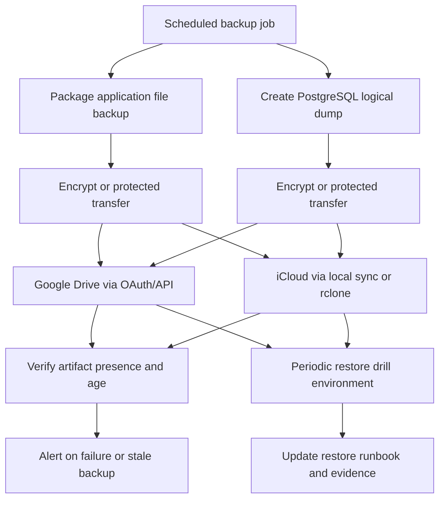

# Backup Implementation Plan

## Status
- Overall: `partially implemented` (PostgreSQL one-shot backup slice + scheduled company Google Drive one-shot slice implemented)
- Document type: implementation spec
- Intended start: after technical owner approves scope, target posture, and operational budget

### Implementation Snapshot (this slice)

Implemented now:

- PostgreSQL logical backup one-shot container service (`backup-postgres`) built from `ops/backup/Dockerfile`
- Host-scheduler-friendly execution path (`docker compose --profile backup run --rm backup-postgres`)
- Scheduled company Google Drive policy one-shot container service (`backup-gdrive-scheduled`) using API runtime and existing policy logic (`runScheduledCompanyGoogleDriveBackups`)
- Timestamped PostgreSQL artifacts with checksum and manifest files
- PostgreSQL local-only mode support when remote names are not configured
- Upload to one or two optional `rclone` remotes with retention cleanup
- Docker Compose local-only runtime support without requiring custom rclone config path configuration
- PostgreSQL readiness wait before backup execution
- Staged remote publishing with remote artifact-set presence verification and cleanup on failure
- Local PostgreSQL artifact retention cleanup (`DB_BACKUP_LOCAL_RETENTION_DAYS`)
- Initial PostgreSQL restore runbook (`docs/restore-postgresql.md`)
- File restore runbook for current file backup flows (`docs/restore-files.md`)
- Basic one-shot backup freshness verification service (`verify-backups`) with non-zero exit on stale/missing/failed required backups
- PostgreSQL freshness verification includes latest local complete artifact-set presence and local checksum validation
- Docker Compose runtime alignment so `api` can read local PostgreSQL artifacts for read-only freshness status (`POSTGRESQL_BACKUP_ARTIFACTS_PATH` + bind mount)
- Read-only company settings status endpoint (`GET /companies/:companyId/backup-status`) for indicator-focused backup status rendering
- Documented restore drill procedure with evidence template (`docs/backup-restore-drill.md`)
- Documentation updates in README and infrastructure docs

Still pending from broader plan:

- Move remaining API in-process file backup triggers out of the API process (daily iCloud cron and invoice-issued best-effort trigger if/when desired)
- Full monitoring and alert routing integration
- Scheduled restore drill execution with recorded evidence
- Final approved retention policy tiers (daily/weekly/monthly)
- Technical enforcement of remote encryption posture (current slice documents requirements but does not cryptographically enforce destination type)

## Objective
Define a backup implementation plan that moves the platform from basic file-sync posture toward a recoverable, verifiable backup posture for both application files and PostgreSQL data, with explicit restore procedures, retention rules, and operational checks.

## Confirmed Findings
1. File backups exist today.
   - Backups are sent to Google Drive via OAuth/API integration and to iCloud via local sync (macOS) or `rclone` (Linux/VPS).
   - Scheduling is described as daily at `02:00`.
   - Execution now uses host cron + one-shot service for scheduled company Google Drive policy runs, and API async trigger for invoice-issued runs.
   - Scheduled company Google Drive execution is best-effort per slot and currently has no catch-up semantics.
   - Google Drive behavior is company-scoped and uses company-specific folders.

2. Current evidence confirms file backup intent, but not full recovery coverage.
   - Repository context states automated Google Drive and iCloud backup exists.
   - The confirmed current state says scheduled company Google Drive runs are host-cron-triggered one-shot jobs, while invoice-issued trigger remains API async best-effort.

3. PostgreSQL backup baseline is now implemented in this slice.
   - A logical dump flow exists via `backup-postgres` one-shot Docker Compose service.
   - Point-in-time recovery capability is still not implemented and should not be assumed.

4. Restore documentation baseline is now in place.
   - PostgreSQL restore runbook exists in `docs/restore-postgresql.md`.
   - File restore runbook exists in `docs/restore-files.md`.
   - Restore drill procedure and evidence template exist in `docs/backup-restore-drill.md`.

5. Retention and versioning policy is partial.
   - Timestamped artifacts and initial retention windows exist.
   - Final approved tiered retention policy and immutability expectations remain pending.

6. Basic freshness verification exists, but monitoring/alerting posture is still partial.
     - One-shot `verify-backups` service exists and exits non-zero on stale/missing/failed required checks.
     - API now reads local PostgreSQL artifacts in containerized runtime for read-only freshness status.
     - Company settings now use a dedicated read-only backup status read model for indicators, while editable Google Drive policy remains separate.
     - Full alert routing integration and remote integrity/restoreability proof are still pending.

7. Company settings backup UX is now split by intent.
   - `GET /companies/:companyId/backup-status` is the preferred indicator-focused read model for the settings UI.
   - `GET/PATCH /companies/:companyId/backup-policy` remains the editable Google Drive company policy API.
   - `GET /companies/:companyId/backup-policy` still includes PostgreSQL freshness fields for compatibility, but that is no longer the preferred status source for settings.
   - Technical backup fields are shown in settings under an advanced details accordion.
   - If status cannot be loaded but policy can, Google Drive policy editing remains available and the PostgreSQL indicator degrades to unavailable.

## Target Backup Posture
The target posture should provide:

- scheduled backups for both file storage and PostgreSQL
- at least two independent remote destinations for critical backup artifacts
- encrypted backup artifacts in transit and at rest where supported
- explicit retention and pruning rules
- a documented restore runbook for files and database
- regular restore drills in a non-production environment
- monitoring for job success, freshness, and restore test outcomes
- clear ownership for backup operations and incident response

## Scope
In scope:

- backup coverage definition for:
  - PostgreSQL database
  - local application file storage
  - backup metadata needed for restores
- backup orchestration design
- retention and versioning policy definition
- restore runbook definition
- drill and verification process
- monitoring and alerting requirements
- rollout sequencing and rollback considerations

Out of scope:

- business continuity planning beyond backup and restore
- cross-region active-active architecture
- application-level high availability redesign
- legal or contractual data retention advice beyond technical implementation needs

## Non-Goals
- This plan does not assume zero-downtime restores.
- This plan does not propose replacing PostgreSQL with a managed service.
- This plan does not guarantee point-in-time recovery unless WAL archiving or equivalent is explicitly implemented.
- This plan does not treat Google Drive or iCloud alone as sufficient evidence of restore readiness.

## Recommended RPO / RTO
Recommended starting targets for this product stage:

- **RPO:** `24 hours` maximum acceptable data loss
- **RTO:** `8 hours` maximum acceptable service restoration time

Recommended stretch targets after the first stable version:

- **RPO:** `4 hours` for PostgreSQL
- **RTO:** `4 hours`

Notes:

- The current confirmed state supports only a daily file-backup assumption.
- These targets should be revalidated against invoice issuance, OCR intake, and KSeF-related operational expectations.

## Architecture Decisions
1. **Separate file backups from database backups**
   - File backup and PostgreSQL backup should be implemented as distinct flows with distinct verification.
   - A successful file sync must not be treated as a successful full-system backup.

2. **Prefer out-of-process execution over API in-process cron**
   - Backup execution should move away from API process lifecycle coupling.
   - Preferred options:
     - dedicated container job
     - host scheduler invoking versioned scripts
     - orchestrator-native scheduled job if deployment platform supports it

3. **Use logical PostgreSQL backups first**
   - Start with scheduled logical dumps for full restore coverage.
   - Reassess WAL archiving or physical backup only after baseline restore reliability is proven.

4. **Version backup artifacts by timestamp**
   - Every backup artifact should be uniquely timestamped and traceable to source environment.
   - Latest-copy-only behavior should be avoided.

5. **Keep dual remote destinations if operationally sustainable**
   - Google Drive (OAuth/API) and iCloud (local sync or `rclone`, depending on environment) can remain remote targets for file backups if verification is added.
   - Database backups should use the same or equivalent remote strategy only if operational complexity stays acceptable.

6. **Treat restore verification as part of the backup system**
   - Backup is not complete until restore steps are documented and periodically exercised.

## Proposed Architecture

## Phased Implementation Plan

### Now
Goal: establish minimum recoverable baseline without over-design.

1. Document current backup flow
   - capture the exact current file-backup trigger, source paths, target paths, and credentials model
   - record what is confirmed versus assumed
   - **Status in this slice:** implemented for current file backup and new PostgreSQL backup flow in README/docs

2. Add PostgreSQL backup flow
    - create scheduled logical dump process
    - store timestamped artifacts separately from file backups
    - upload database backup artifacts to approved remote target(s)
    - **Status in this slice:** implemented as one-shot Docker Compose service (`backup-postgres`) triggered by host cron, with both local-only mode and optional remote upload mode

3. Define retention policy
   - daily backups retained for at least `14 days`
   - weekly backups retained for at least `8 weeks`
   - monthly backups retained for at least `6 months`
   - final values require technical owner approval
   - **Status in this slice:** partial — configurable `DB_BACKUP_RETENTION_DAYS` implemented for remote pruning; tiered daily/weekly/monthly policy still pending approval

4. Move scheduling outside the API process where operationally justified
   - keep API in-process scheduling only for intentionally retained flows
   - **Status in this slice:** partial — PostgreSQL and scheduled company Google Drive scheduling moved outside API process via host cron one-shot services; daily iCloud and invoice-issued file backup trigger remain in API process intentionally

5. Create initial restore runbook
   - file restore procedure
   - PostgreSQL restore procedure
   - service restart and smoke verification steps
   - **Status in this slice:** implemented — PostgreSQL and file restore runbooks are documented

6. Add minimum monitoring
   - log backup start and end
   - record artifact name, size, destination, and completion status
   - alert when a scheduled backup fails or when no fresh artifact is detected within expected window
   - **Status in this slice:** partial — basic one-shot `verify-backups` freshness check is implemented (local PostgreSQL complete-set and checksum validation + `BackupRun` metadata freshness/status checks); remote checksum integrity / restoreability proof and alert routing integration remain pending

### Next
Goal: reduce operational risk and increase confidence.

1. Add backup manifest metadata
   - backup type
   - creation time
   - source environment
   - artifact checksum
   - retention class

2. Add automated backup verification
   - checksum validation
   - freshness validation
   - destination presence validation

3. Execute scheduled restore drills in non-production
   - restore latest PostgreSQL dump
   - restore representative file set
   - run application smoke checks
   - record drill evidence

4. Tighten security controls
   - dedicated backup credentials
   - least-privilege access to destinations
   - key rotation process
   - documented operator access path

### Later
Goal: improve recovery objectives and resilience.

1. Evaluate PostgreSQL WAL archiving or equivalent incremental strategy
   - only if business needs justify lower RPO than daily dumps

2. Evaluate immutable or append-only backup storage options
   - especially for ransomware resistance

3. Add backup dashboard or operational reporting
   - latest success
   - artifact age
   - drill status
   - retention compliance

4. Reassess dual-destination design
   - keep, simplify, or replace based on restore evidence and operator burden

## Security And Access Control Requirements
- Backup credentials must be separate from normal application credentials.
- Backup destinations must use least-privilege access.
- Backup artifacts must not be publicly accessible.
- Secrets used for backup operations must come from managed environment configuration, not committed files.
- Database dumps must be encrypted at rest or stored only in destinations with strong access controls and documented encryption guarantees.
- Current implementation note: backup script does not enforce remote encryption type. Operator configuration must ensure encrypted destinations (for example `rclone crypt` or encrypted provider storage).
- Restore permissions must be limited to designated operators.
- Restore activity should be auditable.
- Backup logs must avoid leaking secrets or sensitive payload content.

## Restore And Drill Requirements
- A written restore runbook is required before rollout is considered complete.
- The runbook must cover:
  - latest-file restore
  - point-in-time not supported / supported statement
  - latest-database restore
  - full service bring-up sequence
  - validation steps after restore
  - rollback steps if restore environment is invalid
- Restore drills should run at least quarterly.
- Each drill should capture:
  - backup artifact used
  - restore duration
  - issues encountered
  - validation outcome
  - owner and date
- Drill failures must create follow-up remediation work before backup posture is considered healthy.

## Verification Checklist
- [x] Current file-backup implementation is documented with exact source and destination scope.
- [x] PostgreSQL backup approach is selected and documented.
- [x] Backup scheduling mechanism is defined and owned (host cron for PostgreSQL backup service and scheduled company Google Drive one-shot service).
- [x] Timestamped, versioned backup artifacts are produced.
- [ ] Retention and pruning rules are defined (partial: remote and local retention windows implemented; tiered policy pending).
- [ ] Backup success and freshness are monitored (partial: basic logs + local/metadata freshness checks implemented; remote integrity and restoreability verification remain pending, as do freshness monitoring and alerts).
- [ ] Failure alert path is defined and tested.
- [x] Restore runbook exists for files and PostgreSQL.
- [ ] A non-production restore drill has been executed successfully.
- [ ] Access controls for backup operators and credentials are documented.
- [x] README and infrastructure documentation are updated when implementation starts.

## Rollout And Rollback Considerations
### Rollout
- Introduce PostgreSQL backups without removing the current file-backup flow.
- Validate artifact generation and remote upload in a safe environment first.
- Enable alerting before relying on the new schedule operationally.
- Run at least one documented restore drill before declaring the new baseline active.

### Rollback
- If the new backup job is unstable, keep the existing file-backup path active while disabling only the new failing component.
- Do not remove previous working remote sync flows until replacement coverage is verified.
- Preserve backup artifacts generated during rollout for investigation unless storage pressure requires controlled pruning.

## Risks / Assumptions
### Risks
- API in-process triggers (daily iCloud cron and invoice-issued Google Drive best-effort trigger) may skip backups during restarts, deployments, or process failure.
- File-only backups may create false confidence if PostgreSQL remains uncovered.
- Remote sync success may not guarantee artifact consistency or restorability.
- Lack of retention rules may cause silent data loss or uncontrolled storage growth.
- Lack of alerting may allow stale backups to persist unnoticed.

### Assumptions
- The application remains dependent on PostgreSQL as the system of record.
- Local file storage remains in use and must be backed up.
- Google Drive and iCloud/rclone remain acceptable interim remote destinations unless policy or operational evidence says otherwise.
- A non-production environment can be used for restore drills.

## Open Questions
1. What exact directories are included in the current file-backup job, and are they sufficient for restore?
2. Is API in-process cron acceptable as a temporary state, or should out-of-process scheduling be mandatory before any broader rollout?
3. Which remote destination is considered primary for database backups?
4. Are Google Drive and iCloud acceptable for sensitive database dump storage under current security expectations?
5. Is encryption of backup artifacts handled by destination guarantees, by `rclone`, or by a separate packaging step?
6. What retention window does the technical owner want for daily, weekly, and monthly copies?
7. Is a daily PostgreSQL logical dump sufficient for the current business risk tolerance?
8. Who owns backup failure response and restore drill execution?
9. What post-restore smoke checks are required to confirm business readiness?
10. Should future scope include WAL archiving for lower RPO, or is that explicitly deferred?
