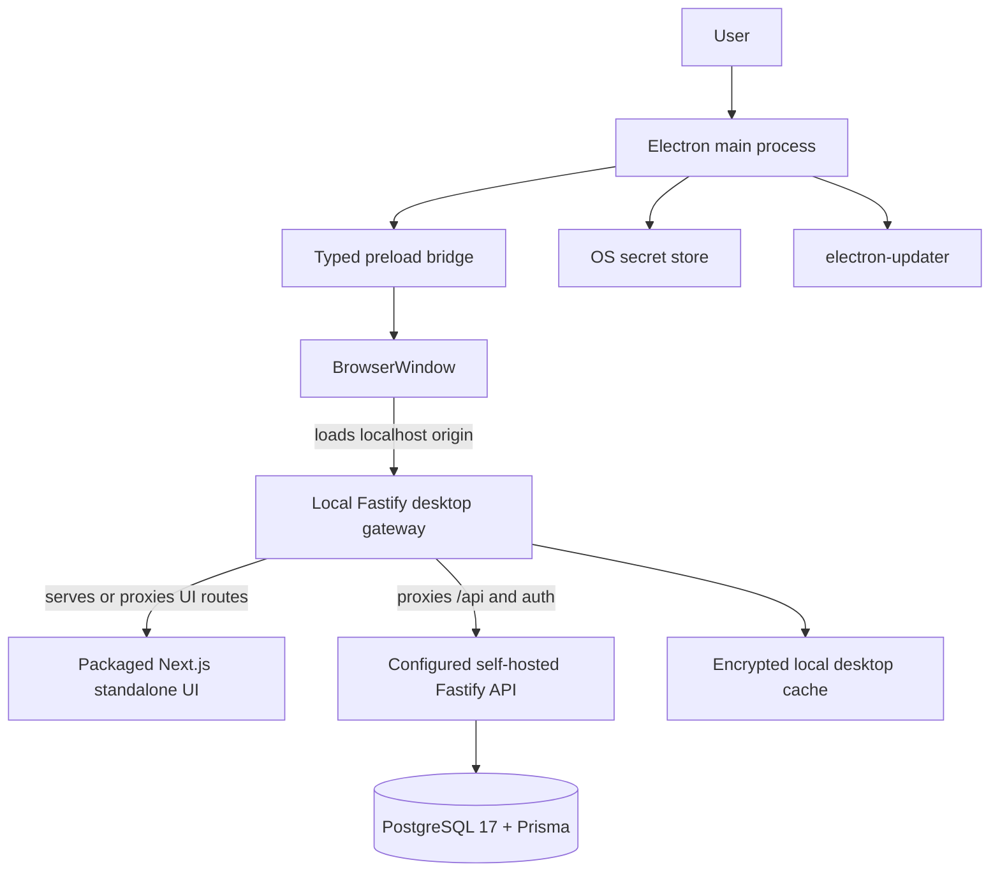

# Desktop Implementation Plan

## Status

- Overall: `partially implemented`
- Scope:
  - add Electron desktop support in a dedicated `apps/desktop` workspace
  - keep the existing web and API product architecture intact
  - ship signed staged desktop releases for supported operating systems

## Objective

Deliver a cross-platform desktop application that:

- runs through Electron with a hardened renderer boundary
- loads a single localhost origin in `BrowserWindow`
- serves the packaged Next.js standalone UI behind a local Fastify desktop gateway
- proxies business API traffic to the existing self-hosted Fastify API in the initial delivery
- uses OS-backed secret storage and encrypted local desktop state
- supports signed staged updates via `electron-builder` and `electron-updater`

## Confirmed Findings

1. The repository is a `pnpm` workspace monorepo with `apps/web` and `apps/api`.
2. `apps/web` uses Next.js 15 App Router and is already built for standalone runtime in Docker.
3. `apps/api` uses Fastify 5 + TypeScript and depends on PostgreSQL 17 + Prisma.
4. Current product capabilities rely on server-side infrastructure that is not desktop-ready as a fully local bundle:
   - PostgreSQL 17 + Prisma
   - local filesystem storage on the deployed host
   - Google OAuth2 callback handling
   - Puppeteer PDF generation
   - Tesseract OCR
5. Current deployment and operational docs are Docker-first and self-hosted, not desktop-first.
6. Desktop security and release constraints are already clear:
   - `sandbox: true`
   - `contextIsolation: true`
   - `nodeIntegration: false`
   - narrow typed preload contract
   - OS secret store for secrets
   - encrypted local sensitive data
   - signed staged desktop releases
7. Initial desktop workspace scaffolding now exists.
   - `apps/desktop` is present as a dedicated Electron workspace.
   - minimal Electron main and preload entrypoints are defined.
   - the initial workspace enforces localhost-only renderer loading and a typed preload API.

## Scope

In scope:

- create `apps/desktop` with Electron main, preload, packaging, and update flow
- create a local Fastify desktop gateway for the localhost app origin
- package `apps/web` standalone output for desktop use
- proxy `/api` and auth traffic from the desktop gateway to the configured self-hosted API
- introduce desktop-safe auth flow using the system browser
- define minimal typed preload APIs for approved desktop capabilities
- store secrets in OS-backed secret storage
- encrypt sensitive local desktop cache and temporary persisted state
- add desktop packaging, signing, update, and release documentation

## Non-Goals

- packaging PostgreSQL in the initial desktop application
- moving all business logic into Electron main or preload
- replacing the existing deployed Fastify API in the first release
- delivering full offline accounting workflows in the first increment
- creating a separate native UI stack outside `apps/web`
- exposing generic file system, shell, or process execution to the renderer

## Architecture Decisions

1. **Electron is shell-only**
   - desktop-specific concerns live in `apps/desktop`
   - business logic stays in the existing server-side system

2. **One localhost origin**
   - the renderer loads one local origin only
   - the local Fastify desktop gateway becomes the renderer entrypoint

3. **Next.js stays the only UI runtime**
   - desktop uses packaged standalone output from `apps/web`
   - no second renderer framework is introduced

4. **Desktop starts online-first**
   - the self-hosted API remains the source of truth in the initial delivery
   - later local-first capabilities must be approved feature by feature

5. **Preload stays narrow and typed**
   - only approved capabilities such as file dialogs, update status, and explicit desktop actions cross the boundary

6. **Desktop secrets use OS storage**
   - refresh tokens, key material, and other secrets do not live in plain files or renderer storage

7. **Desktop delivery uses signed staged updates**
   - `electron-builder` packages the application
   - `electron-updater` delivers staged signed releases

## Proposed Architecture

## Phased Implementation Plan

### Now

Goal: establish the minimum secure desktop shell around the existing product.

1. Create `apps/desktop`
   - Electron main process
   - preload entrypoint
   - desktop-specific TypeScript config
   - root `pnpm` scripts for desktop development and build
   - **Status in this slice:** implemented as initial workspace scaffold with local build and typecheck support

2. Add the local desktop gateway
   - Fastify-based localhost entrypoint
   - health and readiness endpoints
   - reverse proxy to packaged Next.js standalone output
   - proxy `/api` and auth traffic to the configured self-hosted API
   - **Status in this slice:** implemented as a localhost-only Fastify gateway with `/_desktop/health`, `/auth/*` proxying, `/_desktop/api/*` business API proxying, UI reverse proxying to `DESKTOP_WEB_RUNTIME_URL`, and desktop-safe OAuth callback handoff using a short-lived one-time exchange

3. Harden the renderer boundary
   - `sandbox: true`
   - `contextIsolation: true`
   - `nodeIntegration: false`
   - typed preload contract only
   - strict navigation and external-open allowlists

4. Define desktop authentication flow
   - system browser for Google sign-in
   - callback handoff into desktop session flow
   - cookie and session behavior validated against the localhost desktop origin

5. Add desktop storage foundations
   - OS app-data path layout
   - OS secret store integration
   - encrypted local cache for sensitive desktop data

### Next

Goal: make the desktop app releasable and operationally safe.

1. Add packaging and signing
   - `electron-builder` configuration
   - macOS notarization flow
   - Windows signing flow
   - artifact outputs and release metadata

2. Add updater flow
   - `electron-updater`
   - staged rollout channels
   - rollback-ready release procedure

3. Add approved desktop capabilities
   - file pick/save dialogs
   - safe external-link handling
   - update status UI
   - bounded local cache or work queue only where explicitly needed

4. Add desktop verification coverage
   - packaged startup smoke tests
   - auth flow checks
   - preload contract tests
   - navigation and security regression checks

### Later

Goal: extend desktop value only where it is justified by product needs.

1. Evaluate bounded local-first features
   - encrypted drafts
   - short-lived upload or OCR queue
   - retryable background actions

2. Reassess local sidecar support only if needed
   - only for clearly bounded workflows
   - not as a full replacement for the deployed system of record

3. Expand release operations
   - richer rollout dashboards
   - crash reporting and support bundles
   - documented rollback drills

## Risks And Mitigations

- **OAuth flow complexity in desktop**  
  Mitigation: use the system browser and prove callback behavior early.

- **Cookie and session drift on localhost**  
  Mitigation: define one canonical desktop origin and validate session rules in packaged builds.

- **Desktop packaging drift from the web app**  
  Mitigation: keep `apps/web` as the only UI runtime and package the standalone build directly.

- **Secret leakage on local machines**  
  Mitigation: use OS secret storage and encrypt sensitive local data at rest.

- **Release pipeline complexity**  
  Mitigation: add signing, notarization, and updater flow before broad beta release.

- **Offline scope expansion**  
  Mitigation: treat local-first support as opt-in per workflow, not as a blanket product promise.

## Verification Checklist

- [ ] `apps/desktop` builds from the monorepo workspace
- [ ] packaged desktop app starts without Docker
- [ ] `BrowserWindow` loads only the configured localhost origin
- [ ] preload API is typed, minimal, and does not expose raw Node.js access
- [ ] local Fastify gateway serves or proxies the packaged Next.js UI correctly
- [ ] `/api` and auth proxying works against the configured deployed API
- [x] Google sign-in works through the desktop-safe system-browser flow
- [ ] secrets are stored in the OS secret store
- [ ] sensitive local desktop state is encrypted at rest
- [ ] update metadata and signed artifacts are generated in CI
- [ ] staged release and rollback runbooks are documented
- [ ] README and dedicated desktop docs are updated

## Recommended Conventional Commit Sequence

1. `chore(desktop): scaffold electron workspace and desktop build scripts`
2. `build(desktop): add localhost gateway and packaged web runtime`
3. `feat(desktop): add hardened browser window and typed preload contract`
4. `feat(auth): support desktop-safe oauth and localhost session flow`
5. `feat(security): add os secret storage and encrypted local cache`
6. `build(release): add electron-builder packaging signing and updater pipeline`
7. `test(desktop): cover packaged startup auth and boundary checks`
8. `docs(desktop): add architecture decision and implementation plan`
