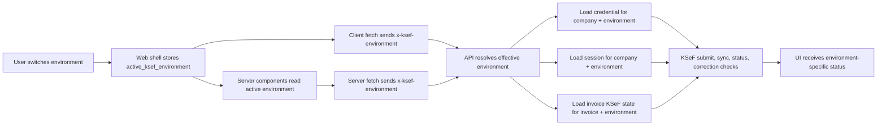

# Environment Context Switcher Plan

## Status
- Overall: `planned`
- Document type: implementation spec
- Confirmed product decision: the switcher changes only the current user's context, not the company's shared KSeF setting

## Objective
Make the active `TEST` or `PRODUCTION` context visible across the dashboard and let the user switch it quickly, without silently changing company-wide configuration for other users.

The implementation must keep KSeF operations safe:
- the selected context must be explicit in the UI
- credentials and sessions must not mix between environments
- invoice KSeF state must not be ambiguous when the same invoice is touched in both environments

## Confirmed Findings
1. The repository already has a persisted company-level KSeF environment.
   - `apps/api/prisma/schema.prisma`
   - `apps/api/src/routes/companies.ts`
   - `apps/web/src/app/dashboard/settings/KsefSettingsForm.tsx`

2. The web app already persists user context for company selection through a cookie.
   - `apps/web/src/components/CompanySwitcher.tsx`
   - `apps/web/src/lib/auth.ts`

3. The current KSeF settings flow is not suitable for fast environment switching.
   - `PATCH /companies/:id/ksef-settings` requires both `ksefToken` and `ksefEnv`
   - `KsefSettingsForm` couples token save and environment change into one action

4. KSeF credentials are effectively single-environment today.
   - `Company` stores one encrypted token pair: `ksefTokenEnc`, `ksefTokenIv`
   - `Company.ksefEnv` decides which endpoint is used

5. KSeF session caching is keyed only by `companyId`, so `TEST` and `PRODUCTION` refresh tokens would overwrite each other.
   - `apps/api/prisma/schema.prisma`
   - `apps/api/src/services/ksef.service.ts`

6. Invoice KSeF state is global on the `Invoice` record today.
   - `Invoice.ksefStatus`
   - `Invoice.ksefReference`
   - `Invoice.ksefSubmittedAt`
   - `Invoice.ksefAcceptedAt`

7. Incoming KSeF sync and KSeF submission audit records are not environment-aware.
   - `KsefSubmission` has no environment field
   - `KsefIncomingSync` has no environment field
   - `IncomingInvoice` has no KSeF environment field

8. Browser mutations in `apps/web` call the API directly, so a web-only cookie is not enough for KSeF-sensitive operations.
   - `apps/web/src/lib/api-client.ts`
   - custom environment context must be forwarded explicitly to the API

## Product Rules
- The switcher is a user-level context switcher.
- Company, contractor, invoice, and OCR data remain company-scoped in this slice.
- The selected environment controls KSeF-connected behavior only.
- The company still keeps a default KSeF environment as fallback.
- `TEST` and `PRODUCTION` credentials are stored separately.
- KSeF-sensitive actions must always show the active environment before execution.
- The application must never mix `TEST` and `PRODUCTION` refresh tokens, submission statuses, or correction references.

## Scope
In scope:
- visible environment indicator in the shell
- fast environment switcher in the shell
- persisted user selection
- environment-aware KSeF credential storage
- environment-aware KSeF session storage
- environment-aware invoice KSeF state
- environment-aware incoming sync audit
- environment-aware correction and submission logic
- settings UI for per-environment token management
- tests and docs updates

Out of scope:
- full duplication of company data per environment
- separate companies for test and production
- splitting contractors or invoices into separate test and production datasets
- retroactive KSeF cleanup outside normal business flows

## Non-Goals
- This slice does not redesign all business data around environments.
- This slice does not remove existing company-level fallback behavior immediately.
- This slice does not guarantee every historical KSeF record can be perfectly attributed if legacy data has no environment marker.

## Architecture Decision
Use a user-selected KSeF context, but keep the domain source of truth environment-aware in the backend.

This means:
- the web shell owns the current user selection
- the API receives the selected environment explicitly on KSeF-sensitive requests
- the backend stores credentials, sessions, and invoice KSeF state per environment
- company-level `ksefEnv` remains the default fallback, not the active user context

## Context Flow

## Data Model Changes

### 1. Keep `Company.ksefEnv` as default environment
Do not rename it in the first slice.

Use it as:
- default environment for users without explicit selection
- migration source for legacy KSeF token and invoice KSeF state
- fallback for non-updated callers during rollout

### 2. Add `CompanyKsefCredential`
Add a dedicated model keyed by `companyId + environment`.

Recommended shape:
- `id`
- `companyId`
- `environment`
- `tokenEnc`
- `tokenIv`
- `createdAt`
- `updatedAt`

Reason:
- avoids adding more token fields directly to `Company`
- matches the business concept cleanly
- supports separate `TEST` and `PRODUCTION` credentials

### 3. Make `KsefSession` environment-aware
Add `environment` to `KsefSession`.

Change uniqueness from:
- `@@unique([companyId])`

To:
- `@@unique([companyId, environment])`

Reason:
- test and production refresh tokens must not overwrite each other

### 4. Make `KsefSubmission` environment-aware
Add `environment` to `KsefSubmission`.

Reason:
- submission audit must record where the invoice was sent
- status polling and acceptance handling must operate in the selected environment

### 5. Add `InvoiceKsefState`
Introduce a new environment-aware state model instead of continuing to rely on global invoice fields.

Recommended shape:
- `id`
- `invoiceId`
- `environment`
- `status`
- `ksefReference`
- `submittedAt`
- `acceptedAt`
- `lastSubmissionId`
- `createdAt`
- `updatedAt`

Uniqueness:
- `@@unique([invoiceId, environment])`

Reason:
- the same invoice can have different KSeF states in `TEST` and `PRODUCTION`
- correction logic must use the accepted reference from the active environment
- dashboard and detail views need environment-specific status

### 6. Make incoming sync environment-aware
Add `environment` to:
- `KsefIncomingSync`
- `IncomingInvoice` for KSeF-originated records

Reason:
- imported incoming invoices from `TEST` and `PRODUCTION` must be distinguishable
- deduplication should not accidentally merge records across environments

### 7. Legacy transition
Treat these as legacy fields during rollout:
- `Company.ksefTokenEnc`
- `Company.ksefTokenIv`
- `Invoice.ksefStatus`
- `Invoice.ksefReference`
- `Invoice.ksefSubmittedAt`
- `Invoice.ksefAcceptedAt`

Migration rule:
- backfill them into environment-aware tables using `Company.ksefEnv` as the legacy source environment

Cleanup rule:
- remove or stop reading legacy fields in a follow-up slice after rollout validation

## API And Backend Plan

### Phase 1. Persistence foundation
Targets:
- `apps/api/prisma/schema.prisma`
- migration files
- data-model docs

Tasks:
1. Add `CompanyKsefCredential`.
2. Add `environment` to `KsefSession`.
3. Add `environment` to `KsefSubmission`.
4. Add `environment` to `KsefIncomingSync`.
5. Add `InvoiceKsefState`.
6. Add environment marker to `IncomingInvoice` for KSeF-linked records.
7. Backfill legacy KSeF token into `CompanyKsefCredential` using the company's current default environment.
8. Backfill legacy invoice KSeF state into `InvoiceKsefState` using the company's current default environment.

Exit criteria:
- the schema can represent test and production credentials, sessions, and invoice states independently

### Phase 2. Request context resolution
Targets:
- `apps/api/src/plugins/cors.ts`
- new helper under `apps/api/src/lib/` or `apps/api/src/services/`
- `apps/web/src/lib/api.ts`
- `apps/web/src/lib/api-client.ts`
- `apps/web/src/lib/auth.ts`

Tasks:
1. Introduce a shared environment resolver that accepts only `TEST` or `PRODUCTION`.
2. Read the chosen environment from header `x-ksef-environment` for KSeF-sensitive requests.
3. Fallback to `Company.ksefEnv` when the header is absent.
4. Update client fetch helpers to send `x-ksef-environment`.
5. Update server-side fetch helpers to forward `x-ksef-environment`.
6. Update CORS config to allow the custom header when needed.

Exit criteria:
- KSeF-sensitive requests always resolve one explicit effective environment

### Phase 3. KSeF credential management API
Targets:
- `apps/api/src/routes/companies.ts`
- `apps/web/src/app/dashboard/settings/KsefSettingsForm.tsx`
- `apps/web/src/lib/api-client.ts`

Tasks:
1. Replace the current one-shot `PATCH /companies/:id/ksef-settings` shape with environment-aware management.
2. Introduce read model for settings:
   - `defaultEnvironment`
   - `credentials: [{ environment, hasToken }]`
3. Add write endpoint for saving token per environment.
4. Add write endpoint for changing company default environment.
5. Invalidate only the matching environment session when its token changes.

Recommended endpoint shape:
- `GET /companies/:id/ksef-settings`
- `PUT /companies/:id/ksef-credentials/:environment`
- `PATCH /companies/:id/ksef-default-environment`

Exit criteria:
- admin can manage test and production credentials independently
- changing default environment does not overwrite the other token

### Phase 4. KSeF service refactor
Targets:
- `apps/api/src/services/ksef.service.ts`
- `apps/api/src/services/ksef-incoming.service.ts`
- `apps/api/src/routes/invoices/outgoing.ts`
- `apps/api/src/routes/invoices/incoming.ts`
- `apps/api/src/routes/reports.ts`

Tasks:
1. Pass `environment` explicitly through KSeF service methods.
2. Resolve credentials from `CompanyKsefCredential` instead of `Company`.
3. Resolve refresh token session from `KsefSession(companyId, environment)`.
4. Write submission audit to `KsefSubmission.environment`.
5. Update or create `InvoiceKsefState(invoiceId, environment)` after submit, accept, reject, and offline queue cases.
6. Update correction flow to require accepted state in the active environment and to use that environment's KSeF reference.
7. Update incoming sync to tag created or linked records with the environment used for the sync.
8. Update any report or export read paths that expose KSeF status or reference so they use active environment state.

Exit criteria:
- submit, status refresh, correction, and incoming sync all operate against the effective environment without cross-environment leakage

### Phase 5. Web shell and UX
Targets:
- `apps/web/src/components/organisms/DashboardShell.tsx`
- new `apps/web/src/components/KsefEnvironmentSwitcher.tsx`
- `apps/web/src/app/dashboard/layout.tsx`
- `apps/web/src/app/dashboard/incoming/KsefSyncButton.tsx`
- `apps/web/src/app/dashboard/invoices/[id]/InvoiceActions.tsx`
- settings pages and related types

Tasks:
1. Add a clear shell badge for the active environment.
2. Add a fast switcher in the same shell area as the company switcher.
3. Persist user selection in a cookie:
   - `active_ksef_environment`
4. On desktop and mobile, keep the environment indicator visible near company context.
5. Show the active environment in risky KSeF actions:
   - submit invoice
   - check KSeF status
   - sync incoming invoices
   - create correction when KSeF acceptance is required
6. Update settings UI to manage separate credentials:
   - one card for `TEST`
   - one card for `PRODUCTION`
   - separate default environment control
7. If the selected environment has no configured token, show a blocking warning before KSeF actions.

Exit criteria:
- users can always see the current environment
- users can change it in one quick action
- KSeF-sensitive screens show explicit environment feedback

## UX Rules
- `TEST` must be visually different from `PRODUCTION`.
- `PRODUCTION` should feel more dangerous and explicit.
- The shell indicator must be visible without opening settings.
- The switch must not be hidden behind the KSeF settings form.
- If `PRODUCTION` is selected, show stronger confirmation language on external KSeF actions.
- If a token is missing for the selected environment, show a direct path to settings.

## Migration Strategy
1. Deploy schema changes first.
2. Backfill credentials and invoice KSeF state from legacy fields using the company's current default environment.
3. Ship environment-aware read and write paths.
4. Keep legacy invoice and company KSeF fields as transitional compatibility only.
5. After validation, remove legacy reads in a cleanup slice.

## Risks
1. Global invoice KSeF fields are deeply used today.
   - This is the largest behavioral refactor in the slice.

2. Correction flow currently assumes one accepted KSeF reference per invoice.
   - Environment-aware correction rules must be explicit.

3. Incoming KSeF records may look duplicated between `TEST` and `PRODUCTION`.
   - UI should show environment markers where KSeF-linked records are displayed.

4. Direct browser API calls require header plumbing and CORS support.
   - Missing this would make the switcher cosmetic only.

5. Legacy data does not have explicit environment markers.
   - Backfill must rely on `Company.ksefEnv` as the best available source of truth.

## Testing Plan

### API
Add or update tests for:
- environment resolver
- company KSeF credential write and read flows
- KSeF session lookup by `companyId + environment`
- submit flow writes `KsefSubmission.environment`
- submit flow updates the correct `InvoiceKsefState`
- correction flow uses accepted state from the active environment only
- incoming sync writes environment markers and deduplicates inside the same environment only

### Web
Add tests for:
- shell indicator renders selected environment
- switcher persists selection
- KSeF-sensitive client calls include `x-ksef-environment`
- settings page shows separate credential states for both environments

### End-to-end
Add Playwright coverage for:
- switching from `TEST` to `PRODUCTION` updates the shell badge
- selected environment survives refresh
- submit invoice flow shows the active environment before action
- incoming sync flow uses the selected environment
- missing token in selected environment blocks KSeF action with clear message

## Documentation Updates
Update after implementation:
- `README.md`
- `docs/data-model.md`
- any KSeF-related spec that describes current single-environment behavior
- add a focused runbook section describing:
  - default environment
  - user-selected environment
  - per-environment token management
  - expected behavior when one environment is not configured

## Recommended File Targets
Backend:
- `apps/api/prisma/schema.prisma`
- `apps/api/src/routes/companies.ts`
- `apps/api/src/routes/invoices/outgoing.ts`
- `apps/api/src/routes/invoices/incoming.ts`
- `apps/api/src/routes/reports.ts`
- `apps/api/src/services/ksef.service.ts`
- `apps/api/src/services/ksef-incoming.service.ts`
- `apps/api/src/plugins/cors.ts`

Frontend:
- `apps/web/src/lib/auth.ts`
- `apps/web/src/lib/api.ts`
- `apps/web/src/lib/api-client.ts`
- `apps/web/src/components/organisms/DashboardShell.tsx`
- `apps/web/src/components/CompanySwitcher.tsx`
- new environment switcher component under `apps/web/src/components/`
- `apps/web/src/app/dashboard/settings/KsefSettingsForm.tsx`
- `apps/web/src/app/dashboard/incoming/KsefSyncButton.tsx`
- `apps/web/src/app/dashboard/invoices/[id]/InvoiceActions.tsx`

## Rollout Recommendation
Implement this in two delivery slices:

### Slice 1
- persistence foundation
- request context plumbing
- shell indicator and switcher
- per-environment credential management

### Slice 2
- environment-aware invoice KSeF state
- correction logic
- incoming sync and reporting alignment
- cleanup of legacy reads

Reason:
- slice 1 establishes visible context and safe credential and session separation
- slice 2 finishes the business-state refactor without forcing one risky release
