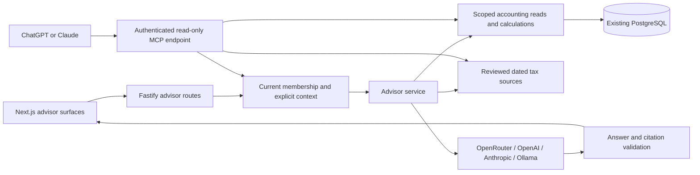

# Tax advisor implementation plan

Status: **implementation in progress on `feat/tax-advisor` — embedded advisor and connector resource server implemented; deployment and tax-review gates remain open**. Updated: **2026-09-19**.

Tracking: [TRY-160 — Tax advisor epic](https://linear.app/trysoft/issue/TRY-160/epic-implement-the-contextual-tax-advisor), in the Trysoft / Księgowy Vibe project. Phase issues: TRY-161 through TRY-166, in order. Branch: `feat/tax-advisor` (local). The [Linear plan](https://linear.app/trysoft/document/tax-advisor-implementation-plan-d88af7b59f73) contains the original planning snapshot; this checklist and the [implemented specification](../docs/specs/tax-advisor.md) track delivery.

## 1. Outcome and delivery decisions

Add an advisor layer to the existing accounting workspace. Users can ask questions about their company, understand figures and documents, and receive Polish tax guidance supported by dated sources. The advisor prepares explanations and proposed next steps; existing accounting flows retain responsibility for changes and submissions.

Deliver two connection modes:

1. **Inside Księgowy Vibe:** embedded advisor using the user's OpenRouter, OpenAI API, Anthropic API, or an operator-configured Ollama instance.
2. **Inside ChatGPT or Claude:** an authenticated connector exposing selected Księgowy Vibe records and tax evidence to the user's existing assistant account. This addresses subscription use without treating a consumer subscription as an API key. Conversations in these products remain in those products.

Start with OpenRouter for the first working slice: the repository already uses the OpenAI SDK against OpenRouter. Add the other three embedded providers before calling provider support complete. Implement the subscription connector as a separate release milestone, not an optional replacement for the requested subscription path.

The first tax scope is Polish company VAT, invoice questions, and KSeF operational explanations. Income tax, ZUS, depreciation, tax-regime comparisons, and cash forecasts need additional facts and calculation support; their explicit follow-on milestone is below. Personal/household accounting remains outside this project increment.

Use the existing Fastify/TypeScript API, Next.js shell, PostgreSQL, and Prisma. No new microservice, agent framework, vector database, or message broker is needed for this scope.

## 2. Design evidence and scope mapping

The advisor reference is [private design reference](../private design reference), screens **15–19**, with [the design system](../private design reference) and [implemented Aurora Solid tokens](../docs/specs/aurora-solid-tokens.md).

Both `private design reference` and `private design reference` contain byte-identical sections 15–19. The former also contains screens 33–37; the filename suffix does not establish a newer advisor design. Their latest recorded repository change is `194f897` (2026-09-01). Use the more complete file as the reference. This review inspected the HTML structure, styles, and content; browser-based visual acceptance belongs to implementation.

| Reference | Required experience | Delivery |
|---|---|---|
| 15 — Advisor panel | Header trigger, Command/Ctrl+J, 400px desktop panel beside the 226px rail/content; visible page and period context; Escape to close | First embedded release |
| 16 — Answer card | Short answer, relevant figures, calculation breakdown, source links, assumptions, follow-up question | First embedded release, using available facts |
| 17 — Inline insights | At most one dismissible strip per view; explain a number; document evidence; explicit confirmation before changes | Explain links first; insights after core answers |
| 18 — Briefing | Advisor page, dated summary, prioritised tasks, history | On-demand briefing first; scheduled delivery later |
| 19 — Mobile advisor | Existing central bottom-navigation trigger opens a sheet; answer cards and source access | First embedded release |
| 20–37 — Personal mode | Household context and personal finance | Separate future product work |

Preserve opaque Aurora surfaces, Sora/IBM Plex Mono, tabular amounts, existing light/dark tokens, 60px desktop header, and mobile safe-area space. Use the shipped contrast-corrected tokens rather than copying low-contrast mock colours.

The mock contains illustrative business assertions, not approved tax logic. In particular, do not implement “fixing a rejected sales invoice lowers VAT”, “all unbooked purchase VAT is claimable”, a universal depreciation threshold answer, or mock offline deadlines as rules. KSeF acceptance, accounting inclusion, and tax liability are different facts that need explicit definitions and sources.

The design does **not** specify provider setup, privacy consent, conversation retention, source freshness, or failure states. Design these within the existing Settings workspace and advisor surfaces in phase 1.

## 3. Repository findings that affect implementation

| Existing implementation | Reuse or constraint |
|---|---|
| `apps/web/src/components/organisms/DashboardShell.tsx` | Server-rendered shell already has a disabled central mobile AI button; wrap only advisor interaction in a client boundary |
| `AppHeader.tsx`, `DashboardNavigation.tsx` | Add the desktop trigger and eventual briefing navigation |
| `apps/web/src/components/atoms/NativeDialog.tsx` | Reuse for the mobile sheet; it already handles modal focus and Escape. Desktop docked panel remains non-modal |
| `apps/web/src/app/dashboard/settings/SettingsWorkspace.tsx` | Add an advisor settings section alongside existing company/KSeF settings |
| `apps/web/src/lib/api-client.ts`, `api-base.ts` | Browser calls Fastify directly with cookies; existing `clientFetch` consumes JSON and cannot read streaming responses |
| `apps/api/src/plugins/cors.ts` | Already allows credentials and `x-ksef-environment`; keep streaming compatible with this topology |
| `apps/api/src/app.ts` | Register advisor routes as another bounded module |
| `apps/api/src/services/ocr/openrouter*.ts` | Existing OpenAI SDK and OpenRouter usage; reuse the dependency, not OCR prompts or its deployment-wide secret |
| `packages/shared-utils/src/encryption.ts` | Existing AES-256-GCM secret storage; reuse for connection credentials |
| `apps/api/src/lib/ksef-environment.ts` | Explicit environment validation exists; require it for advisor requests that select financial context |
| `apps/api/prisma/schema.prisma` | Existing users, company memberships, roles, invoices, incoming documents and environment-specific KSeF state |
| `dashboard-summary.service.ts`, `contractor-financials.service.ts`, `routes/reports.ts` | Existing read models have different semantics; explain those distinctions and fix shared aggregation defects before reuse |

Specific data limitations:

- Dashboard sales totals include KSeF-accepted issued invoices. Contractor totals use issued invoices and exclude `FORMAL` corrections; the dashboard aggregation and VAT-register query currently lack that exclusion. Formal corrections can repeat original amounts. Do not promote these existing aggregates to a tax calculation without reconciliation.
- Aggregate totals must retain currency. The dashboard currently selects amounts without currency for its sales buckets. Separate currencies or use an explicit, sourced conversion rule; never silently sum unlike currencies.
- The VAT register is an outgoing-invoice report, not a complete VAT-return calculation. Incoming confirmation does not establish deductible VAT or its claim period.
- `paymentReceived` is cumulative; the schema has no payment-event ledger or bank feed. It cannot substantiate average payment delays, bank balance, or cash-flow forecasts from the mock.
- The company model has VAT status but lacks effective-dated income-tax regime, legal form, ZUS situation, fixed assets, and household finances.
- Some routes authorise using company claims in the access token. Advisor access must also check current database membership so removal/revocation applies to long-lived conversations and connectors.

## 4. Provider and subscription feasibility

Provider information is a research snapshot. Recheck supported authentication, account eligibility, model capabilities, and current secure SDK versions when implementing each integration; do not hard-code today's model ranking or pricing.

| Option | Authentication and billing | Planned support |
|---|---|---|
| OpenRouter | User API key and OpenRouter credits; multiple upstream providers | First embedded provider; reuse installed OpenAI SDK and its compatible endpoint ([documentation](https://openrouter.ai/docs/quickstart)) |
| OpenAI API | User API key, billed through the API account | Embedded provider. Official authentication docs distinguish API usage from included ChatGPT plan credits ([documentation](https://learn.chatgpt.com/docs/auth)) |
| Anthropic API | Claude Console API credentials | Embedded provider via Messages API; native `fetch` is sufficient for the bounded request contract ([documentation](https://platform.claude.com/docs/en/api/overview)) |
| Ollama | Operator-approved endpoint and installed model; local execution has infrastructure cost | Embedded provider through OpenAI compatibility; validate actual model capabilities ([documentation](https://docs.ollama.com/api/openai-compatibility)) |
| ChatGPT subscription | User connects our authenticated tools in ChatGPT | Subscription path through the documented app/plugin MCP integration. Our service authorises access to our records; it does not obtain a ChatGPT inference token ([authentication](https://developers.openai.com/plugins/build/auth)) |
| Claude subscription | User adds our remote MCP connector in Claude | Subscription path in Claude, subject to account/admin availability ([connector documentation](https://support.claude.com/en/articles/11175166-get-started-with-custom-connectors-using-remote-mcp)) |
| Other providers | Initially choose their available models through OpenRouter | Dedicated Gemini, Azure, Bedrock, or arbitrary compatible endpoints only when deployment/customer requirements justify them |

**Subscription qualification:** no general-purpose ChatGPT subscription inference endpoint for embedding this advisor was established by this research. Codex login is a product-specific workflow, not evidence that its tokens can power this application. Do not advertise “Sign in with ChatGPT” as included inference inside Księgowy Vibe.

Anthropic's guidance for products built for other users directs developers to API authentication. Its separate Agent SDK article currently says a planned billing change was paused and some SDK/third-party usage still draws from subscription limits. Those statements do not establish a stable shared web-product entitlement. Keep an embedded subscription experiment outside the committed architecture unless Anthropic confirms this deployment is supported; do not label all subscription integration impossible. Sources: [developer login guidance](https://support.claude.com/en/articles/13189465-log-in-to-your-claude-account), [Agent SDK update](https://support.claude.com/en/articles/15036540-use-the-claude-agent-sdk-with-your-claude-plan).

Connection settings must show the actual execution location and billing mode. Never silently move a conversation to a different provider. OpenRouter can route through upstream providers, so disclose that and enforce the user's permitted data-handling policy; routing availability must fail closed if the selected policy cannot be met. See [OpenRouter privacy](https://openrouter.ai/docs/guides/privacy/data-collection).

“Local Ollama” means local to the configured runtime, not automatically the browser user's laptop. A hosted API cannot reach a laptop's `localhost`. Support co-located Docker/service networking and explicitly configured private endpoints first. For a genuinely local-only setup, disable cloud features and select locally installed models; Ollama also supports cloud features. See [Ollama deployment and cloud controls](https://docs.ollama.com/faq).

## 5. Product contracts

### Setup and daily use

1. Open Advisor from the header, mobile centre button, or an “Explain” link.
2. With no connection, show “Use here” and “Use in ChatGPT / Claude”, with billing/location explanations. Provider credentials are entered only for API mode.
3. Select a provider and model, test with a synthetic prompt, and show the result. A test may incur a small API charge and sends no company documents.
4. Before first company-data transmission, show company, environment, provider, selected period/document scope, and the categories being shared. Allow excluding documents or using general guidance with no company records.
5. Ask a question. Show bounded progress, cancel, then a validated answer card. Show clarification questions when needed rather than guessing missing tax facts.
6. “Show working” opens input facts, deterministic calculations, and cited records. “Sources” separately lists legal sources, publication/effective dates, and verification date.
7. Proposed actions initially link to existing invoice/review/settings flows. The advisor itself cannot issue, book, pay, send, or file anything.

Conversation history is private to the initiating user within a company and KSeF environment. Credentials belong to that user's connection in that company. An administrator controls whether external advisor processing is allowed for company data; members manage their own credentials. Shared company-paid credentials can be added later if requested.

Keep context stable for a turn. The server derives facts from authorised identifiers and filters, never from browser-provided totals or a page DOM dump. Company/environment switches cancel the active request and clear visible old-company state. A provider change starts a fresh conversation or explicitly asks to resend selected history to the new provider. A page/period change displays the new scope before it is used.

### Answer shape

Define the shared contract in `packages/types/src/advisor.ts`, with runtime validation in the API:

- `status`: answered, needs clarification, insufficient evidence, or unavailable.
- Short answer and explanation; explicit assumptions and unanswered questions.
- Calculation rows with decimal-string amounts, currency, named inputs, and inclusion rules.
- Record evidence identifiers with server-resolved links and retrieval timestamps.
- Tax-source identifiers with article/section, jurisdiction, effective interval, verification date, and reviewed excerpt.
- Suggested next steps from an allowlisted set of existing application destinations.
- Provenance: company/environment, period, provider/model, generation time, source-set version, and context freshness.

Replace model-invented “high confidence” percentages with evidence states such as “Calculated from records”, “Source verified for this period”, and “Missing information”. They describe evidence quality, not a guarantee of legal correctness. “Show working” exposes calculations and assumptions, not private model reasoning.

Do not render arbitrary model HTML or unvalidated navigation URLs. Structured cards can use React text rendering and existing components without adding a Markdown library.

### UI states and accessibility

Include unconfigured, connection testing, empty conversation, loading, cancelled, provider unavailable, invalid credentials, quota exceeded, malformed answer, missing source, stale source, permission revoked, and deleted-document states. Provide retry only when appropriate and preserve the user's draft.

Desktop: a docked 400px panel where space permits, collapsing to a modal sheet on narrower screens. Keep the page usable and restore focus to the trigger on close. Mobile: reuse `NativeDialog` bottom-sheet behaviour, visible close button, keyboard-safe composer, at least 44px targets, safe-area padding, and 16px side margins. Command/Ctrl+J is an enhancement; a visible button is always available. Announce completion/errors without reading every streamed token.

## 6. Application architecture and storage



Keep accounting access, evidence selection, and provider transport separate because they have distinct security and correctness responsibilities. A small set of provider functions and a discriminated provider type is enough. No general agent runtime or provider class hierarchy is required.

Initial persistence proposals, to be finalised in phase 1 after checking existing models:

| Record | Minimum responsibility |
|---|---|
| `AdvisorConnection` | User + company + provider, encrypted credential and nonce, optional approved endpoint identifier, model, connection-test result and timestamps; unique user/company/provider |
| `AdvisorConversation` | User, company, environment, connection reference, title, creation/expiry timestamps; provider changes do not silently reuse history |
| `AdvisorMessage` | Conversation, role, content/validated answer, request identifier, lifecycle status, bounded evidence snapshot, provider/model, usage, timestamps |
| `CompanyAdvisorPolicy` | Company opt-in, allowed external providers/data categories and retention; one record per company; absent means disabled |

Use message metadata for request outcome, usage, and evidence rather than separate run, memory, billing, and trace tables. Enforce one active generation per conversation and unique client request identifiers in the database to prevent duplicate paid requests across processes. Conversations survive a disconnected connection as history; deletion of credentials must not delete evidence unexpectedly.

Start tax sources as a small versioned, reviewed repository corpus with metadata and excerpts, loaded by the API. Topic/period filtering suffices initially. Add PostgreSQL full-text search only when corpus size requires it; embeddings need a demonstrated retrieval problem.

Retention proposal: 30 days for conversations/evidence, configurable downward by the operator; explicit delete immediately removes active records. Purge on a scheduled task using the existing scheduling pattern. Document that database backups and upstream provider retention have separate expiry/deletion behaviour. Do not promise upstream deletion simply because a local conversation was removed.

### Proposed API surface

All paths below are under `/companies/:companyId/advisor`. Schema validation, authenticated user ownership, current membership, and company policy apply throughout.

| Method/path | Purpose |
|---|---|
| `GET /settings` | Policy, user's masked connections, available provider modes |
| `PATCH /policy` | Administrator changes company processing/retention policy |
| `PUT /connections/:provider` | Save user's encrypted credentials/model/approved endpoint selection |
| `POST /connections/:provider/test` | Bounded synthetic connectivity and capability test |
| `DELETE /connections/:provider` | Revoke/delete user's saved credentials |
| `GET /connections/:provider/models` | Server-side permitted model discovery; explicit model identifier fallback where discovery is unavailable |
| `GET /conversations` | User's history in the explicitly selected environment |
| `POST /conversations` | Create conversation with fixed user/company/environment/provider scope |
| `GET /conversations/:conversationId` | Load authorised messages and provenance |
| `DELETE /conversations/:conversationId` | Delete local conversation and evidence |
| `POST /conversations/:conversationId/messages` | Submit question/context identifiers and client request identifier; return streamed status and final validated answer |

Use `fetch` streaming with an explicit `x-ksef-environment` header and included cookies. Add an advisor-specific transport beside `clientFetch`; do not change the existing JSON callers. A `text/event-stream` response can emit `status`, `answer`, `error`, and `done`; only expose a completed validated card. This avoids leaking incomplete tax claims while still providing progress. Implement bounded event parsing and cancellation through `AbortController` to the upstream request.

Persist the pending message before calling the provider, then atomically finalise its result. On disconnection, cancellation, or server restart, distinguish an interrupted request from a completed answer. A retry with the same request identifier returns the known result/status and does not automatically charge again. Do not claim upstream cancellation guarantees no billing. Do not auto-replay a paid generation after an ambiguous timeout.

## 7. Tax grounding, correctness, and data access

The model explains supplied evidence; the API computes amounts. Use Prisma Decimal and explicit currency throughout. Use a small, bounded set of read operations for company facts, selected invoices, incoming review status, contractor balances, and defined period summaries. Batch document selection and aggregation; do not fetch every invoice individually or send the entire company archive with each question.

For tax guidance, collect the jurisdiction, relevant tax year/transaction date, entity/regime where required, VAT situation, business/private use, and transaction circumstances. Known company facts can prefill questions, but missing facts stay unknown. Facts provided in chat are marked as user assumptions and do not silently update company records.

Source acquisition starts from Ministry of Finance guidance on [podatki.gov.pl](https://www.podatki.gov.pl/), enacted legal texts, and relevant official interpretations. The enacted-text retrieval endpoint and its update mechanism still need an implementation spike; ELI endpoints could not be fetched during this review. An interpretation's factual scope must be preserved, not presented as a rule for every taxpayer.

Each source needs a stable identifier, canonical URL, title, authority, article/section, effective dates, retrieval/review date, bounded excerpt, and checksum/version. Reviewer-approved sources for the pilot topics must exist before the product presents tax conclusions. A scheduled freshness check flags changed or expired entries; it cannot automatically certify legal correctness. No applicable reviewed source means a clear limitation and a request for accountant review, not an answer from model memory.

Validate that every displayed citation resolves to supplied evidence and supports the referenced claim. Schema validation alone cannot prove legal correctness: the release gate includes human review of representative answers. Current-year material must not silently answer historical-period questions. Do not infer filing deadlines from the shell's simple 25th-of-month widget; add a separately reviewed calendar rule before providing personalised deadlines.

Security boundaries required for this feature:

- Recheck database membership and policy on every request and connector tool call; validate nested conversation/document ownership and exact environment. Bind evidence retrieval to the same scope. Recheck before releasing a final answer; deny subsequent access after revocation.
- Browser clients never receive decrypted credentials. Use existing encryption, redact request secrets, and omit prompt/document contents from logs. Check Origin for cookie-authenticated mutations; retain the current restricted CORS policy.
- Allow cloud providers only at fixed destinations. Ollama endpoints come from an operator-controlled allowlist; company users select a registered endpoint rather than submitting arbitrary URLs. Prevent redirect/DNS tricks and metadata-service access. Local networking exceptions are explicit and deployment-specific.
- Send the minimum useful fields. Exclude national identifiers, full bank details, addresses, raw attachments, and free-text notes unless a question requires them and sharing is allowed.
- Treat user text, invoice descriptions, OCR, and retrieved documents as untrusted data. They cannot change permissions, provider selection, source policy, or available actions. No model-generated SQL, shell commands, or unrestricted network requests.
- Bound message/history size, context documents, output, duration, concurrent requests, and per-user/company request rate. Record token usage when available; show unknown cost when pricing/usage is unavailable rather than zero. Enforce provider-side spend limits where supported.

## 8. Implementation backlog and acceptance gates

All checkboxes below represent future implementation. Update this plan and the corresponding README/docs in each delivered change.

### Phase 1 — Contracts and missing design states

- [x] Add provider setup, disclosure, context selection, source drawer, history, and error-state specifications matching screens 15–19.
- [x] Finalise shared answer/request contracts and current-membership checks, using existing role names.
- [ ] Define the initial reviewed VAT/invoice question set and expected evidence, including questions the advisor must decline or clarify.
- [ ] Confirm connector eligibility on target ChatGPT/Claude accounts and capture current authentication requirements. This feasibility check starts early; external integration ships in phase 5.

**Gate:** a complete first-use-to-answer flow is specified for desktop/mobile, including both subscription and API modes. No connection label promises unsupported billing.

### Phase 2 — Authorised records and reliable calculations

- [x] Add scoped accounting reads in `apps/api/src/services/advisor/`, reusing public services where their semantics match.
- [x] Reconcile correction and currency handling in affected shared read models; make any changed totals visible in their existing docs/tests. Keep accepted-sales and all-issued totals separately named.
- [x] Add bounded source metadata loading, effective-period/current-review selection, corpus provenance, and fail-closed missing/stale-source behavior.
- [ ] Populate an accountant-reviewed source corpus, designate review ownership, and add topic retrieval beyond the first eight applicable excerpts.
- [x] Define bounded context snapshots, exclusion rules, source links, and provenance.

**Gate:** deterministic totals reconcile to synthetic invoice fixtures, formal/cancellation corrections behave correctly, mixed currencies remain separate, and no cross-company/environment record can enter a context. Tax answers have period-appropriate reviewed evidence.

### Phase 3 — First embedded slice, then provider parity

- [x] Add the initial Prisma models/migration, encrypted settings routes, retention cleanup, and feature switch.
- [x] Implement OpenRouter transport and validated answer orchestration; keep OCR configuration independent.
- [x] Add the shell client boundary, panel/sheet, composer, answer cards, source display, and settings section. Files should follow existing components and `translations.ts` conventions.
- [x] Add conversation history, cancellation, idempotent request handling, limits, and actionable failure states.
- [x] Add OpenAI API, Anthropic API, and Ollama using the same application contract. Test provider/model structured-response capability and provide an unsupported-model state.

**Gate:** a user connects each provider type, asks a supported Polish VAT/invoice question, sees correct company facts and citations, follows up, cancels, reconnects, and deletes history. Opening the advisor or changing pages causes no automatic paid model call. Secret values never appear in returned settings or browser storage.

### Phase 4 — Contextual entry points and briefing

- [x] Add dashboard briefing and document Explain entry points, including the document issue month.
- [ ] Add contractor-balance explanations after reconciling that read model and its evidence contract.
- [ ] Add one dismissible insight strip per supported view using deterministic attention facts; persist dismissal scoped to user/company/environment/insight version.
- [x] Add `/dashboard/advisor` with an on-demand dated briefing and history, reusing the answer-generation path. Exclude unavailable bank, forecast, and filing figures.
- [x] Link proposed actions to existing review/edit flows, respecting the user's current role. “Open invoice” and “Review incoming” are safe first actions; no autonomous writes.

**Gate:** context comes from the actual selected record/period, old-company content disappears on switching, insights carry evidence, and VIEWER users cannot cause writes through advisor suggestions.

### Phase 5 — ChatGPT and Claude subscription connectors

- [x] Expose a read-only MCP endpoint in Fastify backed by the same authorised facts and tax-source selection. Start with `get_company_context`, `get_invoice_evidence`, `get_period_summary`, and `get_tax_sources`; explicit company/environment parameters are checked against grants.
- [x] Implement protected-resource metadata and signed JWT validation with the maintained MCP SDK and JOSE; bind consent to the issuer/client/current membership.
- [ ] Configure and demonstrate the external maintained OAuth authorisation server (reference: Keycloak): resource metadata, authorisation-code flow with PKCE, audience/scopes, exact redirects, expiring tokens and revocation. Existing Google OAuth is a sign-in client, not an MCP authorisation server. Select a maintained OAuth implementation during the feasibility spike rather than hand-writing the protocol. Follow [MCP authorisation](https://modelcontextprotocol.io/specification/2025-11-25/basic/authorization).
- [x] Store a connector grant binding user, company, environment, scopes, client, expiry and revocation. Consent occurs in our signed-in app. Do not reuse browser session cookies, Google access tokens, or another user's grant as connector credentials.
- [x] Add setup/status/revoke UX for each external product, including account/admin restrictions and the HTTPS reachability requirement for a self-hosted installation.
- [ ] Validate each integration in the real ChatGPT/Claude client. Provide instructions for starting there and returning to a cited invoice in Księgowy Vibe.

**Gate:** both external products read only explicitly authorised data, and revocation/company removal takes effect on the next tool request. No provider subscription token is collected by Księgowy Vibe. Clearly disclose that external conversation storage and answer rendering belong to the host product; local answer validation cannot control every statement that host adds. Subscription support is complete only when both target integrations are demonstrated.

### Phase 6 — Wider tax advice and reviewed actions

- [ ] Add effective-dated tax facts only for approved use cases: legal form, income-tax regime, VAT settlement method, ZUS situation and asset details. Prefer a dedicated versioned tax profile over adding unrelated fields to `Company`; do not duplicate existing VAT status.
- [ ] Add reviewed, deterministic scenario calculations for the chosen PIT/CIT/ZUS/depreciation questions, with source/rule versions, decimal inputs, explicit assumptions and a comparison card.
- [ ] Add proposal preview/confirm only for a selected supported accounting action. Reuse existing mutation services and role/environment checks; include stale-record detection, single-use confirmation and audit outcome. No generic model-selected command endpoint.
- [ ] Schedule briefings or accountant delivery only after per-user opt-in, recipients, and retention are specified. Bank forecasting requires a separate bank/payment-ledger project first.

**Gate:** each new tax topic has an explicit supported scope and accountant-reviewed evaluation cases. Each write requires a user-reviewed proposal and cannot execute twice or after underlying facts change.

## 9. Verification, release, and rollback

Use existing Vitest and Playwright infrastructure. Cover public routes/services with focused cases, local mocks, full payload assertions, and the repository's naming rules. `builder-pattern` 2.2.0 is now pinned in the API test dependencies. Do not add a second test framework.

Minimum automated coverage:

- Public API isolation: a different company, environment, user, revoked membership, or denied processing policy cannot access settings/history/evidence or initiate a call.
- One successful structured answer per transport family plus invalid credentials, quota/timeout, malformed output and unsupported model. Provider tests use mocked network responses; live paid checks are explicit release checks.
- Deterministic calculations: formal correction, cancellation, partial payment, unconfirmed incoming invoice, mixed currencies, and date boundaries.
- Grounding: fabricated source identifiers, stale sources, missing tax regime and hostile invoice instructions fail safely. Validate historical-date selection.
- Lifecycle: duplicate submission, disconnect/cancel, expired session, process restart and retention/deletion; no silent resend to another provider.
- UI: connection setup, panel/sheet keyboard use, answer/source expansion, context switching during generation, useful errors, light/dark, mobile keyboard and safe areas.
- Connector: consent, insufficient scope, audience mismatch, expiry, revocation and company removal, followed by a real-client check for both products.

Implemented verification commands:

```bash
pnpm --filter @ksiegowy/api test -- src/routes/advisor.test.ts
pnpm --filter @ksiegowy/api test -- src/services/advisor/advisor.service.test.ts
pnpm --filter @ksiegowy/api test -- src/services/dashboard-summary.service.test.ts
pnpm --filter @ksiegowy/api typecheck
pnpm --filter @ksiegowy/web typecheck
pnpm --filter @ksiegowy/e2e test -- tests/advisor.spec.ts
pnpm audit --audit-level=high
```

Evaluate a compact Polish question set with a qualified tax reviewer before enabling tax guidance: invoice explanation, apparent VAT discrepancy, deduction with missing facts, historical tax period, rejected KSeF document, unsupported depreciation comparison, and unavailable cash forecast. Require correct deterministic numbers, valid citations, appropriate clarification/abstention, no leaked records, and no automatic actions. Model upgrades rerun this set; provider API compatibility alone is insufficient.

Roll out behind an advisor feature switch and company opt-in, beginning with synthetic TEST data. TEST/PRODUCTION selects accounting records; it does **not** make LLM requests free. Validate migration/backup restoration, credential encryption, streaming through the deployed proxy, mobile interaction and a live request for each enabled provider before expanding to production companies.

Observe request count, first-progress/total latency, cancellation, provider failures, invalid answers, missing evidence and available token usage. Logs contain operation/request identifiers and sanitised errors, not prompts or documents. Start/end/error logs suffice.

Rollback disables advisor routes/entry points, stops scheduled advisor work, and revokes connector grants; accounting flows continue normally. Keep additive tables until retention/export obligations are handled. A failed rollout must not require destructive invoice migrations.

Documentation to update during delivery: `README.md`, `docs/architecture.md`, `docs/data-model.md`, `docs/infrastructure.md`, `docs/development-run-modes.md`, affected dashboard/report specs, and a new `docs/specs/tax-advisor.md`. Keep this checklist accurate after each phase.

## 10. Remaining decisions and release dependencies

- **Default adopted:** company workspace first; user-owned provider credentials; private history; read-only first release; OpenRouter first; all four embedded providers and both subscription connectors are explicit milestones.
- **Account eligibility:** demonstrate the current ChatGPT/Claude connector flow on target accounts; provider plans and administrative controls can change.
- **Source maintenance:** designate a tax reviewer and source-refresh owner before presenting tax conclusions. Choose and prove the enacted-law retrieval mechanism during phase 2.
- **Deployment:** confirm whether Ollama runs alongside the API or on an approved private host. A bridge to arbitrary user laptops is a separate feature.
- **OAuth:** the resource server uses `@modelcontextprotocol/sdk` 1.30.0 and `jose` 6.2.12. Use an external maintained issuer, with Keycloak as the documented reference. Real deployment must prove host callback registration, S256 PKCE, resource audience, and the administrator-managed user-ID mapping. No custom token/authorisation server is included.
- **Expanded tax scope:** phase 6 needs concrete taxpayer regimes and use cases; missing cash/bank/asset data cannot be substituted with model predictions.

Implementation evidence is recorded in [the advisor specification](../docs/specs/tax-advisor.md). API/unit and desktop/mobile browser checks use synthetic data and mocked providers. Prisma Client and an additive SQL migration are generated; no existing database was migrated and no paid provider call was made.

### Delivery notes

- Phase 3 implementation is present; its real-provider and reviewed-tax-question release gate is still open.
- Phase 2 shares correction semantics with the dashboard and keeps currencies separate; the dashboard's PLN-labelled sales buckets now explicitly exclude other currencies. Contractor/report reconciliation remains outside this slice.
- Phase 4 includes a full conversation/briefing page and safe evidence links. Inline insights and contractor-specific context remain on TRY-164.
- Phase 5 includes four read-only tools, an OAuth resource server, grant consent/expiry/revoke UX and signed-token checks. It is **not yet verified in real ChatGPT/Claude accounts**; external issuer deployment and account eligibility remain on TRY-165.
- Phase 6 remains open: taxpayer regimes, reviewed tax rules and mutation proposals require the planned product/tax inputs. No unsupported figures are generated as placeholders.
